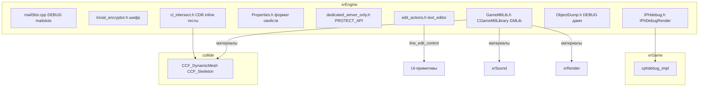

# Прочее

**Прочее** — набор вспомогательных модулей `xrEngine`, которые не входят в основные подсистемы:

- **`mailSlot.cpp`** — Windows mailslots (DEBUG-only): `msCreate`/`msRead`/`msWrite`, `msParse` (extern).
- **`trivial_encryptor.h`** — «шифр» (подстановочная таблица + per-byte XOR): `random32` LCG `0x08088405*x+1`, `m_alphabet[256]` (перемешан `m_table_iterations` swaps с `m_table_seed`), `m_alphabet_back` (обратная); `encode` = `alphabet[i] ^ rand(256)&0xff`, `decode` = `alphabet_back[i ^ rand]`; statics `m_table_iterations=4096`/`m_table_seed=7071984`/`m_encrypt_seed=24031979` под `RUSSIAN_BUILD` (иначе 3072/24081978/20041983); `TRIVIAL_ENCRYPTOR_ENCODER/DECODER` макросы. **Не настоящее шифрование** — тривиальное, seed hardcoded.
- **`cl_intersect.h`** — `namespace CDB`: inline-тесты пересечения (используются collide-кодом): `IntersectRaySphere`, `TestRayTri` (2 overloads, Möller–Trumbore), `TestRayTri2` (2), `TestBBoxTri` (2, OBB), `MgcSqrDistance` (ближайшая точка на отрезке, большой), `TestSphereTri` (3 overloads), `TestSphereOBB`, `TestRayOBB`.
- **`Properties.h`** — `xrProperties` enum (PID-типы), `xrP_Integer/Float/BOOL/TOKEN/CLSID/Template` structs, `CPropertyBase`, `xrPWRITE`/`xrPREAD` helpers, `#pragma pack(4)` — формат свойств редактора.
- **`dedicated_server_only.h`** — `PROTECT_API` макрос: все ветки **идентичны** (`#define PROTECT_API`) — **мёртвое** разделение.
- **`IPHdebug.h`/`phdebug.cpp`** — `IPhDebugRender` чистый интерфейс: `open_cashed_draw`/`close_cashed_draw(remove_time)`/`draw_tri`, `extern ENGINE_API IPhDebugRender* ph_debug_render` = 0 (реализация в xrGame `cphdebug_impl`); используется в `CCF_DynamicMesh::_RayQuery` (DEBUG).
- **`GameMtlLib.h/.cpp` + `GameMtlLib_Engine.cpp`** — `SGameMtl` (флаги `flBreakable`..`flSlowDown` (1<<31), physics/friction/shoot/floation/vis/sound-occlusion factors, `GAMEMTL_CURRENT_VERSION 0x0001`), `SGameMtlPair` (пара mtl0/mtl1 + parent, breaking/step/collide sounds + particles + marks, `GAMEMTL_PAIR_CHUNK_*`), `CGameMtlLibrary` (векторы материалов/пар, `GAMEMTLS_CHUNK_*`, `Load` из `gamemtl.xr` + опц. `.ltx` overrides (biggestId логика), rt pair matrix `material_pairs_rt[idx1*count+idx0]` для игры), `GMLib` глобал, `MTL_EXPORT_API` = `ECORE_API` в редакторе иначе `ENGINE_API`.
- **`ObjectDump.h/.cpp`** — DEBUG only: `dbg_object_base/poses/visual_geom/props/full/full_capped_dump_string`.
- **`edit_actions.h/.cpp`** — `namespace text_editor`: `base` (prev-action chain), `callback_base` (FastDelegate0 + dik + key_state), `type_pair` (dik → char/char_shift/translate), `key_state_base` (state + type_pair) — действия для `line_edit_control` (уже покрыты в [UI-примитивы](ui-primitives.md), порцион 11).

См. [Коллизии](collide-physics.md), [UI-примитивы](ui-primitives.md), [Объект](xr-object.md), [Ядро](engine.md).

## 1. Ответственность

- **`mailSlot.cpp`** — Windows mailslots (DEBUG-only): IPC для отладки.
- **`trivial_encryptor.h`** — «шифр» (не настоящее шифрование): для защиты конфигов/данных от любопытных.
- **`cl_intersect.h`** — inline-тесты пересечения: для collide-кода (см. [Коллизии](collide-physics.md)).
- **`Properties.h`** — формат свойств редактора: для сохранения/загрузки свойств объектов.
- **`dedicated_server_only.h`** — `PROTECT_API` макрос: **мёртвое** разделение (все ветки идентичны).
- **`IPHdebug.h`/`phdebug.cpp`** — отладочный рендер физики: для DEBUG-визуализации.
- **`GameMtlLib.h/.cpp`** — библиотека материалов: для физики/звука/визуализации.
- **`ObjectDump.h/.cpp`** — DEBUG-дамп объектов: для отладки.
- **`edit_actions.h/.cpp`** — действия редактора: для `line_edit_control` (см. [UI-примитивы](ui-primitives.md)).

## 2. Место в архитектуре

Большинство модулей — вспомогательные: не имеют своего цикла, вызываются из других подсистем.

## 3. Публичный API

### `mailSlot.cpp` (DEBUG-only)

| Функция                           | Описание                                                 |
| --------------------------------- | -------------------------------------------------------- |
| `msCreate` / `msRead` / `msWrite` | Создание/чтение/запись mailslot.                         |
| `msParse` (extern)                | Парсинг (extern, реализация где-то в xrGame или xrCore). |

### `trivial_encryptor.h`

| Символ                                                    | Описание                                                                        |
| --------------------------------------------------------- | ------------------------------------------------------------------------------- |
| `random32`                                                | LCG `0x08088405*x+1`.                                                           |
| `m_alphabet[256]`                                         | Подстановочная таблица (перемешан `m_table_iterations` swaps с `m_table_seed`). |
| `m_alphabet_back[256]`                                    | Обратная таблица.                                                               |
| `encode(i)`                                               | `alphabet[i] ^ rand(256)&0xff`.                                                 |
| `decode(i)`                                               | `alphabet_back[i ^ rand]`.                                                      |
| `TRIVIAL_ENCRYPTOR_ENCODER` / `TRIVIAL_ENCRYPTOR_DECODER` | Макросы для выбора стороны.                                                     |

### `cl_intersect.h` — `namespace CDB`

| Функция                       | Описание                                           |
| ----------------------------- | -------------------------------------------------- |
| `IntersectRaySphere`          | Пересечение луча и сферы.                          |
| `TestRayTri` (2 overloads)    | Пересечение луча и треугольника (Möller–Trumbore). |
| `TestRayTri2` (2 overloads)   | Альтернативный тест.                               |
| `TestBBoxTri` (2 overloads)   | Пересечение OBB и треугольника.                    |
| `MgcSqrDistance`              | Ближайшая точка на отрезке (большая функция).      |
| `TestSphereTri` (3 overloads) | Пересечение сферы и треугольника.                  |
| `TestSphereOBB`               | Пересечение сферы и OBB.                           |
| `TestRayOBB`                  | Пересечение луча и OBB.                            |

### `Properties.h`

| Символ                                                                                | Описание                   |
| ------------------------------------------------------------------------------------- | -------------------------- |
| `xrProperties` (enum)                                                                 | PID-типы.                  |
| `xrP_Integer` / `xrP_Float` / `xrP_BOOL` / `xrP_TOKEN` / `xrP_CLSID` / `xrP_Template` | Structs для свойств.       |
| `CPropertyBase`                                                                       | Базовый класс свойств.     |
| `xrPWRITE` / `xrPREAD`                                                                | Helpers для записи/чтения. |

### `dedicated_server_only.h`

| Символ        | Описание                                                                          |
| ------------- | --------------------------------------------------------------------------------- |
| `PROTECT_API` | Макрос: **все ветки идентичны** (`#define PROTECT_API`) — **мёртвое** разделение. |

### `IPHdebug.h`/`phdebug.cpp`

| Символ                     | Описание                                                                          |
| -------------------------- | --------------------------------------------------------------------------------- |
| `IPhDebugRender`           | Чистый интерфейс: `open_cashed_draw`/`close_cashed_draw(remove_time)`/`draw_tri`. |
| `ph_debug_render` (extern) | `ENGINE_API IPhDebugRender*` = 0 (реализация в xrGame `cphdebug_impl`).           |

### `GameMtlLib.h/.cpp`

| Символ            | Описание                                                                                                                                                                        |
| ----------------- | ------------------------------------------------------------------------------------------------------------------------------------------------------------------------------- |
| `SGameMtl`        | Материал: флаги `flBreakable`..`flSlowDown` (1<<31), physics/friction/shoot/floation/vis/sound-occlusion factors, `GAMEMTL_CURRENT_VERSION 0x0001`.                             |
| `SGameMtlPair`    | Пара материалов: mtl0/mtl1 + parent, breaking/step/collide sounds + particles + marks, `GAMEMTL_PAIR_CHUNK_*`.                                                                  |
| `CGameMtlLibrary` | Библиотека: векторы материалов/пар, `GAMEMTLS_CHUNK_*`, `Load` из `gamemtl.xr` + опц. `.ltx` overrides (biggestId логика), rt pair matrix `material_pairs_rt[idx1*count+idx0]`. |
| `GMLib` (глобал)  | Указатель на `CGameMtlLibrary`.                                                                                                                                                 |
| `MTL_EXPORT_API`  | = `ECORE_API` в редакторе иначе `ENGINE_API`.                                                                                                                                   |

### `ObjectDump.h/.cpp` (DEBUG only)

| Функция                                                                                                                                           | Описание             |
| ------------------------------------------------------------------------------------------------------------------------------------------------- | -------------------- |
| `dbg_object_base` / `dbg_object_poses` / `dbg_object_visual_geom` / `dbg_object_props` / `dbg_object_full` / `dbg_object_full_capped_dump_string` | DEBUG-дамп объектов. |

### `edit_actions.h/.cpp` — `namespace text_editor`

| Символ           | Описание                         |
| ---------------- | -------------------------------- |
| `base`           | Prev-action chain.               |
| `callback_base`  | FastDelegate0 + dik + key_state. |
| `type_pair`      | dik → char/char_shift/translate. |
| `key_state_base` | State + type_pair.               |

(Уже покрыты в [UI-примитивы](ui-primitives.md), порцион 11.)

## 4. Внутреннее устройство

**`mailSlot.cpp`**: Windows mailslots (DEBUG-only) — IPC для отладки: `msCreate` создаёт mailslot, `msRead`/`msWrite` — чтение/запись, `msParse` (extern) — парсинг. Используется для отладочной связи между процессами.

**`trivial_encryptor.h`**: «шифр» (не настоящее шифрование):

- `random32` — LCG `0x08088405*x+1`.
- `m_alphabet[256]` — подстановочная таблица: `m_table_iterations` (4096 под `RUSSIAN_BUILD`, иначе 3072) swaps с `m_table_seed` (7071984 под `RUSSIAN_BUILD`, иначе 24081978).
- `m_alphabet_back[256]` — обратная таблица.
- `encode(i)` = `alphabet[i] ^ rand(256)&0xff`.
- `decode(i)` = `alphabet_back[i ^ rand]`.
- `m_encrypt_seed` = 24031979 под `RUSSIAN_BUILD`, иначе 20041983.
- `TRIVIAL_ENCRYPTOR_ENCODER`/`TRIVIAL_ENCRYPTOR_DECODER` — макросы для выбора стороны.
- **Не настоящее шифрование** — тривиальное, seed hardcoded.

**`cl_intersect.h`** — `namespace CDB`: inline-тесты пересечения:

- `IntersectRaySphere` — луч + сфера.
- `TestRayTri` (2 overloads) — луч + треугольник (Möller–Trumbore).
- `TestRayTri2` (2 overloads) — альтернативный тест.
- `TestBBoxTri` (2 overloads) — OBB + треугольник.
- `MgcSqrDistance` — ближайшая точка на отрезке (большая функция).
- `TestSphereTri` (3 overloads) — сфера + треугольник.
- `TestSphereOBB` — сфера + OBB.
- `TestRayOBB` — луч + OBB.

**`Properties.h`**: формат свойств редактора:

- `xrProperties` enum (PID-типы).
- `xrP_Integer`/`xrP_Float`/`xrP_BOOL`/`xrP_TOKEN`/`xrP_CLSID`/`xrP_Template` structs.
- `CPropertyBase` — базовый класс.
- `xrPWRITE`/`xrPREAD` helpers.
- `#pragma pack(4)`.

**`dedicated_server_only.h`**: `PROTECT_API` макрос — **все ветки идентичны** (`#define PROTECT_API`) — **мёртвое** разделение.

**`IPHdebug.h`/`phdebug.cpp`**:

- `IPhDebugRender` — чистый интерфейс: `open_cashed_draw`/`close_cashed_draw(remove_time)`/`draw_tri`.
- `extern ENGINE_API IPhDebugRender* ph_debug_render` = 0 (реализация в xrGame `cphdebug_impl`).
- Используется в `CCF_DynamicMesh::_RayQuery` (DEBUG).

**`GameMtlLib.h/.cpp` + `GameMtlLib_Engine.cpp`**:

- `SGameMtl` — материал: флаги `flBreakable`..`flSlowDown` (1<<31), physics/friction/shoot/floation/vis/sound-occlusion factors, `GAMEMTL_CURRENT_VERSION 0x0001`.
- `SGameMtlPair` — пара материалов: mtl0/mtl1 + parent, breaking/step/collide sounds + particles + marks, `GAMEMTL_PAIR_CHUNK_*`.
- `CGameMtlLibrary` — библиотека: векторы материалов/пар, `GAMEMTLS_CHUNK_*`, `Load` из `gamemtl.xr` + опц. `.ltx` overrides (biggestId логика), rt pair matrix `material_pairs_rt[idx1*count+idx0]` для игры.
- `GMLib` — глобал (указатель на `CGameMtlLibrary`).
- `MTL_EXPORT_API` = `ECORE_API` в редакторе иначе `ENGINE_API`.

**`ObjectDump.h/.cpp`** (DEBUG only): `dbg_object_base/poses/visual_geom/props/full/full_capped_dump_string` — DEBUG-дамп объектов.

**`edit_actions.h/.cpp`** — `namespace text_editor`: `base` (prev-action chain), `callback_base` (FastDelegate0 + dik + key_state), `type_pair` (dik → char/char_shift/translate), `key_state_base` (state + type_pair) — действия для `line_edit_control` (уже покрыты в [UI-примитивы](ui-primitives.md), порцион 11).

## 5. Взаимодействие

**Кто меня вызывает**:

- `CCF_DynamicMesh::_RayQuery` (DEBUG) — `IPhDebugRender` (см. [Коллизии](collide-physics.md)).
- Collide-код — `cl_intersect.h` inline-тесты (см. [Коллизии](collide-physics.md)).
- Редактор — `Properties.h` (формат свойств).
- `line_edit_control` — `edit_actions.h` (см. [UI-примитивы](ui-primitives.md)).
- Игра — `GameMtlLib` (материалы для физики/звука/визуализации).

**Кого я вызываю**:

- `xrGame` (`cphdebug_impl`) — реализация `IPhDebugRender`.
- `xrSound` — звуки материалов.
- `xrRender` — визуализация материалов.
- Windows mailslots API — `mailSlot.cpp`.

## 6. Потоки

Большинство модулей — **main-поток** (вызываются из main-потока). `mailSlot.cpp` — может вызываться из любого потока (IPC). `trivial_encryptor.h` — inline (не thread-safe, но stateless).

## 7. Конфигурация

| Настройка       | Описание                                                                                   |
| --------------- | ------------------------------------------------------------------------------------------ |
| `RUSSIAN_BUILD` | Флаг: меняет `m_table_iterations`/`m_table_seed`/`m_encrypt_seed` в `trivial_encryptor.h`. |
| `gamemtl.xr`    | Файл библиотеки материалов.                                                                |
| `gamemtl.ltx`   | Опц. overrides для `CGameMtlLibrary::Load`.                                                |

## 8. Ограничения / дебаг

- **`mailSlot.cpp`**: DEBUG-only — не компилируется в release.
- **`trivial_encryptor.h`**: **не настоящее шифрование** — тривиальное, seed hardcoded; только для защиты от любопытных.
- **`dedicated_server_only.h`**: `PROTECT_API` макрос — **все ветки идентичны** — **мёртвое** разделение.
- **`IPHdebug.h`**: `ph_debug_render` = 0 по умолчанию — реализация в xrGame (`cphdebug_impl`); в `xrEngine` только интерфейс.
- **`GameMtlLib`**: `MTL_EXPORT_API` зависит от `_EDITOR` — в редакторе `ECORE_API`, в игре `ENGINE_API`.
- **`ObjectDump`**: DEBUG only — не компилируется в release.
- **`edit_actions`**: уже покрыты в [UI-примитивы](ui-primitives.md) (порцион 11) — здесь только указатель.

См. [Коллизии](collide-physics.md), [UI-примитивы](ui-primitives.md), [Объект](xr-object.md), [Ядро](engine.md).
