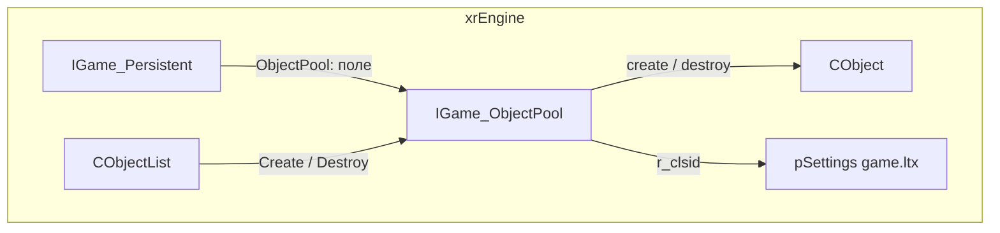
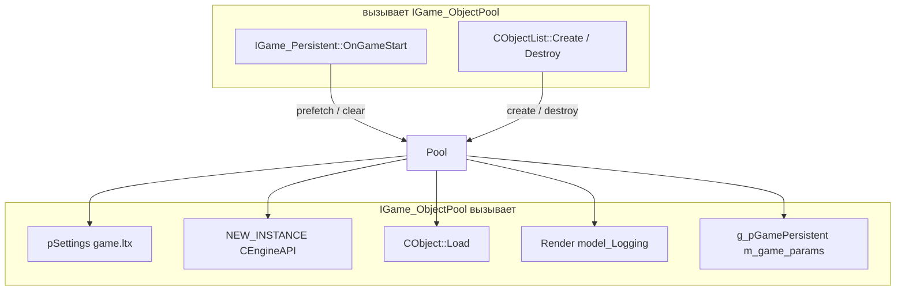
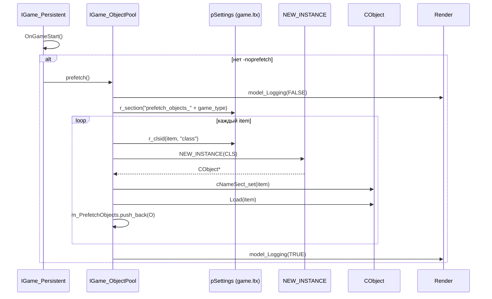
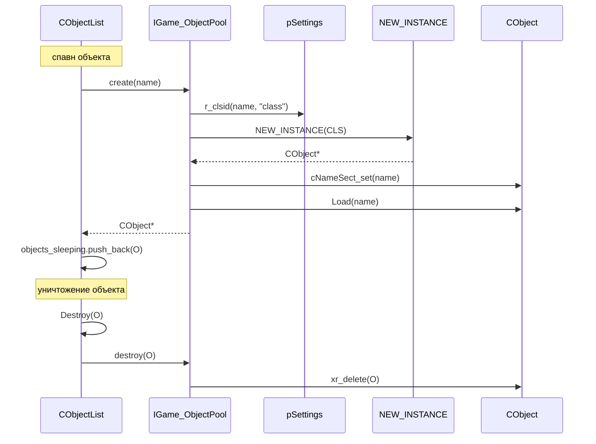

# Пул объектов

`IGame_ObjectPool` — фабрика/«предзагрузка» объектов уровня. В реальности — **не пул** (старый пул закомментирован в `IGame_ObjectPool.cpp`), а:

1. **Фабрика**: `create(name)` — читает `CLASS_ID` из `game.ltx`, `NEW_INSTANCE(CLS)`, `Load(name)`.
2. **Prefetch**: `prefetch()` — при старте игры создаёт объекты из секции `prefetch_objects_<game_type>`, чтобы при первом спавне не было пика загрузки моделей/текстур.

Чего это **НЕ делает**: не хранит «свободные» объекты для повторного использования (это закомментировано), не управляет жизненным циклом (это `CObjectList`), не знает про сеть.

## Место в архитектуре



- **`IGame_ObjectPool`** — вложен в `IGame_Persistent` (поле `ObjectPool`), не в `IGame_Level`.
- **`CObjectList::Create`** — единственный потребитель `create()`; `CObjectList::Destroy` — единственный потребитель `destroy()`.
- **Prefetch** — вызывается `IGame_Persistent::OnGameStart` → `Prefetch()` (если нет `-noprefetch`).

См. [Объект](xr-object.md), [Persistent](persistent.md), [Уровень](level.md).

## Публичный API

### `IGame_ObjectPool` (`src/xrEngine/IGame_ObjectPool.h`)

| Метод                 | Назначение                                                                            |
| --------------------- | ------------------------------------------------------------------------------------- |
| `create(LPCSTR name)` | `r_clsid(name, "class")` → `NEW_INSTANCE(CLS)` → `cNameSect_set(name)` → `Load(name)` |
| `destroy(CObject* O)` | `xr_delete(O)`                                                                        |
| `prefetch()`          | создать объекты из `prefetch_objects_<game_type>`                                     |
| `clear()`             | `xr_delete` всех в `m_PrefetchObjects`, очистить вектор                               |

Поля:

- `m_PrefetchObjects` — `xr_vector<CObject*>`, объекты, созданные `prefetch()`.

## Внутреннее устройство

### `create(LPCSTR name)`

```cpp
CLASS_ID CLS = pSettings->r_clsid(name, "class");  // game.ltx
CObject* O = (CObject*)NEW_INSTANCE(CLS);
O->cNameSect_set(name);
O->Load(name);  // читает visual, cform и т.д. из секции name
return O;
```

- `name` — секция в `game.ltx` (не имя объекта, а **секцию-прототип**).
- `NEW_INSTANCE(CLS)` — фабрика `CEngineAPI` (см. [API](api.md)).
- `Load(name)` — `CObject::Load`: читает `visual`, `cform`, `bullet_check_visual`.

### `destroy(CObject* O)`

Просто `xr_delete(O)`. Старая реализация (закомментирована) возвращала объект в `map_POOL` для повторного использования; сейчас — полное уничтожение.

### `prefetch()`

1. `R_ASSERT(m_PrefetchObjects.empty())`.
2. `::Render->model_Logging(FALSE)` — отключить лог рендера.
3. Секция: `"prefetch_objects_" + g_pGamePersistent->m_game_params.m_game_type`.
4. Для каждого item в секции: `r_clsid(item.first, "class")` → `NEW_INSTANCE` → `Load` → push в `m_PrefetchObjects`.
5. `::Render->model_Logging(TRUE)`.

**Зачем**: при первом спавне объекта движок должен загрузить `.ogf`, текстуры, шейдеры — это пик. Prefetch создаёт **один** экземпляр каждого типа при старте игры, чтобы рендер-слой закэшировал ресурсы. Объекты **не** идут в `CObjectList` — они просто живут в `m_PrefetchObjects` до `clear()`.

### `clear()`

`xr_delete` каждого в `m_PrefetchObjects`, `m_PrefetchObjects.clear()`. Вызывается при смене типа игры (`OnGameEnd`).

### Закомментированный пул

В `IGame_ObjectPool.cpp` (строки 66–140) — старая реализация с `xr_multimap<shared_str, CObject*>`:

- `prefetch` — создавал `count` экземпляров (из значения item в секции).
- `create` — искал в `map_POOL` по имени секции; если найден — доставал из пула, если нет — создавал.
- `destroy` — возвращал в `map_POOL`.

Сейчас **не используется**: `create` всегда создаёт новый, `destroy` всегда `xr_delete`.

## Взаимодействие



**Кто вызывает меня**:

- `IGame_Persistent::OnGameStart` → `Prefetch()` → `ObjectPool.prefetch()`.
- `IGame_Persistent::OnGameEnd` → `ObjectPool.clear()`.
- `CObjectList::Create(name)` → `g_pGamePersistent->ObjectPool.create(name)`.
- `CObjectList::Destroy(O)` → `g_pGamePersistent->ObjectPool.destroy(O)`.

**Кого вызываю я**:

- `pSettings` (`CInifile`) — `r_clsid(name, "class")`.
- `NEW_INSTANCE(CLS)` — фабрика `CEngineAPI` (см. [API](api.md)).
- `CObject::Load(name)`.
- `::Render->model_Logging` (prefetch).
- `g_pGamePersistent->m_game_params.m_game_type` (prefetch: имя секции).

## Потоки данных

### Prefetch при старте игры



### Create / Destroy (кадр)



## Конфигурация

- **`game.ltx`** — секции объектов:
  - `class = <GUID>` — `CLASS_ID` (обязателен для `create`).
  - `visual = <.ogf>` — модель (в `CObject::Load`).
  - `cform` — наличие строки (в `CObject::net_Spawn`).
- **`prefetch_objects_<game_type>`** (в `game.ltx`) — секция для `prefetch()`: каждый item — имя секции объекта (значение item **игнорируется** в текущей реализации; в закомментированной — было `count`).
- **`m_game_params.m_game_type`** — тип игры (из командной строки, `params::parse_cmd_line`); определяет имя секции prefetch.

## Известные ограничения / дебаг

- **Не пул** — старая реализация (закомментирована в `IGame_ObjectPool.cpp`, строки 66–140) возвращала объекты в `map_POOL` для повторного использования. Сейчас `destroy` = `xr_delete`, `create` = всегда новый.
- **`prefetch` не создаёт «свободные» объекты** — `m_PrefetchObjects` — это просто список созданных объектов; они **не** в `CObjectList`, **не** в `g_SpatialSpace`, **не** в `CSheduler`. Они существуют только для кэширования ресурсов рендером.
- **`create` не кэширует** — каждый вызов создаёт новый `CObject`; если нужно 100 одинаковых объектов — 100 `NEW_INSTANCE`.
- **`m_PrefetchObjects`** — не ограничено по размеру; зависит от секции в `game.ltx`.
- **`prefetch` при `R_ASSERT(m_PrefetchObjects.empty())`** — если вызвать дважды без `clear` → assert.
- **`destroy` не проверяет, что объект в `m_PrefetchObjects`** — `xr_delete` любого `CObject*`.
- **`IGame_ObjectPool` не имеет виртуальных методов** — не наследуется (в `xrGame` нет `CObjectPool`).
- **`IGame_ObjectPool` в `IGame_Persistent`** (не в `IGame_Level`) — потому что prefetch при старте игры, а не при загрузке уровня.
- **Закомментированный код** — 75 строк (66–140) в `IGame_ObjectPool.cpp`; не удалять, пока не решено, нужен ли пул.
- **`prefetch` не зависит от уровня** — объекты создаются при `OnGameStart`, до `Load` любого уровня.
- **`create` не проверяет `name`** — если секция нет в `game.ltx` → `r_clsid` вернёт 0 → `NEW_INSTANCE(0)` → UB.
- **`model_Logging`** — отключает лог рендера на время prefetch (чтобы не засорять лог 100+ моделями).
