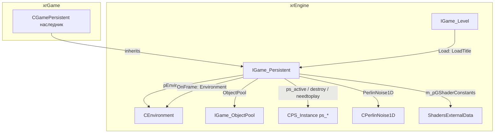
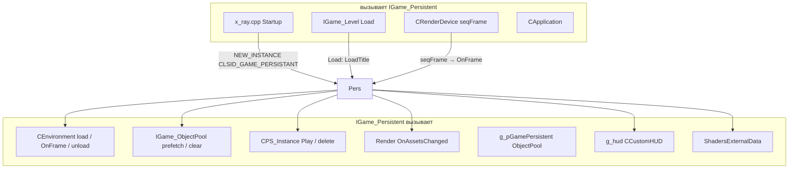
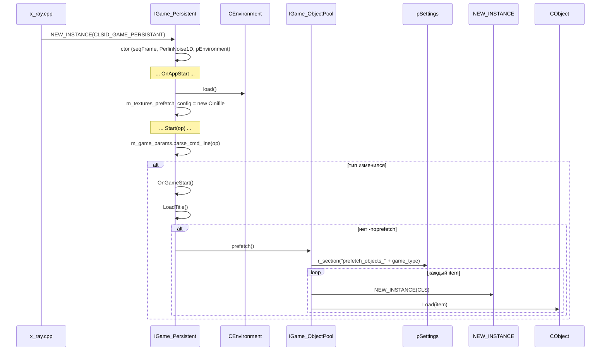
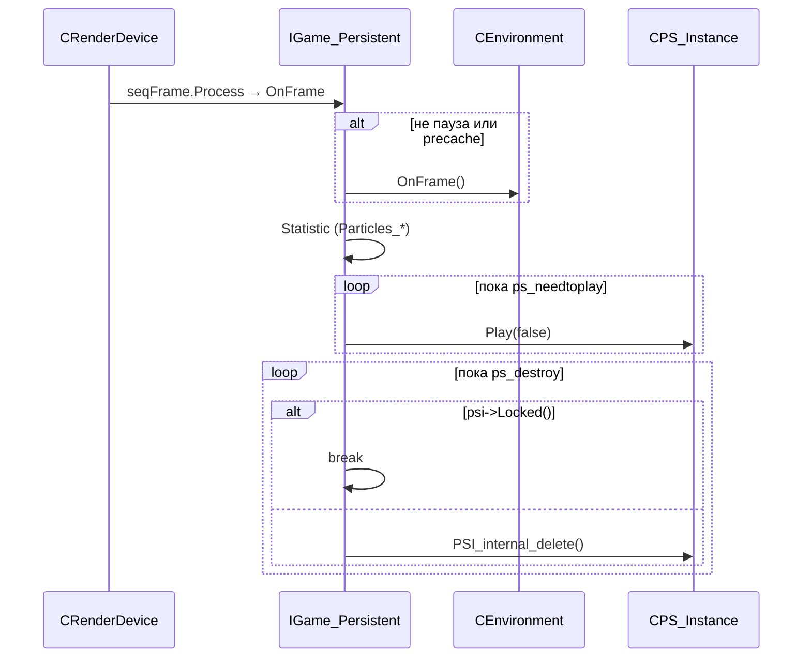

# Persistent

`IGame_Persistent` — **персистентный слой** приложения: то, что переживает смену уровней и типов игры. Владеет `CEnvironment` (небо, свет, погода), `IGame_ObjectPool`, партиклами (`CPS_Instance`), `CPerlinNoise1D` (трава), shader-константами (`ShadersExternalData`), main-menu, wallmarks.

Жизненный цикл: создаётся один раз при старте (`NEW_INSTANCE(CLSID_GAME_PERSISTANT)`), живёт до `OnAppEnd`. Регистрируется в `Device.seqAppStart/End`, `seqFrame` (приоритет `REG_PRIORITY_HIGH + 1`), `seqAppActivate/Deactivate`.

Чего это **НЕ делает**: не хранит уровень (это `IGame_Level`), не управляет объектами уровня (это `CObjectList`), не реализует сетевой протокол (это `CLevel` в xrGame). В `xrGame` — `CGamePersistent` (наследник).

## Место в архитектуре



- **`IGame_Persistent`** — «каркас» персистентного состояния: окружение, пул, партиклы, трава.
- **`CGamePersistent`** (xrGame) — реальная реализация: ambient-эффекты, DoF, intro, UI, `OnThunderboltSound/OnRainSound`.
- **`g_pGamePersistent`** — глобальный указатель, устанавливается в `x_ray.cpp` при старте.

См. [Карта модулей](../../architecture/module-map.md), [Окружение](environment.md), [Пул объектов](object-pool.md), [Уровень](level.md), [Ядро](engine.md).

## Публичный API

### `IGame_Persistent` (`src/xrEngine/IGame_Persistent.h`)

| Группа         | Методы / поля                                                                                                                                                                                                                |
| -------------- | ---------------------------------------------------------------------------------------------------------------------------------------------------------------------------------------------------------------------------- |
| Параметры игры | `m_game_params` (union: `m_game_or_spawn`, `m_game_type`, `m_alife`, `m_new_or_load`, `m_e_game_type`), `GameType()`                                                                                                         |
| Партиклы       | `ps_active` (xr_set), `ps_destroy` (xr_vector), `ps_needtoplay` (xr_vector), `destroy_particles(bool all)`                                                                                                                   |
| Трава          | `GrassBendersUpdateAnimations`, `GrassBendersAddExplosion/Shot`, `GrassBendersRemoveById/Index`, `GrassBendersUpdate`, `GrassBendersReset`, `GrassBendersSet`, `GrassBenderToValue`, `grass_shader_data` (struct, 16 слотов) |
| Perlin         | `PerlinNoise1D` (`CPerlinNoise1D*`)                                                                                                                                                                                          |
| Окружение      | `pEnvironment` (`CEnvironment*`), `Environment()`, `Prefetch()`                                                                                                                                                              |
| UI             | `m_pMainMenu`, `m_pWallmarksManager`, `GetWallmarksManager()`, `AttachmentUIsToRender`                                                                                                                                       |
| Shader         | `m_pGShaderConstants` (`ShadersExternalData*`), `OnAssetsChanged`                                                                                                                                                            |
| Пост-обработка | `OnRenderPPUI_query/main/PP`                                                                                                                                                                                                 |
| Жизненный цикл | `PreStart(op)`, `Start(op)`, `Disconnect()`, `OnAppStart/End/Activate/Deactivate`, `_BCL OnFrame()`, `OnGameStart/End`, `UpdateGameType()`, `OnSectorChanged(int)`, `OnAssetsChanged()`                                      |
| Модель         | `RegisterModel(IRenderVisual*)` (чистая), `MtlTransparent(u32)` (чистая)                                                                                                                                                     |
| Актор          | `actor_data` (struct: health, stamina, bleeding, helmet)                                                                                                                                                                     |
| PDA/NV         | `pda_shader_data`, `nv_shader_data`                                                                                                                                                                                          |
| DoF            | `GetCurrentDof(Fvector3&)`, `SetBaseDof(Fvector3 const&)`                                                                                                                                                                    |
| Звук           | `OnThunderboltSound(file, dist)`, `OnRainSound(file)` (виртуальные, по умолчанию 1.0)                                                                                                                                        |
| Прочее         | `Statistics(CGameFont*)` (чистая), `LoadTitle(bool, shared_str)`, `CanBePaused()`, `ImGui_OnRender(name)`                                                                                                                    |

### `params` (union в `IGame_Persistent`)

```cpp
union params {
    struct {
        string256 m_game_or_spawn;  // параметр 1
        string256 m_game_type;      // параметр 2 (single/coop/deathmatch/...)
        string256 m_alife;          // параметр 3
        string256 m_new_or_load;    // параметр 4
        EGameIDs m_e_game_type;     // числовой тип
    };
    string256 m_params[4];
    void parse_cmd_line(LPCSTR);    // split по '/', tolower
    void reset();
};
```

### `IMainMenu` (interface)

```cpp
class IMainMenu {
    virtual void Activate(bool) = 0;
    virtual bool IsActive() = 0;
    virtual bool CanSkipSceneRendering() = 0;
    virtual void DestroyInternal(bool bForce) = 0;
};
```

Глобалы: `g_pGamePersistent` (`IGame_Persistent*`), `g_dedicated_server` (`bool`), `IsMainMenuActive()` (inline).

## Внутреннее устройство

### Конструктор

```cpp
IGame_Persistent::IGame_Persistent() {
    RDEVICE.seqAppStart.Add(this);
    RDEVICE.seqAppEnd.Add(this);
    RDEVICE.seqFrame.Add(this, REG_PRIORITY_HIGH + 1);  // до CApplication (REG_PRIORITY_HIGH + 1000)
    RDEVICE.seqAppActivate.Add(this);
    RDEVICE.seqAppDeactivate.Add(this);
    m_pGShaderConstants = new ShadersExternalData();
    m_pMainMenu = NULL;
    PerlinNoise1D = xr_new<CPerlinNoise1D>(Random.randI(0, 0xFFFF));
    PerlinNoise1D->SetOctaves(2);
    PerlinNoise1D->SetAmplitude(0.66666f);
    pEnvironment = xr_new<CEnvironment>();  // или editor::environment::manager
}
```

- Приоритет `REG_PRIORITY_HIGH + 1` — **до** `CApplication` (`+1000`), но **после** остальных `HIGH`.
- `CPerlinNoise1D` — для анимации травы (`grass_shader_data`), seed случайный.

### `OnAppStart` / `OnAppEnd`

- `OnAppStart`: `Environment().load()`, загрузить `$game_config$/prefetch/textures.ltx` (конфиг префетча текстур).
- `OnAppEnd`: `Environment().unload()`, `OnGameEnd()`, `DEL_INSTANCE(g_hud)`.

### `PreStart(op)` / `Start(op)`

- `PreStart`: распарсить `op` (командную строку), если тип игры изменился → `OnGameEnd()`.
- `Start`: распарсить `op`, если тип изменился:
  - Если новый тип не пуст → `OnGameStart()` (prefetch).
  - `DEL_INSTANCE(g_hud)` (создать новый HUD под новый тип).
  - Иначе → `UpdateGameType()`.
- `VERIFY(ps_destroy.empty())`.

### `Disconnect`

- `destroy_particles(true)` — удалить все партиклы.
- `DEL_INSTANCE(g_hud)`.

### `OnGameStart`

- `LoadTitle()`.
- Если нет `-noprefetch` → `Prefetch()`.

### `Prefetch`

Загрузка текстур/моделей перед игрой:

1. Таймер, `mem_0`.
2. `loadFileFolder` — загрузить все файлы из папки (`.ogf`, `.tga`, ...).
3. Секции `prefetch_textures_*` (из `m_textures_prefetch_config`).
4. Статистика: время, память.

(Реализация — 75 строк, `src/xrEngine/IGame_Persistent.cpp` L178–252.)

### `OnFrame`

```cpp
if (!Device.Paused() || Device.dwPrecacheFrame)
    Environment().OnFrame();

// Статистика
Device.Statistic->Particles_starting = ps_needtoplay.size();
Device.Statistic->Particles_active = ps_active.size();
Device.Statistic->Particles_destroy = ps_destroy.size();

// Play
while (ps_needtoplay.size()) {
    CPS_Instance* psi = ps_needtoplay.back();
    ps_needtoplay.pop_back();
    psi->Play(false);
}

// Destroy
while (ps_destroy.size()) {
    CPS_Instance* psi = ps_destroy.back();
    if (psi->Locked()) break;  // заблокирован — не удалять
    ps_destroy.pop_back();
    psi->PSI_internal_delete();
}
```

### `destroy_particles(bool all)`

- Очистить `ps_needtoplay`.
- Удалить все в `ps_destroy` (без `Locked` проверки).
- Если `all` — удалить все в `ps_active`.
- Иначе — удалить только те, что **не** `destroy_on_game_load()`.

### `GrassBenders*` (трава)

16 слотов в `grass_shader_data`:

- `index`, `anim[16]` (enum: `BENDER_ANIM_EXPLOSION/DEFAULT/WAVY/SUCK/BLOW/PULSE`), `id[16]`, `pos[16]`, `dir[16]`, `radius[16]`, `radius_curr[16]`, `str[16]`, `str_target[16]`, `time[16]`, `fade[16]`, `speed[16]`, `prev_pos[16]`, `prev_dir[16]`.

Методы:

- `GrassBendersSet(idx, id, pos, dir, fade, speed, str, radius, anim, resetTime)` — установить слот.
- `GrassBendersUpdate(id, data_idx, data_frame, pos, radius, str, CheckDistance)` — обновить.
- `GrassBendersAddExplosion/Shot` — добавить эффект.
- `GrassBendersRemoveById/Index` — удалить.
- `GrassBendersUpdateAnimations` — анимация всех слотов.
- `GrassBenderToValue(current, go_to, intensity, use_easing)` — интерполяция.

Данные передаются в shader через `ps_ssfx_grass_interactive` (extern `Fvector4`).

### `OnAssetsChanged`

`Device.m_pRender->OnAssetsChanged()` — пересчитать ресурсы (текстуры, шейдеры) после смены ассетов.

### `CGamePersistent` (xrGame, наследник)

Добавляет:

- `ambient_particles` (`CParticlesObject*`), `ambient_sound_next_time[32]`, `ambient_effect_*`.
- `m_dof[4]` (dest, current, from, original), `m_bPickableDOF`.
- `m_intro` (`CUISequencer*`), `eQuickLoad`, `eDemoStart`.
- `m_pUI_core` (`ui_core*`), `pDemoFile`.
- `WeathersUpdate`, `UpdateDof`.
- `OnEvent(EVENT, u64, u64)` — событийная шина.
- `OnThunderboltSound/OnRainSound` — спрашивают Lua.
- `SetPickableEffectorDOF/SetEffectorDOF/RestoreEffectorDOF`.

## Взаимодействие



**Кто вызывает меня**:

- `x_ray.cpp` (`Startup`) — `NEW_INSTANCE(CLSID_GAME_PERSISTANT)` → `g_pGamePersistent`.
- `IGame_Level::Load` — `LoadTitle()`, `Environment().mods_load()`.
- `CRenderDevice` — `seqFrame.Process` → `OnFrame` каждый кадр.
- `CApplication` — `seqAppStart/End` → `OnAppStart/End`.
- `xrGame` (`CLevel`, `CGamePersistent`) — `PreStart/Start/Disconnect`, `RegisterModel`, `MtlTransparent`, `Statistics`.

**Кого вызываю я**:

- `CEnvironment` — `load/unload/OnFrame/mods_load`.
- `IGame_ObjectPool` — `prefetch/clear` (через `OnGameStart/OnGameEnd`).
- `CPS_Instance` — `Play`, `PSI_internal_delete` (партиклы).
- `Device.m_pRender` — `OnAssetsChanged`.
- `g_hud` — `DEL_INSTANCE` (создание/уничтожение HUD).
- `ShadersExternalData` — shader-константы.
- `CPerlinNoise1D` — трава.

## Потоки данных

### Старт игры



### OnFrame (кадр)



## Конфигурация

- **`game.ltx`** — `prefetch_objects_<game_type>` (см. [Пул объектов](object-pool.md)).
- **`$game_config$/prefetch/textures.ltx`** — конфиг префетча текстур (загружается `OnAppStart`).
- **Командная строка** — `params::parse_cmd_line`: 4 параметра через `/`:
  - `m_game_or_spawn` — game/spawn.
  - `m_game_type` — single/coop/deathmatch/... (определяет `EGameIDs`).
  - `m_alife` — ALIFE-параметр.
  - `m_new_or_load` — new/load.
- **`-noprefetch`** (в `Core.Params`) — отключает `Prefetch()` в `OnGameStart`.
- **`-nes_texture_storing`** (в `Core.Params`) — в `IGame_Level::~IGame_Level` (не здесь, но связан).

## Известные ограничения / дебаг

- **`IGame_Persistent` не владеет уровнем** — уровень (`IGame_Level`) создаётся/уничтожается отдельно; `Persistent` живёт дольше.
- **`g_pGamePersistent`** — устанавливается в `x_ray.cpp`, **не** в конструкторе (в отличие от `g_pGameLevel`).
- **`OnFrame`** — приоритет `REG_PRIORITY_HIGH + 1`; **до** `CApplication` (`+1000`), но **после** других `HIGH`.
- **`ps_destroy`** — если `CPS_Instance::Locked()` → `break` (не удалить); заблокированный партикл останется до разблокировки.
- **`destroy_particles(false)`** — удаляет только те, что **не** `destroy_on_game_load()`; «важные» партиклы переживают загрузку.
- **`GrassBenders*`** — 16 слотов (фиксировано); если больше эффектов → перезапись.
- **`params::parse_cmd_line`** — `_min(4, _GetItemCount)`; больше 4 параметров игнорируются.
- **`m_game_params`** — `string256` (4×256 = 1КБ в union); не для больших строк.
- **`CGamePersistent`** (xrGame) — переопределяет почти всё; база (`IGame_Persistent`) — только каркас.
- **`RegisterModel` / `MtlTransparent` / `Statistics`** — чистые в базе; в `xrGame` реализованы в `CGamePersistent`.
- **`OnThunderboltSound` / `OnRainSound`** — виртуальные, по умолчанию `1.0f`; в `CGamePersistent` спрашивают Lua.
- **`PerlinNoise1D`** — seed случайный (`Random.randI(0, 0xFFFF)`); трава не детерминирована.
- **`pEnvironment`** — `xr_new<CEnvironment>()` в конструкторе; в `INGAME_EDITOR` — `editor::environment::manager`.
- **`m_textures_prefetch_config`** — `VERIFY(m_textures_prefetch_config)` в деструкторе; если `OnAppStart` не вызван → assert.
- **`IGame_Persistent` не имеет `IEventReceiver`** — события обрабатываются в `CGamePersistent` (xrGame).
- **`g_dedicated_server`** — глобал, устанавливается в `x_ray.cpp`; влияет на `OnRender` (IGame_Level) и `Prefetch`.
- **`IsMainMenuActive()`** — inline, проверяет `m_pMainMenu->IsActive()`; `m_pMainMenu` может быть `NULL` (проверка `&&`).
- **`actor_data`** — struct в базе, заполняется в `CGamePersistent`; не сериализуется.
- **`pda_shader_data` / `nv_shader_data`** — struct в базе, передаются в shader; не сериализуются.
- **`OnRenderPPUI_query`** — по умолчанию `FALSE`; если `TRUE` → вызываются `OnRenderPPUI_main` и `OnRenderPPUI_PP`.
- **`CanBePaused()`** — по умолчанию `true`; переопределяется в `CGamePersistent` (например, `false` в intro).
- **`LoadTitle`** — по умолчанию пустой; в `CGamePersistent` — загрузочный экран.
- **`OnSectorChanged`** — по умолчанию пустой; в `CGamePersistent` — пересчёт эффектов при смене сектора.
- **`OnAssetsChanged`** — в базе вызывает `Device.m_pRender->OnAssetsChanged()`; в `CGamePersistent` переопределён.
- **`ImGui_OnRender`** — по умолчанию пустой; в `CGamePersistent` — ImGui-отрисовка.
- **`UpdateGameType`** — по умолчанию пустой; в `CGamePersistent` — пересчёт при смене типа (без `OnGameStart`).
- **`SetBaseDof` / `GetCurrentDof`** — по умолчанию пустой / `(-1.4, 0, 250)`; в `CGamePersistent` — реальный DoF.
- **`OnAppActivate` / `OnAppDeactivate`** — по умолчанию пустые; в `CGamePersistent` — пауза/резюм.
- **`Disconnect`** — в базе: `destroy_particles(true)` + `DEL_INSTANCE(g_hud)`; в `CGamePersistent` — расширено.
- **`PreStart`** — в базе: распарсить, `OnGameEnd` при смене типа; в `CGamePersistent` — расширено.
- **`Start`** — в базе: распарсить, `OnGameStart` при смене типа; в `CGamePersistent` — расширено.
- **`OnAppStart`** — в базе: `Environment().load()` + `m_textures_prefetch_config`; в `CGamePersistent` — расширено (ambient, intro).
- **`OnAppEnd`** — в базе: `Environment().unload()` + `OnGameEnd` + `DEL_INSTANCE(g_hud)`; в `CGamePersistent` — расширено.
- **`OnGameStart`** — в базе: `LoadTitle` + `Prefetch`; в `CGamePersistent` — расширено.
- **`OnGameEnd`** — в базе: `ObjectPool.clear()`; в `CGamePersistent` — расширено.
- **`OnFrame`** — в базе: `Environment().OnFrame` + партиклы; в `CGamePersistent` — расширено (ambient, DoF, weather).
- **`IGame_Persistent`** — не `DLL_Pure` при `#ifdef _EDITOR` (см. `#ifndef _EDITOR` в `#include`); в редакторе — не чистый.
- **`IGame_Persistent`** — не `IEventReceiver` (в базе); события — в `CGamePersistent`.
- **`IGame_Persistent`** — не `ISheduled` (не в `CSheduler`); обновляется через `seqFrame`.
- **`IGame_Persistent`** — не `IRenderable` (не рендерится), не `ISpatial`, не `ICollidable`, не `IInputReceiver`, не `pureRender`.
- **`IGame_Persistent`** — `pureAppStart/End/Activate/Deactivate/Frame` (5 регистраторов) + `DLL_Pure` (кроме `_EDITOR`).
