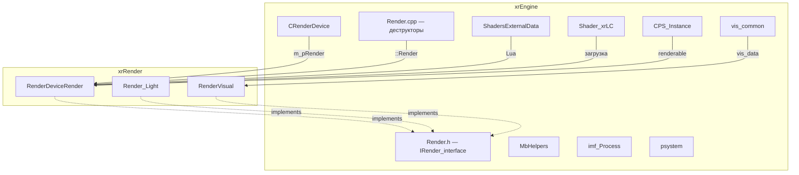
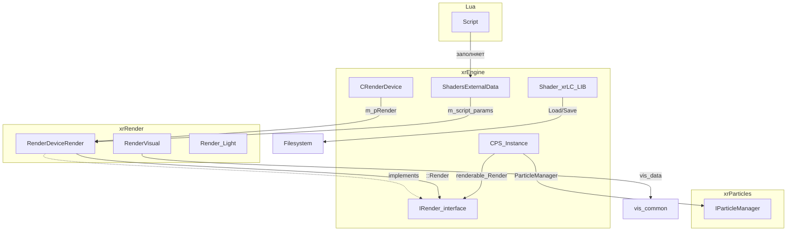
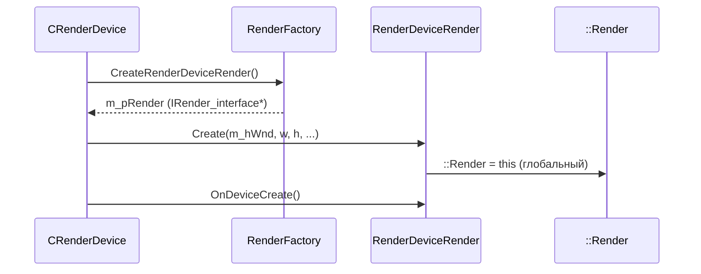
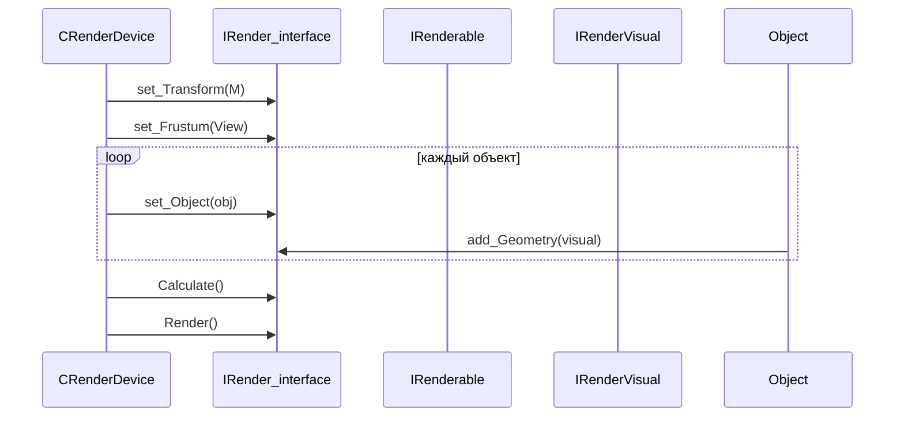
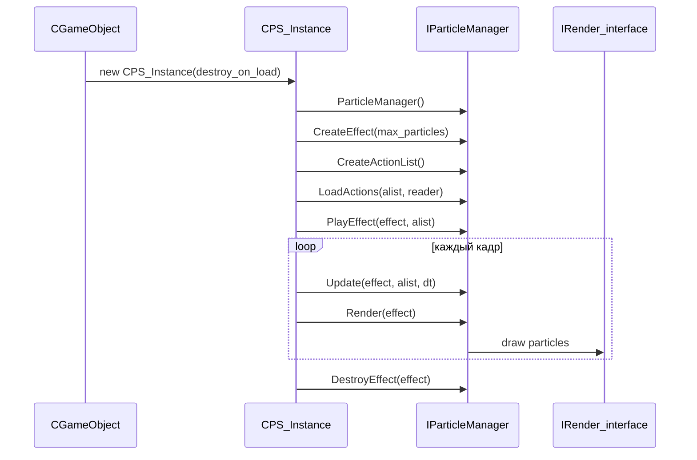

# Рендер-слой

`Render.h/.cpp` — контракт между `xrEngine` и конкретным рендерером (`xrRender`), плюс вспомогательные структуры: `ShadersExternalData`, `Shader_xrLC`, `vis_common`, `MbHelpers`, `xrImage_Resampler`, `psystem`.

## Ответственность

- Определить интерфейс `IRender_interface` — единственную точку, через которую `xrEngine` обращается к рендереру (модели, свет, тачка, скриншоты, occlusion, расчёт/рендер).
- Определить ресурсы рендера: `IRender_Light`, `IRender_Glow`, `IRender_ObjectSpecific`, `IRender_Portal`, `IRender_Sector`, `IRender_Target`.
- Держать вспомогательные структуры, общие для всех рендереров: `ShadersExternalData` (параметры, читаемые из Lua), `Shader_xrLC` (библиотека шейдерных описаний), `vis_data` (bounding volume + метки кадров), `CPS_Instance` (база для частиц).
- Предоставлять CPU-утилиты: `mbhMulti2Wide` (UTF-8→UTF-16), `imf_Process` (фильтрованное ресэмплирование изображений).

## Место в архитектуре



`xrEngine` **не знает** реализации рендерера. Конкретный рендерер (R1..R4, выбирается `STATIC_RENDERER_R*` в `defines.h`) реализует `IRender_interface` и регистрируется через `RenderFactory->CreateRenderDeviceRender()` (см. [Device](device.md)). Глобальный указатель `::Render` (типа `IRender_interface*`) устанавливается `xrRender` и используется из `Render.cpp` в деструкторах `IRender_Light`/`IRender_Glow`.

## Публичный API

### `IRender_interface`

```cpp
// Render.h
class ENGINE_API IRender_interface
{
public:
    enum GenerationLevel { GENERATION_R1=81, GENERATION_DX81=81, GENERATION_R2=90, GENERATION_DX90=90 };
    enum ScreenshotMode { SM_NORMAL=0, SM_FOR_CUBEMAP=1, SM_FOR_GAMESAVE=2, SM_FOR_LEVELMAP=3, SM_FOR_MPSENDING=4 };
    enum RRT { rtPDA=1, rtSVP };
    enum DxEncoding { eDXE_A8R8G8B8=0, eDXE_DXT1=1, eDXE_DXT5=2, eDXE_BC7=3, eDXE_undefined=4 };

    bool hud_loading;
    s32 m_skinning;
    s32 m_MSAASample;
    CFrustum ViewBase;
    CFrustum* View;

    // Feature level
    virtual GenerationLevel get_generation() = 0;
    virtual bool is_sun_static() = 0;
    virtual DWORD get_dx_level() = 0;

    // Loading / Unloading
    virtual void create() = 0;
    virtual void destroy() = 0;
    virtual void reset_begin() = 0;
    virtual void reset_end() = 0;
    virtual void level_Load(IReader*) = 0;
    virtual void level_Unload() = 0;
    virtual HRESULT shader_compile(LPCSTR name, DWORD const* pSrcData, UINT SrcDataLen,
                                   LPCSTR pFunctionName, LPCSTR pTarget, DWORD Flags, void*& result) = 0;

    // Information
    virtual void Statistics(CGameFont* F) {}
    virtual LPCSTR getShaderPath() = 0;
    virtual IRender_Sector* getSector(int id) = 0;
    virtual IRenderVisual* getVisual(int id) = 0;
    virtual IRender_Sector* detectSector(const Fvector& P) = 0;
    virtual IRender_Target* getTarget() = 0;

    // Main
    IC void set_Frustum(CFrustum* O) { VERIFY(O); View = O; }
    virtual void set_Transform(Fmatrix* M) = 0;
    virtual void set_HUD(BOOL V) = 0;
    virtual BOOL get_HUD() = 0;
    virtual void set_CamAttached(BOOL V) = 0;
    virtual BOOL get_CamAttached() = 0;
    virtual void set_Invisible(BOOL V) = 0;
    virtual void flush() = 0;
    virtual void set_Object(IRenderable* O) = 0;
    virtual void add_Occluder(Fbox2& bb_screenspace) = 0;
    virtual void add_Visual(IRenderVisual* V) = 0;   // no culling
    virtual void add_Geometry(IRenderVisual* V) = 0; // all culling

    // Wallmarks
    virtual void add_StaticWallmark(const wm_shader& S, const Fvector& P, float s, CDB::TRI* T, Fvector* V) = 0;
    virtual void add_StaticWallmark(IWallMarkArray* pArray, const Fvector& P, float s, CDB::TRI* T, Fvector* V,
                                    float ttl=0.f, bool ignore_opt=false, bool random_rotation=true) = 0;
    virtual void add_StaticWallmark(IWallMarkArray* pArray, const Fvector& P, float s, CDB::TRI* T, Fvector* V,
                                    float ttl, bool ignore_opt, float rotation) = 0;
    virtual void clear_static_wallmarks() = 0;
    virtual void add_SkeletonWallmark(const Fmatrix* xf, IKinematics* obj, IWallMarkArray* pArray,
                                      const Fvector& start, const Fvector& dir, float size,
                                      float ttl=0.f, bool ignore_opt=false) = 0;

    // Object-specific
    virtual IRender_ObjectSpecific* ros_create(IRenderable* parent) = 0;
    virtual void ros_destroy(IRender_ObjectSpecific*&) = 0;

    // Lighting / glow
    virtual IRender_Light* light_create() = 0;
    virtual void light_destroy(IRender_Light* p_) {};
    virtual IRender_Glow* glow_create() = 0;
    virtual void glow_destroy(IRender_Glow* p_) {};

    // Models
    virtual IRenderVisual* model_CreateParticles(LPCSTR name) = 0;
    virtual IRenderVisual* model_Create(LPCSTR name, IReader* data=0) = 0;
    virtual IRenderVisual* model_CreateChild(LPCSTR name, IReader* data) = 0;
    virtual IRenderVisual* model_Duplicate(IRenderVisual* V) = 0;
    virtual void model_Delete(IRenderVisual*& V, BOOL bDiscard=FALSE) = 0;
    virtual void model_Logging(BOOL bEnable) = 0;
    virtual void models_Prefetch() = 0;
    virtual void models_PrefetchOne(LPCSTR name, bool assert=true) = 0;
    virtual void models_Clear(BOOL b_complete) = 0;
    virtual bool models_Exists(LPCSTR name) = 0;

    // Sun (antglobes)
    virtual Fvector GetSunPosition() { static Fvector default_pos; return default_pos; }
    virtual Fcolor GetSunColor() { static Fcolor default_color; return default_color; }
    virtual float GetSunIntensity() { static float default_intensity; return default_intensity; }
    virtual bool IsSun() { static bool is_sun_visible; return is_sun_visible; }

    // Screenshot
    virtual void TakeScreenshot(LPCSTR path, Fvector2 dimensions, DxEncoding encoding=eDXE_A8R8G8B8) = 0;
    virtual void Screenshot(ScreenshotMode mode=SM_NORMAL, LPCSTR name=0) = 0;
    virtual void Screenshot(ScreenshotMode mode, CMemoryWriter& memory_writer) = 0;
    virtual void ScreenshotAsyncBegin() = 0;
    virtual void ScreenshotAsyncEnd(CMemoryWriter& memory_writer) = 0;
    protected:
    virtual void ScreenshotImpl(ScreenshotMode mode, LPCSTR name, CMemoryWriter* memory_writer) = 0;

    // Particles
    virtual void ExportParticles() {}
    virtual void ImportParticles() {}

    // Render mode
    virtual void rmNear() = 0;
    virtual void rmFar() = 0;
    virtual void rmNormal() = 0;
    virtual u32 memory_usage() = 0;
    virtual u32 active_phase() = 0;
    virtual void RenderToTarget(RRT target) = 0;

    // Occlusion culling
    virtual BOOL occ_visible(vis_data& V) = 0;
    virtual BOOL occ_visible(Fbox& B) = 0;
    virtual BOOL occ_visible(sPoly& P) = 0;

    // Main
    virtual void Calculate() = 0;
    virtual void Render() = 0;

    virtual ~IRender_interface();
};
```

### `IRender_Light`

```cpp
class ENGINE_API IRender_Light : public xr_resource
{
public:
    enum LT { DIRECT=0, POINT=1, SPOT=2, OMNIPART=3, REFLECTED=4 };
    virtual void set_type(LT type) = 0;
    virtual void set_active(bool) = 0;
    virtual bool get_active() = 0;
    virtual void set_shadow(bool) = 0;
    virtual void set_volumetric(bool) = 0;
    virtual void set_volumetric_quality(float) = 0;
    virtual void set_volumetric_intensity(float) = 0;
    virtual void set_volumetric_distance(float) = 0;
    virtual void set_indirect(bool) {};
    virtual void set_position(const Fvector& P, const float eps=EPS) = 0;
    virtual void set_rotation(const Fvector& D, const Fvector& R, const float eps=EPS) = 0;
    virtual void set_cone(float angle) = 0;
    virtual void set_range(float R) = 0;
    virtual void set_virtual_size(float R) = 0;
    virtual void set_texture(LPCSTR name) = 0;
    virtual void set_color(const Fcolor& C) = 0;
    virtual void set_color(float r, float g, float b) = 0;
    virtual void set_hud_mode(bool b) = 0;
    virtual bool get_hud_mode() = 0;
    virtual void set_is_playerlight(bool b) = 0;
    virtual ~IRender_Light();   // → ::Render->light_destroy(this)
};
typedef resptr_core<IRender_Light, resptrcode_light> ref_light;
```

### `IRender_Glow`

```cpp
class ENGINE_API IRender_Glow : public xr_resource
{
public:
    virtual void set_active(bool) = 0;
    virtual bool get_active() = 0;
    virtual void set_position(const Fvector& P, const float eps=EPS_L) = 0;
    virtual void set_direction(const Fvector& P) = 0;
    virtual void set_radius(float R) = 0;
    virtual void set_texture(LPCSTR name) = 0;
    virtual void set_color(const Fcolor& C) = 0;
    virtual void set_color(float r, float g, float b) = 0;
    virtual ~IRender_Glow();   // → ::Render->glow_destroy(this)
};
typedef resptr_core<IRender_Glow, resptrcode_glow> ref_glow;
```

### `IRender_ObjectSpecific` (ROS)

```cpp
class ENGINE_API IRender_ObjectSpecific
{
public:
    enum mode { TRACE_LIGHTS=1<<0, TRACE_SUN=1<<1, TRACE_HEMI=1<<2, TRACE_ALL=TRACE_LIGHTS|TRACE_SUN|TRACE_HEMI };
    virtual void force_mode(u32 mode) = 0;
    virtual float get_luminocity() = 0;
    virtual float get_luminocity_hemi() = 0;
    virtual float* get_luminocity_hemi_cube() = 0;
    virtual ~IRender_ObjectSpecific() {};
};
```

### `IRender_Target`

```cpp
class ENGINE_API IRender_Target
{
public:
    virtual void set_blur(float f) = 0;
    virtual void set_gray(float f) = 0;
    virtual void set_duality_h(float f) = 0;
    virtual void set_duality_v(float f) = 0;
    virtual void set_noise(float f) = 0;
    virtual void set_noise_scale(float f) = 0;
    virtual void set_noise_fps(float f) = 0;
    virtual void set_color_base(u32 f) = 0;
    virtual void set_color_gray(u32 f) = 0;
    virtual void set_color_add(const Fvector& f) = 0;
    virtual u32 get_width() = 0;
    virtual u32 get_height() = 0;
    virtual void set_cm_imfluence(float f) = 0;
    virtual void set_cm_interpolate(float f) = 0;
    virtual void set_cm_textures(const shared_str& tex0, const shared_str& tex1) = 0;
    virtual ~IRender_Target() {};
};
```

`IRender_Portal` и `IRender_Sector` — пустые маркерные интерфейсы (только виртуальный деструктор).

### `CPS_Instance` (база частиц)

```cpp
// PS_instance.h
class ENGINE_API CPS_Instance : public ISpatial, public ISheduled, public IRenderable
{
    friend class IGame_Persistent;
private:
    bool m_destroy_on_game_load;
protected:
    int m_iLifeTime;
    BOOL m_bAutoRemove;
    BOOL m_bDead;
public:
    CPS_Instance(bool destroy_on_game_load);
    IC const bool& destroy_on_game_load() const { return m_destroy_on_game_load; }
    virtual void PSI_destroy();
    IC BOOL PSI_alive() { return m_iLifeTime > 0; }
    IC BOOL PSI_IsAutomatic() { return p_bAutoRemove; }
    IC void PSI_SetLifeTime(float life_time) { m_iLifeTime = iFloor(life_time * 1000); }
    virtual void Play(bool bHudMode) = 0;
    virtual BOOL Locked() { return FALSE; }
    virtual shared_str shedule_Name() const { return shared_str("particle_instance"); }
    virtual void shedule_Update(u32 dt);
    virtual IRenderable* dcast_Renderable() { return this; }
};
```

Механика жизненного цикла:

- Конструктор: `g_pGamePersistent->ps_active.insert(this)`, `renderable.pROS_Allowed = FALSE`, `m_iLifeTime = int_max`, `m_bAutoRemove = TRUE`.
- `shedule_Update(dt)`: удаляет `pROS` (частицы не используют ROS), вычитает `dt` из `m_iLifeTime`; если `m_bAutoRemove && m_iLifeTime <= 0` → `PSI_destroy()`.
- `PSI_destroy()`: ставит `m_bDead=TRUE`, `m_iLifeTime=0`, пушит `this` в `g_pGamePersistent->ps_destroy` (очередь отложенного удаления).
- `~CPS_Instance()`: `VERIFY(!g_bRendering)`, удаляет из `ps_active`, `VERIFY` что нет в `ps_destroy`, `spatial_unregister()`, `shedule_unregister()`.
- `PSI_internal_delete()`: `xr_delete(self)` — вызывается `IGame_Persistent` после `PSI_destroy()`.

### `ShadersExternalData`

```cpp
class ShadersExternalData
{
public:
    Fmatrix m_script_params;   // матрица, значения доступны из Lua
    Fvector4 hud_params;       // [zoom_rotate_factor, secondVP_zoom_factor, hud_fov, NULL]
    Fvector4 hud_fov_params;   // [scope_zoom_factor, min_scope_zoom_factor, NULL, NULL]
    Fvector4 m_blender_mode;   // x/y = [0=default, 1=night vision, 2=thermo vision, ...]
                                // w = [0=обычный рендер, 1=детальные объекты (трава, мусор)]
};
```

Читается в `Blender_Recorder_StandartBinding.cpp` (xrRender). Заполняется из Lua-скриптов.

### `Shader_xrLC` и `Shader_xrLC_LIB`

```cpp
struct Shader_xrLC
{
    enum { flCollision=1<<0, flRendering=1<<1, flOptimizeUV=1<<2,
           flLIGHT_Vertex=1<<3, flLIGHT_CastShadow=1<<4, flLIGHT_Sharp=1<<5 };
    struct Flags { u32 bCollision:1, bRendering:1, bOptimizeUV:1, bLIGHT_Vertex:1, bLIGHT_CastShadow:1, bLIGHT_Sharp:1; };

    char Name[128];
    union { Flags32 m_Flags; Flags flags; };
    float vert_translucency;   // default 0.5
    float vert_ambient;        // default 0.0
    float lm_density;          // default 1.0
};

class Shader_xrLC_LIB
{
    Shader_xrLCVec library;
public:
    void Load(LPCSTR name);       // бинарный файл, FATAL если не найден
    bool Save(LPCSTR name);
    void Unload();
    u32 GetID(LPCSTR name);       // stricmp, u32(-1) если нет
    Shader_xrLC* Get(LPCSTR name);
    Shader_xrLC* Get(int id);
    Shader_xrLC* Append(Shader_xrLC* parent=0);
    void Remove(LPCSTR name);
    void Remove(int id);
    Shader_xrLCVec& Library();
};
```

### `vis_data`

```cpp
// vis_common.h
#pragma pack(push,4)
struct vis_data
{
    Fsphere sphere;
    Fbox box;
    u32 marker;        // for different sub-renders
    u32 accept_frame;  // когда было запрошено для main render
    u32 hom_frame;     // когда выполнять тест (shedule)
    u32 hom_tested;    // когда последний раз тестировалось
    IC void clear();
};
#pragma pack(pop)
```

### `MbHelpers`

```cpp
// MbHelpers.h
#define MAX_MB_CHARS 4096
typedef unsigned short int wide_char;

ENGINE_API unsigned short int mbhMulti2Wide(wide_char* WideStr, wide_char* WidePos,
                                            const unsigned short int WideStrSize, const char* MultiStr);
__inline BOOL IsNeedSpaceCharacter(wide_char wc);
__inline BOOL IsBadStartCharacter(wide_char wc);
__inline BOOL IsBadEndCharacter(wide_char wc);
__inline BOOL IsAlphaCharacter(wide_char wc);
```

### `imf_Process`

```cpp
// xrImage_Resampler.h
enum EIMF_Type { imf_filter=0, imf_box, imf_triangle, imf_bell, imf_b_spline, imf_lanczos3, imf_mitchell };
ENGINE_API void imf_Process(u32* dst, u32 dstW, u32 dstH, u32* src, u32 srcW, u32 srcH, EIMF_Type FILTER);
```

### `PAPI` (psystem.h)

```cpp
namespace PAPI
{
    class pVector : public Fvector { /* +length, operator*, /, +, -, ^ */ };

    struct Particle
    {
        enum { ANIMATE_CCW = 1<<0 };
        pVector pos;    // 12
        pVector posB;   // 12
        pVector vel;    // 12
        pVector size;   // 12
        pVector rot;    // 12
        u32 color;      // 4
        float age;      // 4
        u16 frame;      // 2
        Flags16 flags;  // 2
    }; // 72 байта

    enum PDomainEnum { PDPoint=0, PDLine=1, PDTriangle=2, PDPlane=3, PDBox=4, PDSphere=5, PDCylinder=6, PDCone=7, PDBlob=8, PDDisc=9, PDRectangle=10 };
    enum PActionEnum { PAAvoidID, PABounceID, PACopyVertexBID, PADampingID, PAExplosionID, PAFollowID, PAGravitateID, PAGravityID, PAJetID, PAKillOldID, PAMatchVelocityID, PAMoveID, PAOrbitLineID, PAOrbitPointID, PARandomAccelID, PARandomDisplaceID, PARandomVelocityID, PARestoreID, PASinkID, PASinkVelocityID, PASourceID, PASpeedLimitID, PATargetColorID, PATargetSizeID, PATargetRotateID, PATargetRotateDID, PATargetVelocityID, PATargetVelocityDID, PAVortexID, PATurbulenceID, PAScatterID };

    class IParticleManager
    {
    public:
        virtual int CreateEffect(u32 max_particles) = 0;
        virtual void DestroyEffect(int effect_id) = 0;
        virtual int CreateActionList() = 0;
        virtual void DestroyActionList(int alist_id) = 0;
        virtual void PlayEffect(int effect_id, int alist_id) = 0;
        virtual void StopEffect(int effect_id, int alist_id, BOOL deffered=TRUE) = 0;
        virtual void Update(int effect_id, int alist_id, float dt) = 0;
        virtual void Render(int effect_id) = 0;
        virtual void Transform(int alist_id, const Fmatrix& m, const Fvector& velocity) = 0;
        virtual void RemoveParticle(int effect_id, u32 p_id) = 0;
        virtual void SetMaxParticles(int effect_id, u32 max_particles) = 0;
        virtual void SetCallback(int effect_id, OnBirthParticleCB b, OnDeadParticleCB d, void* owner, u32 param) = 0;
        virtual void GetParticles(int effect_id, Particle*& particles, u32& cnt) = 0;
        virtual u32 GetParticlesCount(int effect_id) = 0;
        virtual ParticleAction* CreateAction(PActionEnum type) = 0;
        virtual u32 LoadActions(int alist_id, IReader& R) = 0;
        virtual void SaveActions(int alist_id, IWriter& W) = 0;
    };

    PARTICLES_API IParticleManager* ParticleManager();
}
```

## Внутреннее устройство

### Файлы

| Файл                       | Назначение                                                                                                                           |
| -------------------------- | ------------------------------------------------------------------------------------------------------------------------------------ |
| `Render.h`                 | `IRender_interface`, `IRender_Light`, `IRender_Glow`, `IRender_ObjectSpecific`, `IRender_Portal`, `IRender_Sector`, `IRender_Target` |
| `Render.cpp`               | Деструкторы `IRender_Light`/`IRender_Glow` (вызов `::Render->light_destroy/glow_destroy`), деструктор `IRender_interface`            |
| `PS_instance.h/.cpp`       | `CPS_Instance` — база для `PAPI`-эффектов                                                                                            |
| `ShadersExternalData.h`    | Параметры, читаемые из Lua                                                                                                           |
| `Shader_xrLC.h`            | `Shader_xrLC` + `Shader_xrLC_LIB` (бинарная библиотека)                                                                              |
| `vis_common.h`             | `vis_data` — bounding volume + метки кадров                                                                                          |
| `MbHelpers.h/.cpp`         | `mbhMulti2Wide` (UTF-8→UTF-16), helpers для line-breaking                                                                            |
| `xrImage_Resampler.h/.cpp` | `imf_Process` — 2D-фильтрованное ресэмплирование                                                                                     |
| `psystem.h`                | `PAPI` — интерфейс к `xrParticles` (отдельный DLL)                                                                                   |

### `Render.cpp` — деструкторы

```cpp
IRender_interface::~IRender_interface() {};

IRender_Light::~IRender_Light()
{
    ::Render->light_destroy(this);
}

IRender_Glow::~IRender_Glow()
{
    ::Render->glow_destroy(this);
}
```

`::Render` — глобальный указатель `IRender_interface*`, устанавливаемый `xrRender`. `light_destroy`/`glow_destroy` по умолчанию пустые (no-op в `IRender_interface`), но конкретный рендерер может переопределить.

### `mbhMulti2Wide` — UTF-8 → UTF-16

Алгоритм:

1. `MB_DUMB_CONVERSION` определён — невалидные UTF-8 последовательности конвертируются as-is (по байту), без ошибок.
2. Для каждого байта `b1`:
   - `0xxxxxxx` (ASCII) → `wc = b1`.
   - `110xxxxx` (2 байта) → `wc = ((b1 & ~0xE0) << 6) | (b2 & ~0xC0)`.
   - `1110xxxx` (3 байта) → `wc = ((b1 & ~0xF0) << 12) | ((b2 & ~0xC0) << 6) | (b3 & ~0xC0)`.
   - Иначе → `mbhMulti2WideDumb` (as-is).
3. `WideStr[0] = dpos` (count), `WideStr[dpos+1] = 0` (null-terminator).
4. `WidePos[i]` — позиции в исходной строке (для line-breaking).

`MAX_MB_CHARS = 4096` — максимальная длина.

### `imf_Process` — фильтрованное ресэмплирование

Алгоритм (2 прохода, separable):

1. Создаёт промежуточное изображение `tmp` (размер `dst.xsize × src.ysize`).
2. **Горизонтальный проход**: для каждого пикселя `dst` вычисляет вклад `contrib[i]` (список `(pixel, weight)`), применяет фильтр к строкам `src` → `tmp`.
3. **Вертикальный проход**: аналогично, но по колонкам `tmp` → `dst`.

Фильтры:

| `EIMF_Type`    | Поддержка | Описание                                 |
| -------------- | --------- | ---------------------------------------- |
| `imf_filter`   | 1.0       | `f(t) = 2\|t\|^3 - 3\|t\|^2 + 1` (cubic) |
| `imf_box`      | 0.5       | nearest-neighbor                         |
| `imf_triangle` | 1.0       | linear                                   |
| `imf_bell`     | 1.5       | box\*box\*box                            |
| `imf_b_spline` | 2.0       | box\*box\*box\*box                       |
| `imf_lanczos3` | 3.0       | `sinc(t) * sinc(t/3)`                    |
| `imf_mitchell` | 2.0       | Mitchell-Netravali (B=C=1/3)             |

Пиксели — `u32` (RGBA). При уменьшении (`xscale < 1.0`) — антиалиасинг через нормализацию весов (`/fscale`).

### `PAPI` — интерфейс частиц

- `pVector` — `Fvector` с перегруженными операторами (dot, cross, scale).
- `Particle` — 72 байта: `pos`, `posB` (secondary), `vel`, `size`, `rot`, `color`, `age`, `frame`, `flags`.
- `IParticleManager` — фабрика эффектов (`CreateEffect`/`DestroyEffect`), управление (`PlayEffect`/`StopEffect`), обновление/рендер (`Update`/`Render`), действия (`CreateAction`/`LoadActions`/`SaveActions`).
- `ParticleManager()` — singleton, возвращает `IParticleManager*` из `xrParticles.lib`.
- `drand48()` → `::Random.randF()` (глобальный `Random` из `xrCore`).

## Взаимодействие



- **`CRenderDevice`** → `m_pRender` (тип `IRender_interface*`): все вызовы рендера идут через этот указатель.
- **`CPS_Instance`** → `::Render` (глобальный): `ros_create`/`ros_destroy`, `model_Create`/`model_Delete`.
- **`Shader_xrLC_LIB`** → `FS` (filesystem): бинарная загрузка/сохранение.
- **`ShadersExternalData`** → Lua: заполняется из скриптов, читается `xrRender` при рендере.
- **`PAPI::ParticleManager()`** → `xrParticles.lib`: отдельный DLL.

## Потоки данных

### Создание рендера



### Рендер кадра



### Создание частиц



## Конфигурация

- `hud_loading` — флаг `IRender_interface` (не виртуальный), управление HUD при загрузке.
- `m_skinning` / `m_MSAASample` — параметры рендера, задаются через `shader_option_skinning(mode)`.
- `P_MAXFLOAT = 1.0e16f` — ограничение для `PAPI` (храним squared).
- `P_MAXINT` — `MAXINT` или `0x7fffffff`.
- `MAX_MB_CHARS = 4096` — максимальная длина для `mbhMulti2Wide`.

## Ограничения / дебаг

- `::Render` — **глобальный** указатель, устанавливается `xrRender`. Не thread-safe.
- `IRender_Light::~IRender_Light()` вызывает `::Render->light_destroy(this)` — если `::Render == NULL` (после `Device.Destroy`) → crash.
- `CPS_Instance::~CPS_Instance()` — `VERIFY(!g_bRendering)`: нельзя уничтожать частицы во время рендера.
- `mbhMulti2Wide` — `MB_DUMB_CONVERSION` всегда включён (невалидный UTF-8 → as-is, без ошибок).
- `imf_Process` — `R_ASSERT` на `dstW > 1`, `dstH > 1`, `srcW > 1`, `srcH > 1`.
- `Shader_xrLC_LIB::Load` — `FATAL` если файл не найден.
- `PAPI::Particle` — 72 байта, **не** содержит указателей (plain data, можно сериализовать).
- `vis_data` — `#pragma pack(push,4)`, размер зависит от `Fsphere`/`Fbox`.
