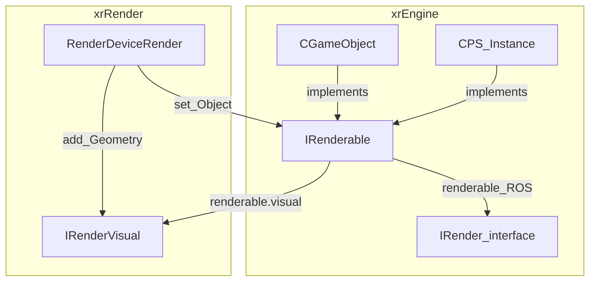
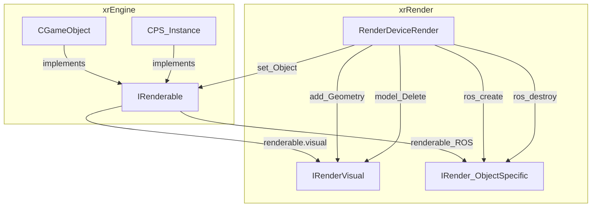
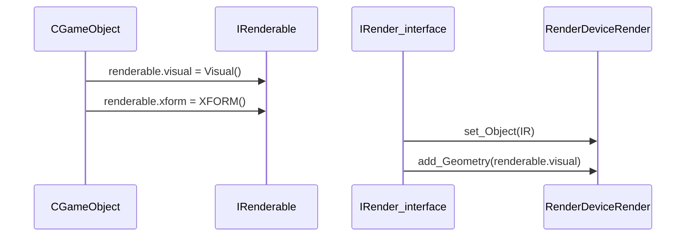
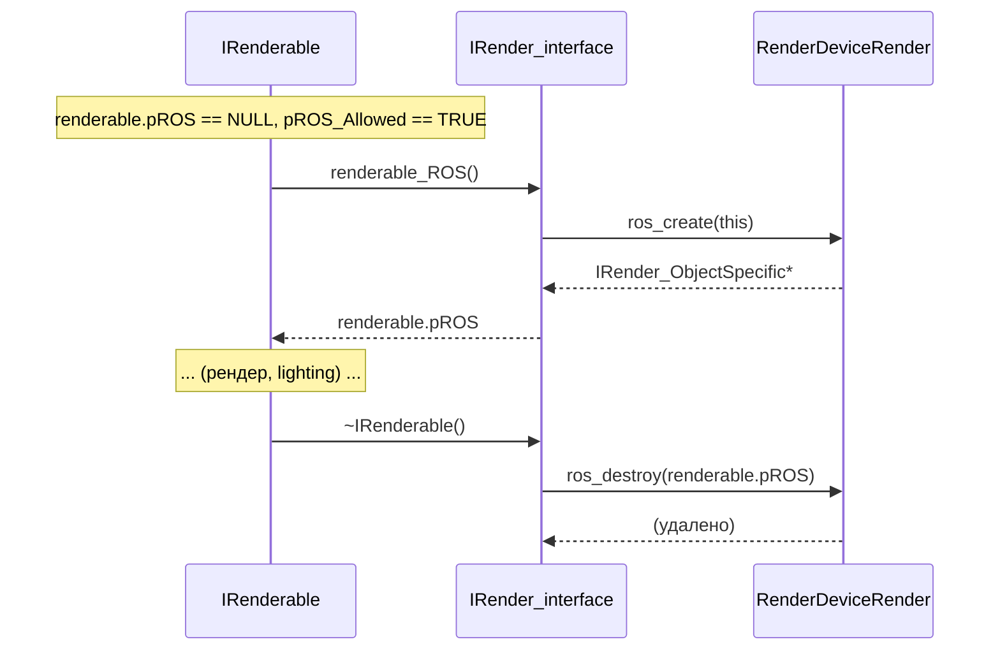

# IRenderable

`IRenderable` — интерфейс, который объект должен реализовать, чтобы быть видимым для рендера.

## Ответственность

- Хранить рендер-состояние объекта: `xform` (матрица), `visual` (указатель на `IRenderVisual`), `pROS` (object-specific), `pROS_Allowed`.
- Предоставить `renderable_Render()` — чистый виртуальный, вызывается рендерером.
- Опционально: `renderable_ShadowGenerate()` / `renderable_ShadowReceive()` (по умолчанию `FALSE`).
- Опционально: `GetHotness()` / `GetTransparency()` / `GetGlowing()` (HeatVision / SilencerOverheat).

## Место в архитектуре



`IRenderable` — **мixin**, не singleton. Любой объект (игровой, частица, декорация) может реализовывать его. `CGameObject` реализует через `Visual()` → `IRenderVisual`. `CPS_Instance` реализует напрямую.

## Публичный API

```cpp
// IRenderable.h
class ENGINE_API IRenderable
{
public:
    struct
    {
        Fmatrix xform;
        IRenderVisual* visual;
        IRender_ObjectSpecific* pROS;
        BOOL pROS_Allowed;
    } renderable;

public:
    IRenderable();
    virtual ~IRenderable();
    IRender_ObjectSpecific* renderable_ROS();
    virtual void renderable_Render() = 0;
    virtual BOOL renderable_ShadowGenerate() { return FALSE; }
    virtual BOOL renderable_ShadowReceive() { return FALSE; }
    virtual float GetHotness() { return 0.0; }
    virtual float GetTransparency() { return 0.0; }
    virtual float GetGlowing() { return 0.0; }
};
```

## Внутреннее устройство

### Конструктор

```cpp
IRenderable::IRenderable()
{
    renderable.xform.identity();
    renderable.visual = NULL;
    renderable.pROS = NULL;
    renderable.pROS_Allowed = TRUE;

    ISpatial* self = fast_dynamic_cast<ISpatial*>(this);
    if (self) self->spatial.type |= STYPE_RENDERABLE;
}
```

- Инициализирует `xform` как identity.
- `visual = NULL` (ещё не назначен).
- `pROS_Allowed = TRUE` (ROS разрешён по умолчанию).
- Если объект является `ISpatial` — ставит флаг `STYPE_RENDERABLE` (для пространственного поиска).

### Деструктор

```cpp
IRenderable::~IRenderable()
{
    VERIFY(!g_bRendering);
    Render->model_Delete(renderable.visual);
    if (renderable.pROS) Render->ros_destroy(renderable.pROS);
    renderable.visual = NULL;
    renderable.pROS = NULL;
}
```

- **`VERIFY(!g_bRendering)`** — нельзя уничтожать рендеруемый объект во время рендера.
- Удаляет `visual` через `Render->model_Delete`.
- Удаляет `pROS` через `Render->ros_destroy`.

### `renderable_ROS()`

```cpp
IRender_ObjectSpecific* IRenderable::renderable_ROS()
{
    if (0 == renderable.pROS && renderable.pROS_Allowed)
        renderable.pROS = Render->ros_create(this);
    return renderable.pROS;
}
```

Ленивое создание `pROS` (object-specific data) через `Render->ros_create(this)`. Если `pROS_Allowed == FALSE` (например, `CPS_Instance`) — возвращает `NULL`.

## Взаимодействие



- **Кто вызывает `renderable_Render()`**: `RenderDeviceRender` (xrRender) при рендере сцены.
- **Кто устанавливает `renderable.visual`**: `CGameObject::Visual()` (xrEngine) или `CPS_Instance` (частично).
- **Кто создаёт/удаляет `pROS`**: `renderable_ROS()` (ленивое), деструктор `~IRenderable()` (удаление).
- **`g_bRendering`** — глобальный флаг (`device.cpp`), `TRUE` во время `Device.Begin()` → `Device.End()`.

## Потоки данных

### Назначение visual



### ROS lifecycle



## Конфигурация

- `renderable.pROS_Allowed` — флаг, разрешающий создание `pROS`. По умолчанию `TRUE`. `CPS_Instance` ставит `FALSE` (частицы не используют ROS).
- `STYPE_RENDERABLE` — битовый флаг `ISpatial.type`, ставится в конструкторе `IRenderable` (если объект `ISpatial`).

## Ограничения / дебаг

- **`VERIFY(!g_bRendering)`** в деструкторе: уничтожение `IRenderable` во время рендера → crash в DEBUG.
- **`renderable.visual`** — **сырой указатель** на `IRenderVisual`, управляемый `Render->model_Delete`. Нельзя вручную `delete`.
- **`renderable.xform`** — копируется из `CGameObject::XFORM()` каждый кадр (см. [xr_object](xr-object.md)).
- **`renderable_ShadowGenerate/Receive`** — по умолчанию `FALSE`. Переопределяется в `CGameObject` (см. [xr_object](xr-object.md)).
- **`GetHotness` / `GetTransparency` / `GetGlowing`** — HeatVision / SilencerOverheat, по умолчанию `0.0`. Переопределяется в конкретных объектах.
