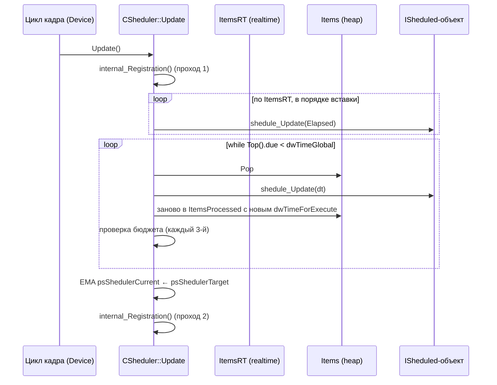

# Sheduler (планировщик)

`CSheduler` — временной планировщик `ISheduled`-объектов: уровень, ALIFE, звук, физика и всё, что обновляется не «каждый кадр», а по интервалам с адаптивным бюджетом времени.

> Имя `Sheduler` — опечатка из исходников, сохраняется везде.

## Ответственность

- Хранит два пула задач: **realtime** (каждый кадр, в порядке регистрации) и **scheduled** (по времени, min-heap).
- Каждому scheduled-объекту динамически подбирается интервал обновления через `shedule_Scale()`.
- **Адаптивный бюджет**: целевое время шага (`psShedulerTarget`, 3–66 мс) регулируется по фактическому времени выполнения; при превышении бюджета оставшиеся задачи переносится на следующий кадр.
- Отложенная (deferred) регистрация/отмена: `Register`/`Unregister` из любого места кода применяются планировщиком в безопасные точки кадра.
- Гарантирует порядок двух realtime-объектов — `EnsureOrder`.
- Отладка: кросс-проверка состояний, `g_bSheduleInProgress`.

## Место в архитектуре

Средний слой. Владеет `CEngine` (`Engine.Sheduler`, см. [Ядро](engine.md)); обновляется **один раз за кадр** в рамках цикла кадра (см. [Цикл кадра](frame-loop.md)).

Не путать с `CRegistrator<T>` (из `pure.h`): регистратор — упорядоченный по приоритету список сообщений, исполняемый каждый кадр; планировщик — временной, с адаптивным шагом.

Реализуют `ISheduled` и регистрируются сюда: `CGameObject`/объекты уровня (xrGame, итерация 5), звук, ALIFE, эффекты — детали в соответствующих итерациях.

## Публичный API

```cpp
// ISheduled.h
class ENGINE_API ISheduled {
public:
    // битовое поле: интервалы + флаги
    u32 t_min : 14;   // минимальный интервал, мс (default 20)
    u32 t_max : 14;   // максимальный интервал, мс (default 1000)
    u32 b_RT    : 1;  // realtime (каждый кадр)
    u32 b_locked: 1;  // заблокирован (default FALSE)

    void shedule_register();
    void shedule_unregister();

    // чистые виртуальные
    virtual float shedule_Scale() = 0;   // 0..1 — доля интервала между t_min и t_max
    virtual bool  shedule_Needed() = 0;  // нужен ли объект вообще
    // виртуальные (default'ы)
    virtual void  shedule_Update(u32 dt);       // по умолчанию no-op
    virtual shared_str shedule_Name() const;   // по умолчанию "unknown"
};
```

```cpp
// xrSheduler.h
class ENGINE_API CSheduler {
public:
    void Initialize();
    void Destroy();
    void Register(ISheduled* A, BOOL RT = FALSE);
    void Unregister(ISheduled* A);
    void EnsureOrder(ISheduled* Before, ISheduled* After);
    void Update();   // вызывается один раз за кадр из цикла кадра

    u64 cycles_start;   // QPC на начало Update()
    u64 cycles_limit;   // QPC на конец разрешённого бюджета
};
```

Глобальные (файл `xrSheduler.cpp`):

```cpp
ENGINE_API float psShedulerCurrent;  // текущий бюджет шага, мс (EMA)
ENGINE_API float psShedulerTarget;   // целевой бюджет, мс (обратная связь)
ENGINE_API float psShedulerReaction; // скорость реакции (0.1f)
ENGINE_API BOOL  g_bSheduleInProgress; // TRUE во время Update()
```

## Внутреннее устройство

### Файлы

| Файл                              | Назначение              |
| --------------------------------- | ----------------------- |
| `ISheduled.h` / `ISheduled.cpp`   | интерфейс задачи        |
| `xrSheduler.h` / `xrSheduler.cpp` | реализация планировщика |

### Контейнеры

| Поле                 | Тип                      | Назначение                                                               |
| -------------------- | ------------------------ | ------------------------------------------------------------------------ |
| `ItemsRT`            | `xr_vector<Item>`        | realtime-задачи, исполнение в порядке вставки                            |
| `Items`              | `xr_vector<Item>` (heap) | scheduled-задачи, min-heap по времени исполнения                         |
| `ItemsProcessed`     | `xr_vector<Item>`        | staging-область на время `ProcessStep()`                                 |
| `Registration`       | `xr_vector<ItemReg>`     | очередь отложенных register/unregister                                   |
| `m_current_step_obj` | `ISheduled*`             | объект, чьё `shedule_Update` сейчас выполняется (детект self-unregister) |
| `m_processing_now`   | `BOOL`                   | флаг «идёт Update»                                                       |

`Item`:

```cpp
struct Item {
    u32        dwTimeForExecute;   // следующий срок исполнения (мс)
    u32        dwTimeOfLastExecute; // когда выполнялся в последний раз
    shared_str scheduled_name;
    ISheduled* Object;
    u32        dwPadding;
    // operator<:  dwTimeForExecute > I.dwTimeForExecute  ← инвертировано
};
```

`operator<` инвертирован специально: стандартные `push_heap`/`pop_heap` дают **min-heap** — `Top() = Items.front()` = ближайший срок.

`ItemReg{BOOL OP; BOOL RT; ISheduled* Object}` — запись очереди отложенной регистрации.

### Отложенная регистрация

`Register`/`Unregister` **не** трогают контейнеры напрямую:

```cpp
void CSheduler::Register(ISheduled* A, BOOL RT) {
    A->shedule.b_RT = RT;
    Registration.push_back(ItemReg{ TRUE, RT, A });
}
void CSheduler::Unregister(ISheduled* A) {
    if (m_processing_now) { /* попытка немедленного internal_Unregister */ }
    Registration.push_back(ItemReg{ FALSE, FALSE, A });
}
```

`internal_Registration()` применяется дважды в каждом `Update()` — после настройки таймера и в конце. Алгоритм парной отмены: для каждой записи-register ищется **вперёд** по очереди запись-unregister того же объекта — пара аннулируется; оставшиеся применяются через `internal_Register`/`internal_Unregister`.

`internal_Register(O, RT)`: `VERIFY(!O->shedule.b_locked)`; оба таймстемпа = `Device.dwTimeGlobal`; `b_RT` сохраняется; RT → `ItemsRT.push_back`, иначе `Push` (heap).

`internal_Unregister`: для scheduled-объекта просто `Item.Object = NULL` — **ленивое удаление**: heap-элемент остаётся, `ProcessStep` пропускает NULL-объекты и удаляет их при встрече. Self-unregister (объект отписался внутри собственного `shedule_Update`) обнаруживается по `m_current_step_obj == NULL` после вызова.

### EnsureOrder

```cpp
void CSheduler::EnsureOrder(ISheduled* Before, ISheduled* After) {
    VERIFY(Before->shedule.b_RT && After->shedule.b_RT);
    // After перемещается в КОНЕЦ ItemsRT
}
```

То есть `Before` гарантированно выполняется раньше `After` (оба — realtime, порядок вставки).

### Update() — точка входа на кадр

Порядок (полностью, `xrSheduler.cpp`):

1. `R_ASSERT(Device.Statistic)`; `Statistic->Sheduler.Begin()`.
2. Бюджет в циклах CPU: `cycles_start = CPU::QPC()`; `cycles_limit = QPC_freq * ceil(psShedulerCurrent)/1000 + cycles_start`.
3. `internal_Registration()` (первый проход).
4. `g_bSheduleInProgress = TRUE`; `m_processing_now = true`.
5. **RT-проход**: по `ItemsRT` в порядке вставки — если `shedule_Needed()`, вызвать `shedule_Update(Elapsed)`, где `Elapsed = dwTimeGlobal - dwTimeOfLastExecute` (сырые мс, без масштаба); обновить `dwTimeOfLastExecute`.
6. **`ProcessStep()`** — scheduled-проход (ниже).
7. `m_processing_now = false`.
8. Обратная связь: `clamp(psShedulerTarget, 3.f, 66.f)`; EMA `psShedulerCurrent = 0.9*psShedulerCurrent + 0.1*psShedulerTarget`; `Statistic->fShedulerLoad = psShedulerCurrent`.
9. `g_bSheduleInProgress = FALSE`; `internal_Registration()` (второй проход); `Statistic->Sheduler.End()`.

### ProcessStep() — scheduled-проход

```text
c = 0
while Items не пуст и Top().dwTimeForExecute < dwTimeGlobal:
    Pop
    if Object == NULL or !shedule_Needed(): continue   # ленивое удаление
    m_current_step_obj = Object
    shedule_Update(clampr(Elapsed, 1, max(t_max, 1000)))
    if m_current_step_obj == NULL: continue             # self-unregister
    # новый интервал
    dwMin  = max(30, t_min)
    dwMax  = (1000 + t_max) / 2
    dwUpdate = dwMin + floor((dwMax - dwMin) * shedule_Scale())
    clamp(dwUpdate, max(dwMin, 20), dwMax)
    Item.dwTimeForExecute = dwTimeGlobal + dwUpdate
    ItemsProcessed.push_back(Item)
    # контроль бюджета — каждый 3-й объект
    if (c % 3) == 2:
        if dwPrecacheFrame == 0 и CPU::QPC() > cycles_limit:
            psShedulerTarget += psShedulerReaction * 3
            break                                       # остаток — на следующий кадр
    c++
Items ← ItemsProcessed (push в heap)
psShedulerTarget -= psShedulerReaction                  # затухание ВСЕГДА
```

Формула интервала: `shedule_Scale()` (0..1) — доля между `dwMin` и `dwMax`; чем объект «важнее» (scale ближе к 1), тем **длиннее** его интервал. Пороги: минимум 30 мс (или `t_min`, если больше), максимум `(1000 + t_max)/2`.

Механика бюджета: при превышении `cycles_limit` (каждые 3-й объект) цель `psShedulerTarget` растёт на `reaction*3` — следующий кадр получит **больший** бюджет; в конце шага цель всегда затухает на `reaction`. Через EMA в `psShedulerCurrent` это превращается в плавную адаптацию шага планировщика к нагрузке.

### Инициализация / уничтожение

- `Initialize()` — обнуляет состояние; вызывается из `CEngine::Initialize` ([Ядро](engine.md)).
- `Destroy()` — сначала `internal_Registration()` (применить накопленное), затем очистка всех контейнеров; в DEBUG предупреждение, если work-list не пуст.
- Деструктор `ISheduled`: в DEBUG проверяет, что объект **не** зарегистрирован; в release — принудительно `Unregister` (комментарий в коде: «sad, but true — we need this to become MASTER_GOLD»).

## Взаимодействие

```mermaid
graph TD
    subgraph цикл кадра
        FL[CRenderDevice: цикл кадра]
    end
    FL -->|Update() 1×/кадр| S[CSheduler]
    S -->|shedule_Update| L[уровень / ALIFE / звук — xrGame, итерация 5]
    S -->|shedule_Update| FX[эффекты — порцион 8]
    S -->|shedule_Update| PHY[физика — итерация 5]
    E[CEngine] -->|владеет Engine.Sheduler| S
    D[CRenderDevice] -->|dwTimeGlobal, dwPrecacheFrame| S
    S -->|Begin/End| ST[Statistic → fShedulerLoad]
    S -->|g_bSheduleInProgress| OTHER[код, проверяющий активность планировщика]
```

- **Кто вызывает `Update()`**: цикл кадра — см. [Цикл кадра](frame-loop.md). Планировщик — один из участников кадра; точное место регистрации в `seqFrame`/обёртке раскрывается на порционе 3 (Device).
- **Время**: источник — `Device.dwTimeGlobal` (см. [Device](device.md), порцион 3) и `Device.dwPrecacheFrame` (precache-режим: при `dwPrecacheFrame != 0` контроль бюджета отключён).
- **Кто реализует `ISheduled`**: игровые объекты, звук, ALIFE — xrGame (итерация 5); эффекты — порцион 8 этой же итерации.
- **`g_bSheduleInProgress`** — внешний флаг: другие модули могут проверить «идёт ли сейчас шаг планировщика».

## Потоки данных



## Конфигурация

- `psShedulerCurrent` / `psShedulerTarget` / `psShedulerReaction` — глобалы, читаемые/пишущиеся извне (консольные команды статистики, итерация 12). Диапазон `psShedulerTarget` жёстко ограничен `clamp(3, 66)` мс.
- `t_min`/`t_max` каждого объекта задаются самим `ISheduled` (по умолчанию 20/1000 мс).
- `dwPrecacheFrame` (Device) — во время precache контроль бюджета выключен.

## Ограничения / дебаг

- **Не рекурсивный**: один `Update()` — один проход по каждому объекту. DEBUG-поле `dbg_update_shedule` в `ISheduled` фиксирует повторный вызов `shedule_Update` за кадр (ASSERT).
- **Ленивое удаление** scheduled-объектов: после `Unregister` в heap остаётся «труп» с `Object = NULL` до первого попадания в `ProcessStep`.
- `EnsureOrder` работает **только** для realtime-объектов (`VERIFY`).
- Регистрация во время `m_processing_now` обрабатывается особым путём (немедленный `internal_Unregister` при отписке); произвольные изменения контейнеров из `shedule_Update` вне `Register/Unregister` — не поддерживаются.
- DEBUG: `CSheduler::Registered(ISheduled*)` — кросс-проверка всех 4 контейнеров (объект ровно в одном месте с учётом очереди Registration). `#define DEBUG_SCHEDULER` (закомментирован) включает `Msg`-лог каждого register/process/unregister. В `ProcessStep` есть закомментированные perf-предупреждения (`delta_ms > 3*dwUpdate`, `execTime > 15 мс`).
- Опечатка `Sheduler`/`ISheduled` — **намеренно** не исправляется: имена такие в исходниках и во всём API.
