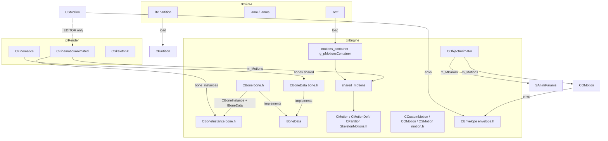
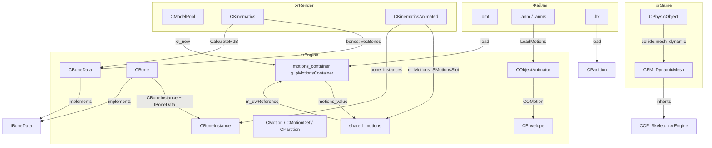
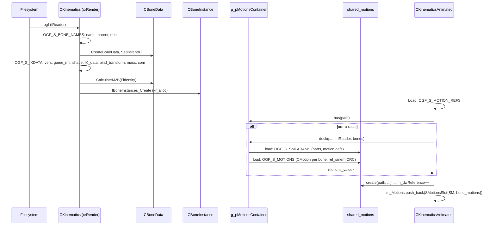
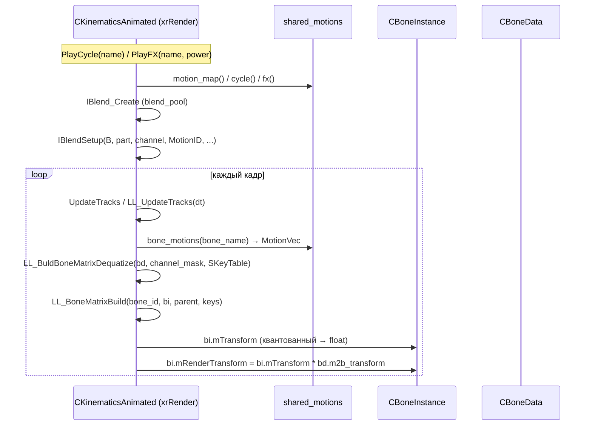
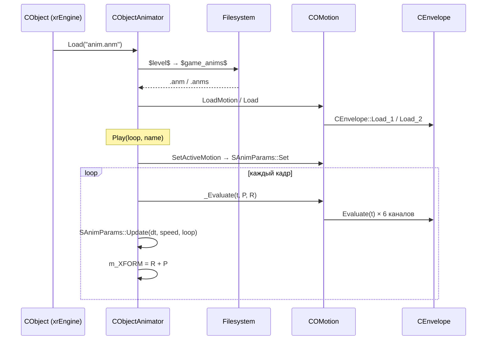

# Скелет и анимация

`bone.h/.cpp`, `SkeletonMotionDefs.h`, `SkeletonMotions.h/.cpp`, `motion.h/.cpp`, `envelope.h/.cpp`, `ObjectAnimator.h/.cpp`, `cf_dynamic_mesh.h/.cpp`.

См. [Fmesh](fmesh.md) (формат OGF/OGF-чанки, `CFM_DynamicMesh`), [Коллизии](collide-physics.md) (`CCF_Skeleton`), [Объект](xr-object.md) (`CObjectAnimator`).

## Ответственность

Страница описывает **данные и формат** скелетной анимации, которые живут в `xrEngine`:

- **Скелет**: `CBoneInstance` (рантайм-инстанс кости), `CBone` (полная кость с редактором-данными), `CBoneData` (shared-данные: `bind_transform`, `m2b_transform`, shape, IK-данные, масса), `IBoneData` (read-only интерфейс).
- **Данные движения** (квантованные, для скелетных моделей `.omf`): `CMotion` (ключи `CKeyQR`/`CKeyQT8`/`CKeyQT16` через `ref_smem` — shared memory), `CMotionDef` (speed/power/accrue/falloff, квантованные), `CPartition` (до `MAX_PARTS = 4` групп костей), `motion_marks` (маркеры по времени), `motions_value`/`shared_motions` (ref-counted общий набор движений по пути файла), `motions_container`/`g_pMotionsContainer` (глобальный кэш).
- **Кастомные движения** (неквантованные, `CEnvelope`-базированные): `CCustomMotion` → `COMotion` (объект, 6 каналов) и `CSMotion` (скелет, 6 каналов на кость; `_EDITOR` only), `SAnimParams` (тик таймлайна), `CObjectAnimator` (`.anm`/`.anms`).
- **Огибающие**: `CEnvelope`/`st_Key` (формат LightWave-огибающих, TCB/HERM/BEZI/LINE/STEP), `CEnvelope::Evaluate` → `interp.cpp::evalEnvelope` (порцион 8).

**НЕ входит в эту страницу**:

- Реализация рендер-скелетов (`CKinematics`/`CKinematicsAnimated`/`CSkeletonX` — `IKinematics`, blending `CBlend`, `PlayCycle`/`PlayFX`, де-квантизация, skinning `skin1W..4W`) — это `xrRender`, итерация 3 (Renderer → Skeleton).
- Постобработочные эффекторы (`EffectorPP`) — порцион 8 ([Эффекторы](effector.md)); `interp.cpp`/`Envelope` подробно — порцион 8 ([Окружение](environment.md)).
- Коллизионные формы скелета (`CCF_Skeleton`) — порцион 5 ([Коллизии](collide-physics.md)).

## Место в архитектуре



`CBoneData` — **shared** (один на модель, принадлежит `CKinematics::bones`), `CBoneInstance` — **per-instance** (аллоцируется `CKinematics::IBoneInstances_Create`). `CMotion`-ключи — shared через `ref_smem` (CRC-based, один буфер на множество костей/моделей с одинаковым контентом). `shared_motions` — ref-counted указатель на общий набор `.omf` (кэшируется `motions_container` по пути файла).

## Публичный API

### Константы и флаги

```cpp
// bone.h
#define BI_NONE (u16(-1))
#define OGF_IKDATA_VERSION 0x0001
#define MAX_BONE_PARAMS 4
typedef void _BCL BoneCallbackFunction(CBoneInstance* P);
typedef BoneCallbackFunction* BoneCallback;
enum EBoneCallbackType { bctDummy, bctPhysics, bctCustom, bctForceU32 };

// SkeletonMotionDefs.h
const u32 MAX_PARTS = 4;
const f32 SAMPLE_FPS = 30.f;
const f32 SAMPLE_SPF = (1.f / SAMPLE_FPS);
f32 const END_EPS = SAMPLE_SPF + EPS;
const f32 KEY_Quant = 32767.f;
const f32 KEY_QuantI = 1.f / KEY_Quant;

// motion.h
enum EChannelType { ctUnsupported=-1, ctPositionX, ctPositionY, ctPositionZ, ctRotationH, ctRotationP, ctRotationB, ctMaxChannel };
enum ESMFlags { esmFX, esmStopAtEnd, esmNoMix, esmSyncPart, esmUseFootSteps, esmRootMover, esmIdle, esmUseWeaponBone };
```

### `CBoneInstance`

```cpp
// bone.h — #pragma pack(push,8), class ENGINE_API
class ENGINE_API CBoneInstance
{
public:
    Fmatrix mTransform;              // final x-form matrix (local to model)
    Fmatrix mTransformHidden;        // hidden x-form matrix
    Fmatrix mRenderTransform;        // final x-form matrix (model_base -> bone -> model)
    Fmatrix mRenderTransform_prev;   // Prev x-form matrix
    Fmatrix mRenderTransform_temp;   // Temp var
private:
    BoneCallback Callback;
    void* Callback_Param;
    BOOL Callback_overwrite;         // performance hint — don't calc anims
    u32 Callback_type;
public:
    float param[MAX_BONE_PARAMS];
    IC void _BCL construct();
    void _BCL set_callback(u32 Type, BoneCallback C, void* Param, BOOL overwrite = FALSE);
    void _BCL reset_callback();
    IC void _BCL set_callback_overwrite(BOOL v);
    void set_param(u32 idx, float data);
    float get_param(u32 idx);
};
```

`construct()` (инлайн в `bone.h`) — `identity()` всех `Fmatrix`-полей, ноль callback'ов, `ZeroMemory(param)`.

### Вершины с skinning

```cpp
// bone.h — #pragma pack(push,2)
struct vertBoned1W // 60 bytes: P,N,T,B + u,v + matrix(u32)
struct vertBoned2W // 64 bytes: matrix0, matrix1, P,N,T,B + w + u,v
struct vertBoned3W // 70 bytes: m[3], P,N,T,B + w[2] + u,v
struct vertBoned4W // 76 bytes: m[4], P,N,T,B + w[3] + u,v
```

`w[n-1]` не хранится (восстанавливается как `1 - sum`). Используется `CSkeletonX` (xrRender, итерация 3) — `ref_smem<vertBoned1W..4W>` — shared между инстансами одной модели.

### `CBone` (редактор-кость)

```cpp
// bone.h — class ECORE_API, наследует CBoneInstance + IBoneData
class ECORE_API CBone : public CBoneInstance, public IBoneData
{
    shared_str name, parent_name, wmap;
    Fvector rest_offset, rest_rotate; float rest_length;   // rest-состояние
    Fvector mot_offset, mot_rotate; float mot_length;      // текущее (motion) состояние
    Fmatrix mot_transform;
    Fmatrix local_rest_transform;  // = bind_transform
    Fmatrix rest_transform, rest_i_transform;
public:
    int SelfID; CBone* parent; BoneVec children;
    Flags8 flags; // flSelected
    SJointIKData IK_data; shared_str game_mtl; SBoneShape shape;
    float mass; Fvector center_of_mass;
    void SetName(const char* p);          // xr_strlwr
    void SetParentName(const char* p);    // xr_strlwr
    void SetRestParams(float length, const Fvector& offset, const Fvector& rotate);
    void _Update(const Fvector& T, const Fvector& R); // mot_offset/rotate, mot_length = rest_length
    void Reset();                          // mot_* = rest_*
    void Save(IWriter& F); void Load_0/Load_1(IReader& F);
    IC float _BCL engine_lo_limit(u8 k) const { return -IK_data.limits[k].limit.y; }
    IC float _BCL engine_hi_limit(u8 k) const { return -IK_data.limits[k].limit.x; }
    IC float _BCL editor_lo_limit(u8 k) const { return IK_data.limits[k].limit.x; }
    IC float _BCL editor_hi_limit(u8 k) const { return IK_data.limits[k].limit.y; }
    void SaveData(IWriter& F); void LoadData(IReader& F); void ResetData(); void CopyData(CBone* bone);
    // _EDITOR/_MAYA_EXPORT: ShapeScale/Rotate/Move, BindRotate/Move, BoneMove/Rotate, Pick, Select, ClampByLimits, ExportOGF
};
```

### `CBoneData` (shared)

```cpp
// bone.h — class ENGINE_API, наследует IBoneData
class ENGINE_API CBoneData : public IBoneData
{
    u16 SelfID, ParentID;
    shared_str name;
    Fobb obb;
    Fmatrix bind_transform;   // local rest
    Fmatrix m2b_transform;    // model-to-bone (обратный к world-трансформу кости)
    SBoneShape shape; shared_str game_mtl_name; u16 game_mtl_idx;
    SJointIKData IK_data; float mass; Fvector center_of_mass;
    vecBones children;
    ChildFacesVec child_faces;  // per-child unique face indices (skinning)
public:
    void SetParentID(u16 id);
    void AppendFace(u16 child_idx, u16 idx);
    void CalculateM2B(const Fmatrix& Parent); // рекурсивно строит m2b_transform
    // IBoneData: GetChild/GetSelfID/GetNumChildren/get_IK_data/get_bind_transform/
    // get_shape/get_obb/get_center_of_mass/get_mass/get_game_mtl_idx/GetParentID/lo_limit/hi_limit
};
```

### `IBoneData`

```cpp
// bone.h — read-only интерфейс (реализации: CBone, CBoneData)
class IBoneData
{
public:
    virtual IBoneData& _BCL GetChild(u16 id) = 0;
    virtual const IBoneData& _BCL GetChild(u16 id) const = 0;
    virtual u16 _BCL GetSelfID() const = 0;
    virtual u16 _BCL GetNumChildren() const = 0;
    virtual const SJointIKData& _BCL get_IK_data() const = 0;
    virtual const Fmatrix& _BCL get_bind_transform() const = 0;
    virtual const SBoneShape& _BCL get_shape() const = 0;
    virtual const Fobb& _BCL get_obb() const = 0;
    virtual const Fvector& _BCL get_center_of_mass() const = 0;
    virtual float _BCL get_mass() const = 0;
    virtual u16 _BCL get_game_mtl_idx() const = 0;
    virtual u16 _BCL GetParentID() const = 0;
    virtual float _BCL lo_limit(u8 k) const = 0;
    virtual float _BCL hi_limit(u8 k) const = 0;
};
```

### `SBoneShape` / `EJointType` / `SJointIKData`

```cpp
// bone.h — #pragma pack(push,1)
enum EJointType { jtRigid, jtCloth, jtJoint, jtWheel, jtNone, jtSlider, jtForceU32 };
struct SJointLimit { Fvector2 limit; float spring_factor, damping_factor; };
struct SBoneShape
{
    enum EShapeType { stNone, stBox, stSphere, stCylinder, stForceU32 };
    enum EShapeFlags { sfNoPickable, sfRemoveAfterBreak, sfNoPhysics, sfNoFogCollider };
    u16 type; Flags16 flags;
    Fobb box; Fsphere sphere; Fcylinder cylinder;
    bool Valid();
};
struct SJointIKData
{
    EJointType type;
    SJointLimit limits[3]; // [axis XYZ on joint] / [Z-wheel, X-steer on wheel]
    float spring_factor, damping_factor;
    enum { flBreakable = 1 };
    Flags32 ik_flags;
    float break_force, break_torque;
    float friction;
    void clamp_by_limits(Fvector& dest_xyz);
    void Export(IWriter& F);   // инвертирует знаки лимитов (ODE vs X-Ray)
    bool Import(IReader& F, u16 vers); // vers > 0 → friction
};
```

### Ключи и `CMotion`

```cpp
// SkeletonMotions.h — #pragma pack(push,2)
enum { flTKeyPresent = 1<<0, flRKeyAbsent = 1<<1, flTKey16IsBit = 1<<2 };
struct CKey   { Fquaternion Q; Fvector T; };
struct CKeyQR { s16 x, y, z, w; };          // квантованный кватернион (16-bit)
struct CKeyQT8 { s8 x1, y1, z1; };          // 8-bit kвантованный перенос
struct CKeyQT16 { s16 x1, y1, z1; };        // 16-bit kвантованный перенос

class ENGINE_API CMotion
{
    u32 _flags : 8; u32 _count : 24;
    ref_smem<CKeyQR> _keysR;      // shared: квантованные вращения (CRC-дедуп)
    ref_smem<CKeyQT8> _keysT8;    // shared: 8-bit переносы
    ref_smem<CKeyQT16> _keysT16;  // shared: 16-bit переносы
    Fvector _initT, _sizeT;
    float GetLength() { return float(_count) * SAMPLE_SPF; } // SAMPLE_FPS = 30
    u32 mem_usage(); // делит размер на ref_count() shared-буферов
};
```

### `CMotionDef` / `motion_marks` / `CPartition`

```cpp
class ENGINE_API CMotionDef
{
    u16 bone_or_part; // bone_id (cycle) или part_id (cycle)
    u16 motion;       // motion_id (index в .omf)
    u16 speed, power, accrue, falloff; // квантованные 0..65535 (Dequantize: V / 655.35)
    u16 flags;        // ESMFlags
    xr_vector<motion_marks> marks;
    ICF float Dequantize(u16 V) const { return float(V) / 655.35f; }
    ICF float Accrue() { return fQuantizerRangeExt * Dequantize(accrue); } // *1.5
    ICF float Falloff() { return fQuantizerRangeExt * Dequantize(falloff); }
    ICF float Speed() { return Dequantize(speed); }
    ICF float Power() { return Dequantize(power); }
    bool StopAtEnd();
};
const float fQuantizerRangeExt = 1.5f;

class ENGINE_API motion_marks
{
    typedef std::pair<float, float> interval;
    xr_vector<interval> intervals;
    shared_str name;
    bool is_empty() const;
    const interval* pick_mark(float t) const;
    bool is_mark_between(float t0, float t1) const;
    float time_to_next_mark(float time) const;
    void Load(IReader*); // name + count + (t0, t1)*
};

class ENGINE_API CPartDef { shared_str Name; xr_vector<u32> bones; };
class ENGINE_API CPartition
{
    xr_vector<CPartDef*> P; // ≤ MAX_PARTS = 4
    CPartDef* create(); // nullptr при > MAX_PARTS
    u16 part_id(const shared_str& name) const; // Msg при отсутствии
    void load(IKinematics* V, LPCSTR model_name); // из <model>.ltx, секции part_0..3
    u8 count() const;
};
```

### `motions_value` / `shared_motions` / `motions_container`

```cpp
struct ENGINE_API motions_value
{
    accel_map m_motion_map;   // name → idx (все motions)
    accel_map m_cycle;        // name → idx (cycle, !esmFX)
    accel_map m_fx;           // name → idx (esmFX)
    CPartition m_partition;
    u32 m_dwReference;
    BoneMotionMap m_motions;  // bone_name → MotionVec (CMotion по motion_id)
    MotionDefVec m_mdefs;
    shared_str m_id;          // путь к .omf
    BOOL load(LPCSTR N, IReader* data, vecBones* bones);
    MotionVec* bone_motions(shared_str bone_name);
};

class ENGINE_API shared_motions
{
    motions_value* p_;
    bool create(shared_str key, IReader* data, vecBones* bones);
    bool create(shared_motions const& rhs); // ref++
    // доступ: bone_motions, motion_map, cycle, fx, partition, motion_defs, motion_def(idx), id
    // ref-counting: конструктор/копия/assignment/деструктор через destroy()
};

class ENGINE_API motions_container
{
    SharedMotionsMap container; // path → motions_value*
    bool has(shared_str key);
    motions_value* dock(shared_str key, IReader* data, vecBones* bones);
    void dump();
    void clean(bool force_destroy);
};
extern ENGINE_API motions_container* g_pMotionsContainer; // аллоцируется CModelPool (xrRender)
```

### `CCustomMotion` / `COMotion` / `CSMotion` / `SAnimParams`

```cpp
// motion.h
class ENGINE_API CCustomMotion
{
    int iFrameStart, iFrameEnd; float fFPS; // по умолчанию 30
    shared_str name; // xr_strlwr
    int Length() { return iFrameEnd - iFrameStart + 1; }
    void SetParam(int s, int e, float fps);
    virtual void SaveMotion(const char* buf) = 0;
    virtual bool LoadMotion(const char* buf) = 0;
};

class ENGINE_API COMotion : public CCustomMotion
{
    CEnvelope* envs[ctMaxChannel]; // 6 каналов: XYZ + HPB
    void _Evaluate(float t, Fvector& T, Fvector& R);
    // версии формата: 0x0003, 0x0004, EOBJ_OMOTION_VERSION=0x0005 (chunk EOBJ_OMOTION=0x1100)
};

// _EDITOR || _MAX_EXPORT || _MAYA_EXPORT only
class ENGINE_API CSMotion : public CCustomMotion
{
    BoneMotionVec bone_mots; // st_BoneMotion: name + envs[6] + flags
    u16 m_BoneOrPart; float fSpeed, fAccrue, fFalloff, fPower; Flags8 m_Flags;
    xr_vector<motion_marks> marks;
    void _Evaluate(int bone_idx, float t, Fvector& T, Fvector& R);
    // версии формата: 0x0004, 0x0005, ≥0x0006, ≥0x0007 (marks); EOBJ_SMOTION=0x1200, EOBJ_SMOTION_VERSION=0x0007
};

struct ECORE_API SAnimParams
{
    float t_current, tmp, min_t, max_t;
    BOOL bPlay, bWrapped;
    void Set(CCustomMotion* M); // min_t = FrameStart/FPS, max_t = FrameEnd/FPS
    void Set(float start_frame, float end_frame, float fps);
    void Update(float dt, float speed, bool loop); // bWrapped при переполнении, loop → t -= k*len
    void Play(); // bPlay = true, t = min_t
    void Stop();
    void Pause(bool val);
};
```

### `CObjectAnimator`

```cpp
// ObjectAnimator.h
class ENGINE_API CObjectAnimator
{
    shared_str m_Name; Fmatrix m_XFORM; SAnimParams m_MParam;
    MotionVec m_Motions; // COMotion*
    float m_Speed; COMotion* m_Current; bool bLoop;
    void Clear();
    void Load(LPCSTR name); // $level$ → $game_anims$; .anm (1) / .anms (N)
    LPCSTR Name(); float& Speed();
    COMotion* Play(bool bLoop, LPCSTR name = 0); // по имени (lower_bound) или front()
    void Pause(bool val); void Stop();
    BOOL IsPlaying(); const Fmatrix& XFORM();
    const SAnimParams& anim_param();
    float GetLength(); // m_Current->Length() / FPS()
    void Update(float dt);
    void DrawPath(); // _EDITOR only
};
```

### `CEnvelope` / `st_Key`

```cpp
// envelope.h
#define SHAPE_TCB 0  #define SHAPE_HERM 1  #define SHAPE_BEZI 2
#define SHAPE_LINE 3 #define SHAPE_STEP 4  #define SHAPE_BEZ2 5
#define BEH_RESET 0  #define BEH_CONSTANT 1  #define BEH_REPEAT 2
#define BEH_OSCILLATE 3 #define BEH_OFFSET 4 #define BEH_LINEAR 5

// #pragma pack(push,1)
struct st_Key
{
    enum { ktStepped = 1 };
    float value, time; u8 shape;
    float tension, continuity, bias; float param[4];
    void Save(IWriter& F);    // stepped (shape==4) → без tension/continuity/bias/param
    void Load_1(IReader& F);  // v1: shape как u32&0xff, параметры float
    void Load_2(IReader& F);  // v2: shape u8, параметры float_q16(-32,32)
};

class ENGINE_API CEnvelope
{
    KeyVec keys; // st_Key*
    int behavior[2]; // pre/post: BEH_*
    float Evaluate(float t); // → extern float evalEnvelope(CEnvelope*, float) — interp.cpp
    void Save(IWriter& F); void Load_1(IReader& F); void Load_2(IReader& F);
    void SaveA(IWriter& F); void LoadA(IReader& F); // ASCII (LightWave-формат)
    void RotateKeys(float angle); // value += angle
    KeyIt FindKey(float t, float eps);
    void FindNearestKey(float t, KeyIt& min, KeyIt& max, float eps);
    void InsertKey(float t, float val); // SHAPE_TCB, BEH_CONSTANT/BEH_CONSTANT
    void DeleteKey(float t);
    BOOL ScaleKeys(float from_time, float to_time, float scale_factor, float eps);
    float GetLength(float* mn, float* mx);
    void Optimize(); // если все ключи одинаковые и > 2 → оставляем первый+последний
};
```

## Внутреннее устройство

### `CBoneData::CalculateM2B`

```cpp
void ENGINE_API CBoneData::CalculateM2B(const Fmatrix& parent)
{
    m2b_transform.mul_43(parent, bind_transform); // world-трансформ кости
    for (auto C = children.begin(); C != children.end(); C++)
        (*C)->CalculateM2B(m2b_transform);
    m2b_transform.invert(); // model-to-bone (обратный)
}
```

Вызывается один раз при `CKinematics::Load` (xrRender) после чтения `OGF_S_IKDATA` — `(*bones)[LL_GetBoneRoot()]->CalculateM2B(Fidentity)`. Рендер использует `m2b_transform` для `mRenderTransform = mTransform * m2b_transform` (см. `CKinematics::CLBone`, `LL_SetBoneVisible` — итерация 3).

### `CBone::get_obb` / `get_game_mtl_idx`

```cpp
static const Fobb dummy = Fobb().identity();
const Fobb& CBone::get_obb() const { return dummy; } // заглушка — нет OBB у editor-костей
u16 CBone::get_game_mtl_idx() const { return GMLib.GetMaterialIdx(game_mtl.c_str()); }
```

### Загрузка `.omf` (`motions_value::load`)

Бинарный формат `.omf` (OGF-like chunks):

1. `OGF_S_SMPARAMS` chunk: `u16 vers` (≤ `xrOGF_SMParamsVersion = 4`), `u16 part_count`, для каждого `CPartDef`: `name`, `u16 bone_count`, `bone_names[]` (ремап на `vecBones` через `find_bone_id`), `u32 m_idx`. Валидация: `rm_bones[m_idx] = u16(*b_it)` — `VERIFY(*b_it != BI_NONE)`; суммарное число костей == `bones->size()`.
2. `u16 mot_count`, для каждого: `name` (xr_strlwr), `u32 dwFlags` (ESMFlags), `CMotionDef::Load` (bone_or_part, motion, speed/power/accrue/falloff как float → `Quantize`, `falloff >= accrue` при !esmFX → `falloff = accrue - 1`; `vers >= 4` → `u32 marks_count` + `motion_marks::Load`). Раскладка: `esmFX` → `m_fx`, иначе `m_cycle`; оба → `m_motion_map`.
3. `OGF_S_MOTIONS` chunk: `u32 dwCNT` (`VERIFY(dwCNT < 0x3FFF)` — MotionID: 2 bit slot, 14 bit index). Для каждой кости `m_motions[bone_name].resize(dwCNT)`. Для каждого motion `m_idx`: `R_ASSERT(MS->find_chunk(m_idx + 1))`, `name`, `u32 dwLen` (число кадров), для каждой кости: `CMotion` — `set_count(dwLen)`, `flags u8`; `flRKeyAbsent` → `CKeyQR` 1 шт. (CRC); иначе `crc32 + dwLen * sizeof(CKeyQR)`; `flTKeyPresent` → `crc32` + `CKeyQT16`/`CKeyQT8` (по `flTKey16IsBit`) + `_sizeT` + `_initT`; иначе только `_initT`. Ключи идут через `ref_smem::create(crc, count, ptr)` — **shared memory** с CRC-дедупликацией между костями/моделями.

### `CPartition::load`

Читает `<model_name>.ltx` (из `$game_meshes$`): секции `part_0..part_3`, ключ `partition_name` → имя, остальные ключи = имена костей → `V->LL_BoneID(name)` → `bones[]`. Если секций нет — `return` (без партиций).

### `CMotionDef::Load` — квантизация

```cpp
void CMotionDef::Load(IReader* MP, u32 fl, u16 version)
{
    bone_or_part = MP->r_u16();
    motion = MP->r_u16();
    speed = Quantize(MP->r_float());   // s32 t = iFloor(V * 655.35f); clamp 0..65535
    power = Quantize(MP->r_float());
    accrue = Quantize(MP->r_float());
    falloff = Quantize(MP->r_float());
    flags = (u16)fl;
    if (!(flags & esmFX) && (falloff >= accrue)) falloff = u16(accrue - 1);
    if (version >= 4) { u32 cnt = MP->r_u32(); ... marks[i].Load(MP); }
}
```

`Dequantize(V) = float(V) / 655.35f` → диапазон 0..10. `Accrue()/Falloff()` умножают на `fQuantizerRangeExt = 1.5` → 0..15.

### `shared_motions` / `motions_container`

- `g_pMotionsContainer` — глобальный указатель, **аллоцируется `CModelPool` (xrRender)** в конструкторе (`xr_new<motions_container>()`), освобождается в деструкторе (`Destroy()` → `clean(false)`, затем `xr_delete`). В `xrEngine` — только определение + `extern`.
- `dock(key, data, bones)` — если `has(key)` → возвращает существующий `motions_value*`; иначе `xr_new<motions_value>` + `load` → `container.insert`. Не увеличивает `m_dwReference` (это делает `shared_motions::create`).
- `shared_motions::create(key, data, bones)` → `dock` + `m_dwReference++` + `destroy()` (уменьшает старый `p_`) + `p_ = v`.
- `shared_motions::create(rhs)` — копирование: `m_dwReference++` на тот же `motions_value`.
- `clean(force_destroy)`: `true` → удаляет всё; `false` → удаляет только `m_dwReference == 0`.
- `dump()` — `Msg` по каждому: `#idx: [ref/size Kb] - path`.

### `COMotion` / `CSMotion` (квантизация нет — `CEnvelope`)

- `COMotion` — 6 `CEnvelope*` (XYZ + HPB). Формат `EOBJ_OMOTION = 0x1100`, версии `0x0003` (Load_1), `0x0004` (Load_2, без rotationZ?), `EOBJ_OMOTION_VERSION = 0x0005` (Load_2 для всех 6).
- `CSMotion` — `BoneMotionVec` (каждая кость: `name`, `envs[6]`, `flags`), `m_BoneOrPart`, `fSpeed/fAccrue/fFalloff/fPower`, `marks`. Формат `EOBJ_SMOTION = 0x1200`, версии `0x0004`/`0x0005` (Load_1), `≥0x0006` (Load_2, `u16` для `m_BoneOrPart`/`bone_count`), `≥0x0007` (marks).
- `_Evaluate(t, T, R)`: `T.x/y/z = envs[ctPositionX/Y/Z]->Evaluate(t)`, `R.y/x/z = envs[ctRotationH/P/B]->Evaluate(t)` (H→y, P→x, B→z).
- `CSMotion` — **только** `#if defined(_EDITOR) || defined(_MAX_EXPORT) || defined(_MAYA_EXPORT)`; в рантайме `xrEngine`/`xrRender` не компилируется.

### `SAnimParams::Update`

```cpp
void SAnimParams::Update(float dt, float speed, bool loop)
{
    if (!bPlay) return;
    bWrapped = false;
    t_current += speed * dt;
    tmp = t_current;
    if (t_current > max_t)
    {
        bWrapped = true;
        if (loop)
        {
            float len = max_t - min_t;
            float k = float(iFloor((t_current - min_t) / len));
            t_current = t_current - k * len;
        }
        else t_current = max_t;
        tmp = t_current;
    }
}
```

`bWrapped` — флаг «прошёл конец» (используется для loop-событий). `tmp` — промежуточное значение (для mix-калькуляций).

### `CObjectAnimator`

- `LoadMotions` — ищет `$level$` → `$game_anims$`; `.anm` → 1 `COMotion` (`LoadMotion`), `.anms` → `u32 cnt` + `cnt` × `COMotion::Load`. `std::sort` по `name` (для `Play` через `lower_bound`).
- `Play(loop, name)` — если `name` → `lower_bound` + сравнение; иначе `m_Motions.front()`. `SetActiveMotion` → `m_MParam.Set(m_Current)` + `m_XFORM.identity()`.
- `Update(dt)` — `m_Current->_Evaluate(m_MParam.Frame(), P, R)`, `m_MParam.Update(dt, m_Speed, bLoop)`, `m_XFORM.setXYZi(R.x, R.y, R.z)` + `translate_over(P)`.
- `CObjectAnimator` — в `CObject` (xrEngine, порцион 6, [Объект](xr-object.md)). Используется для анимации объектов без скелета (например, деревья, вода, декорации).

### `CEnvelope`

- `st_Key` — `#pragma pack(push,1)`: `value`, `time`, `shape`, `tension`, `continuity`, `bias`, `param[4]`. `Save` — stepped (`shape == SHAPE_STEP`) не пишет `tension/continuity/bias/param`. `Load_1` (v1) — `shape` как `u32 & 0xff`, параметры `float`; `Load_2` (v2) — `shape` `u8`, параметры `float_q16(-32, 32)` (квантованный float в 16-bit).
- `CEnvelope::Evaluate` → `extern float evalEnvelope(CEnvelope*, float)` — реализация в `interp.cpp` (порцион 8, [Окружение](environment.md)).
- `CEnvelope::SaveA/LoadA` — ASCII-формат LightWave (`{ Envelope`, `Key ...`, `Behaviors ...`).
- `CEnvelope::Optimize` — если все ключи одинаковые (`equal`) и `keys.size() > 2` → заменяем на `front + back` (экономия памяти).
- `CEnvelope::InsertKey` — при вставке `SHAPE_TCB`, `BEH_CONSTANT/BEH_CONSTANT`.

### `CFM_DynamicMesh`

```cpp
// cf_dynamic_mesh.h
class ENGINE_API CCF_DynamicMesh : public CCF_Skeleton
{
    CCF_DynamicMesh(CObject* _owner) : CCF_Skeleton(_owner) {};
    virtual BOOL _RayQuery(const collide::ray_defs& Q, collide::rq_results& R);
};
```

Создаётся `CPhysicObject::create_collision_model` (xrGame) если `collide.mesh == "dynamic"`. `_RayQuery` — двухэтапный: `CCF_Skeleton::_RayQuery` (грубый, bounding volumes) + `IKinematics::PickBone` (точный, ray-triangle). Подробности — [Fmesh](fmesh.md), [Коллизии](collide-physics.md).

## Взаимодействие



- **`CModelPool` (xrRender)** — аллоцирует `g_pMotionsContainer` (конструктор) и освобождает (деструктор: `Destroy()` → `clean(false)`).
- **`CKinematics` (xrRender)** — владеет `vecBones*` (shared `CBoneData`), `CBoneInstance*` (per-instance). `Load` — читает `OGF_S_BONE_NAMES` + `OGF_S_IKDATA` → `CalculateM2B`.
- **`CKinematicsAnimated` (xrRender)** — `m_Motions` (slot → `shared_motions` + `bone_motions`), `Load` читает `OGF_S_MOTION_REFS`/`OGF_S_MOTION_REFS2` → `g_pMotionsContainer->has` → `shared_motions::create`. `PlayCycle`/`PlayFX`/`LL_UpdateTracks` — blending (итерация 3).
- **`CObject` (xrEngine, порцион 6)** — владеет `CObjectAnimator` (для `.anm`/`.anms`).
- **`CPhysicObject` (xrGame)** — создаёт `CFM_DynamicMesh` при `collide.mesh == "dynamic"`.
- **`GMLib`** — `CBone::get_game_mtl_idx` → `GMLib.GetMaterialIdx` (материалы, порцион 4 [Рендер-слой](render.md)).

## Потоки данных

### Загрузка скелетной модели (`.omf`)



### Playback (цикл/физ)



### `CObjectAnimator` (объект без скелета)



## Конфигурация

- `SAMPLE_FPS = 30.f` — частота квантованных движений (`.omf`). `GetLength() = _count * (1/30)`.
- `KEY_Quant = 32767.f` — диапазон квантования `CKeyQR`/`CKeyQT16` (16-bit).
- `fQuantizerRangeExt = 1.5f` — множитель `Accrue()/Falloff()`.
- `MAX_PARTS = 4` — максимум партиций (групп костей).
- `MAX_BONE_PARAMS = 4` — `CBoneInstance::param[4]`.
- `MAX_BLENDED` — максимум одновременно блендируемых движений на кость (xrRender, итерация 3).
- `OGF_IKDATA_VERSION = 0x0001` — версия чанка `OGF_S_IKDATA`.
- `xrOGF_SMParamsVersion = 4` — версия `OGF_S_SMPARAMS` (marks — `vers >= 4`).
- `EOBJ_OMOTION = 0x1100`, `EOBJ_OMOTION_VERSION = 0x0005` — формат `.anm`.
- `EOBJ_SMOTION = 0x1200`, `EOBJ_SMOTION_VERSION = 0x0007` — формат `.smotion` (CSMotion, `_EDITOR`).
- `MotionID` — 2 bit slot + 14 bit motion index (`VERIFY(dwCNT < 0x3FFF)`).
- `BI_NONE = u16(-1)` — «нет кости».

## Ограничения / дебаг

- **`CSMotion`** — только `_EDITOR`/`_MAX_EXPORT`/`_MAYA_EXPORT`; в рантайме `xrEngine`/`xrRender` **не компилируется**. Рантайм-анимация — только `.omf` (`CMotion` квантованный) и `.anm`/`.anms` (`COMotion` `CEnvelope`).
- **`CBone::get_obb()`** — возвращает `static const Fobb dummy = Fobb().identity()` (заглушка, нет OBB у editor-костей). `CBoneData::get_obb()` — реальный `obb` из `OGF_S_BONE_NAMES`.
- **`CBone` vs `CBoneData`** — `CBone` (editor) наследует `CBoneInstance` (имеет `mTransform` и т.д.), `CBoneData` (shared) **не наследует** `CBoneInstance`. `CBone` — для редактора/экспорта, `CBoneData` — для рантайма.
- **`CBone::engine_lo/hi_limit` vs `editor_lo/hi_limit`** — инвертированные знаки (`-IK_data.limits[k].limit.y` / `IK_data.limits[k].limit.x`). `SJointIKData::Export` тоже инвертирует (комментарий: «направление вращения в ОДЕ отличается от направления в X-Ray»).
- **`SJointIKData::Import`** — `F.r(limits, sizeof(SJointLimit) * 3)` — читает **сырьё** (без `Export`-инверсии), т.е. лимиты в файле уже в engine-формате.
- **`CMotion`-ключи** — shared через `ref_smem` (CRC-based). `mem_usage()` делит размер на `ref_count()` — один буфер может использоваться множеством костей/моделей.
- **`shared_motions`** — ref-counted, но **не thread-safe** (`m_dwReference++` без атома). `motions_container::clean` — без локов.
- **`g_pMotionsContainer`** — аллоцируется `CModelPool` (xrRender), **не** `xrEngine`. В `xrEngine` — только `extern` + определение.
- **`CObjectAnimator::Play`** — если `name == NULL` или пуст → `m_Motions.front()` (первый по алфавиту, т.к. `std::sort` по `name`).
- **`CEnvelope::Evaluate`** — реализация в `interp.cpp` (порцион 8, [Окружение](environment.md)). Здесь только объявление + `extern`.
- **`CFM_DynamicMesh`** — создаётся только xrGame (`CPhysicObject::create_collision_model` при `collide.mesh == "dynamic"`). В `xrEngine` — только определение класса.
