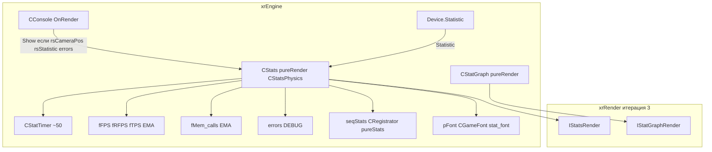

# Статистика

**Статистика** — подсистема `xrEngine` для **замера и отображения** производительности: FPS/RFPS/TPS, время на подсистемы (Engine/Render/Sound/Input/Net/...), память, ошибки. Здесь — `CStats` (таймеры + отрисовка) и `CStatGraph` (график-примитив для xrRender).

См. [Цикл кадра](frame-loop.md), [Консоль](console.md), [Device](device.md), [Ядро](engine.md).

## 1. Ответственность

- **`CStats`** (`src/xrEngine/Stats.h/.cpp`) — `pureRender` + `CStatsPhysics`: ~50 `CStatTimer` (EngineTOTAL, Sheduler, UpdateClient, Particles, AI__, RenderTOTAL, DUMP, Sound, Input, cl_, net*, TEST0–3), FPS/RFPS/TPS (EMA α=0.3), память (EMA 0.9/0.1 или max), ошибки (`xr_vector<shared_str>`, DEBUG), `seqStats` (`CRegistrator<pureStats>`), `Show()` (полный дамп), `OnRender` (DEBUG: sound overlay).
- **`CStatsPhysics`** — база: `ph_collision`/`ph_core`/`Physics` таймеры.
- **`CStatGraph`** (`src/xrEngine/StatGraph.h/.cpp`) — `pureRender`: `EStyle` (stBar/stCurve/stBarLine/stPoint/stVert/stHor), `SSubGraph` (deque `SElement{color,data}`), `SetStyle/SetRect/SetGrid/SetMinMax/AppendItem/AppendSubGraph/Markers`, `FactoryPtr<IStatGraphRender>` (xrRender, итерация 3), `OnRender` → `m_pRender->OnRender(*this)`.
- **Глобалы**: `g_stats_flags` (+ `st_sound*` биты 0–5), `g_bDisableRedText` (через `-xclsx` в `OnDeviceCreate`), `g_ErrorLineCount = 15`.

Чего это **НЕ делает**: не рисует сам (только задаёт данные для `IStatsRender`/`IStatGraphRender`, xrRender, итерация 3); не собирает логи (это `LogFile`/`Log`, xrCore); не управляет cvar'ами (это [Консоль](console.md)).

## 2. Место в архитектуре

`CStats` — `pureRender` + `CStatsPhysics`. Регистрация в `seqRender` — в конструкторе (priority `REG_PRIORITY_LOW - 1000`, только для DEBUG sound overlay `OnRender`). `Show()` вызывается из `CConsole::OnRender` (см. [Консоль](console.md)), **не** из `seqRender`.

## 3. Публичный API

### `CStats` (`src/xrEngine/Stats.h`)

| Поле / метод                                                                                    | Описание                                                                |
| ----------------------------------------------------------------------------------------------- | ----------------------------------------------------------------------- |
| `EngineTOTAL` / `Sheduler` / `UpdateClient` (+crows/active/total)                               | Таймеры ядра/планировщика/обновления клиента.                           |
| `Particles_starting/active/destroy`                                                             | Таймеры частиц.                                                         |
| `AI_Think/Range/Path/Node/Vis/Vis_Query/Vis_RayTests`                                           | Таймеры AI.                                                             |
| `RenderTOTAL` (_Real) / `CALC` / `CALC_HOM` / `Animation`                                       | Таймеры рендера.                                                        |
| `DUMP` (+Wait/Wait_S/RT/SKIN/HUD/Glows/Lights/WM/DT_VIS/DT_Render/DT_Cache/Pcalc/Scalc/Srender) | Таймеры dump-стадии.                                                    |
| `Sound` / `Input`                                                                               | Таймеры звука/ввода.                                                    |
| `clRAY` / `clBOX` / `clFRUSTUM`                                                                 | Таймеры коллизий.                                                       |
| `netClient1/2` / `netServer` / `netClient/ServerCompressor`                                     | Таймеры сети.                                                           |
| `TEST0–3`                                                                                       | Тестовые таймеры.                                                       |
| `fFPS` / `fRFPS` / `fTPS`                                                                       | FPS/RenderFPS/TPS (EMA α=0.3).                                          |
| `fMem_calls`                                                                                    | Память (EMA 0.9/0.1 или max).                                           |
| `dwSND_Played` / `dwSND_Allocated`                                                              | Звук: сыграно/аллоцировано.                                             |
| `fShedulerLoad`                                                                                 | Нагрузка планировщика.                                                  |
| `eval_line_1..3`                                                                                | Обязательные `[evaluation]` ini-строки (FATAL если нет).                |
| `errors` (`xr_vector<shared_str>`)                                                              | Ошибки (DEBUG, заполняются `_LogCallback` для `"! "`-prefixed строк).   |
| `seqStats` (`CRegistrator<pureStats>`)                                                          | Регистратор `pureStats` (обрабатывается в `Show()`).                    |
| `m_pRender` (`FactoryPtr<IStatsRender>`)                                                        | Рендер-бэкенд (xrRender, итерация 3).                                   |
| `pFont` (`CGameFont("stat_font", fsDeviceIndependent)`)                                         | Шрифт (см. [HUD](hud.md)).                                              |
| `Show()`                                                                                        | Полный дамп (вызывается из `CConsole::OnRender`).                       |
| `OnRender()`                                                                                    | DEBUG: sound overlay (3D-предметы: `DrawCross`/`DrawSphere`/`OutText`). |

### `CStatsPhysics` (база)

| Поле                                   | Описание        |
| -------------------------------------- | --------------- |
| `ph_collision` / `ph_core` / `Physics` | Таймеры физики. |

### `CStatGraph` (`src/xrEngine/StatGraph.h`)

| Поле / метод                                            | Описание                                                                     |
| ------------------------------------------------------- | ---------------------------------------------------------------------------- |
| `EStyle` (stBar/stCurve/stBarLine/stPoint/stVert/stHor) | Стиль графика.                                                               |
| `SSubGraph` (deque `SElement{color,data}`)              | Под-график.                                                                  |
| `SetStyle` / `SetRect` / `SetGrid` / `SetMinMax`        | Настройка стиля/прямоугольника/сетки/диапазона.                              |
| `AppendItem` / `AppendSubGraph` / `Markers`             | Добавление элементов/под-графиков/маркеров.                                  |
| `m_pRender` (`FactoryPtr<IStatGraphRender>`)            | Рендер-бэкенд (xrRender, итерация 3).                                        |
| `OnRender`                                              | `m_pRender->OnRender(*this)` (старый D3D9-рендер полностью закомментирован). |

## 4. Внутреннее устройство

**Конструктор `CStats`**: `fFPS=fRFPS=30`, `fTPS=0`, `seqRender.Add(this, REG_PRIORITY_LOW - 1000)` (только для DEBUG `OnRender`).

**`OnDeviceCreate`**: `-xclsx` → `g_bDisableRedText`, создать `pFont`, читать `[evaluation]` (FATAL если нет), DEBUG: `SetLogCB(_LogCallback)` если !red-text.

**`OnDeviceDestroy`**: `SetLogCB(0)`, удалить шрифт.

**`Show()`** (вызывается из `CConsole::OnRender`, gated `rsCameraPos || rsStatistic || errors`; один раз на `dwTimeGlobal`):

1. Остановка всех таймеров.
2. Расчёт FPS/RFPS/TPS (`GetCacheStatPolys()`).
3. Память EMA.
4. **`g_dedicated_server` → return** (dedicated: только таймеры + FPS).
5. Eval-строки (первая половина 2000-кадрового окна, белый).
6. VTune overlay если включён (красный `--= tune =--`).
7. Если `rsStatistic`: r_ps/b_ps EMA, `::Sound->statistic()`, полный текстовый дамп (ENGINE/RENDER/SOUND/Input/cl*/net*/TEST секции, `PPP()` % макрос, `m_pRender->OutData1..4`, `Render->Statistics(&F)`, `g_pGamePersistent->Statistics(&F)`, `seqStats.Process(rp_Stats)`).
8. `_draw_cam_pos` если `rsCameraPos` (белый (10,600), высота 0.02).
9. DEBUG: PERF ALERT (красный (255,16,16) (300,300): FPS<30, `GuardVerts`, если rsStatistic: `GuardDrawCalls`, DT_Count>1000, Sheduler/UpdateClient>3мс, Physics>5мс) + ошибки (последние `g_ErrorLineCount` строк, красный alpha 191, (200,0)).
10. Рестарт всех таймеров, сброс `dwSND_Played/Allocated`, `Particles_*`.

**`OnRender()`** (DEBUG только, из `seqRender`): если `g_stats_flags.is(st_sound)` → `::Sound->statistic(0, &snd_stat_ext)`, для 3D-предметов: `DU->DrawCross` (красный), `DrawSphere` min/max/AI dist (по флагам), `OutText` name/object (по флагам).

**`optimizer vtune`** (static): `average_=30`, `enabled_=FALSE` (отключён — «Engine is not exist»), `update(value)`: `< average*0.7` → `enable()` (`Engine.External.tune_resume()`), иначе `disable()` (`tune_pause()`); EMA `average_ = 0.99*avg + 0.01*value`. (Вызов `vtune.update(fps)` в `Show()` закомментирован.)

**`CStatGraph`**:

- Конструктор: `seqRender.Add(LOW-1000)`, дефолты `mn=0/mx=1/max_item_count=1/lt=(0,0)/rb=(200,200)/grid=(1,1)`, `AppendSubGraph(stCurve)`.
- `OnRender` → `m_pRender->OnRender(*this)` (старый D3D9-рендер полностью закомментирован).

## 5. Взаимодействие

**Кто меня вызывает**:

- `CConsole::OnRender` — `Show()` (если `rsCameraPos || rsStatistic || errors`, см. [Консоль](console.md)).
- `Device.seqRender` — `OnRender` (DEBUG, priority LOW-1000).
- `CApplication` / `CRenderDevice` — `Device.Statistic` (указатель на `CStats`).

**Кого я вызываю**:

- `CStatTimer` — таймеры (start/stop/accumulate).
- `IStatsRender` / `IStatGraphRender` — рендер (xrRender, итерация 3).
- `CGameFont` (`stat_font`) — отрисовка текста (см. [HUD](hud.md)).
- `::Sound->statistic()` — звук (xrSound, итерация 4).
- `Render->Statistics(&F)` — рендер-статистика (xrRender).
- `g_pGamePersistent->Statistics(&F)` — персист-статистика (xrGame).
- `seqStats.Process(rp_Stats)` — регистратор `pureStats`.

## 6. Потоки

Статистика — **только main-поток**: `Show()` вызывается из `CConsole::OnRender` (main), `OnRender` из `seqRender` (main). `CStatTimer` — не thread-safe (main-поток). `g_stats_flags` / `g_bDisableRedText` / `g_ErrorLineCount` — main-поток.

## 7. Конфигурация

| cvar / настройка              | Описание                                                         |
| ----------------------------- | ---------------------------------------------------------------- |
| `[evaluation]` (ini)          | Обязательные eval-строки (FATAL если нет).                       |
| `rsStatistic` / `rsCameraPos` | Флаги показа stats/камеры (см. [Консоль](console.md)).           |
| `st_sound*` (6 битов, DEBUG)  | Флаги sound overlay (см. [Консоль](console.md) §7 `snd_stats*`). |
| `g_ErrorLineCount` (15)       | Число последних ошибок для отображения (DEBUG).                  |
| `-xclsx`                      | Флаг отключения красного текста.                                 |

## 8. Ограничения / дебаг

- **`CStats::Show()` gated** `rsCameraPos || rsStatistic || errors` и вызывается из `CConsole::OnRender`, **не** из `seqRender` (конструктор добавляет в `seqRender` только для DEBUG sound overlay `OnRender` на `LOW-1000`).
- **`g_dedicated_server`**: `Show()` возвращает early после остановки таймеров + расчёта FPS (dedicated: нет рендера).
- **`vtune` optimizer**: `enabled_ = FALSE` в конструкторе («because Engine is not exist»), и вызов `vtune.update(fps)` в `Show()` закомментирован — **vtune мёртвый**.
- **`errors`**: только DEBUG, заполняются `_LogCallback` для `"! "`-prefixed строк лога.
- **PERF ALERT** (DEBUG): FPS<30, `GuardVerts`, `GuardDrawCalls`, DT_Count>1000, Sheduler/UpdateClient>3мс, Physics>5мс — красный (255,16,16) (300,300).
- **Ошибки**: последние `g_ErrorLineCount` (15) строк, красный alpha 191, (200,0).
- **`CStatGraph`**: старый D3D9-рендер полностью закомментирован — активен только `m_pRender->OnRender(*this)` (xrRender, итерация 3).

См. [Цикл кадра](frame-loop.md), [Консоль](console.md), [Device](device.md), [Ядро](engine.md), [HUD](hud.md).
