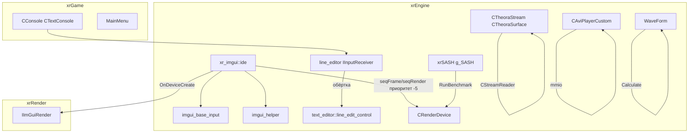
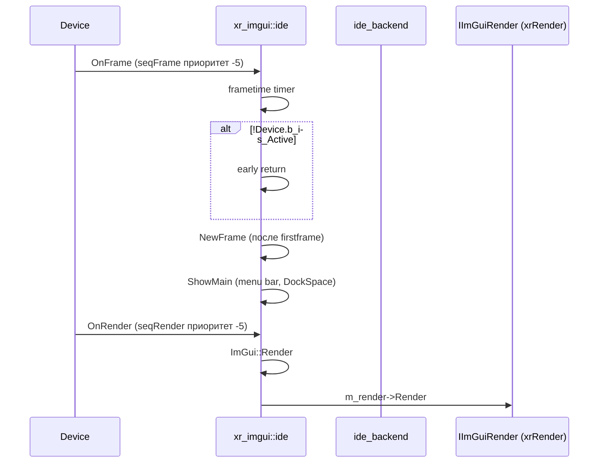
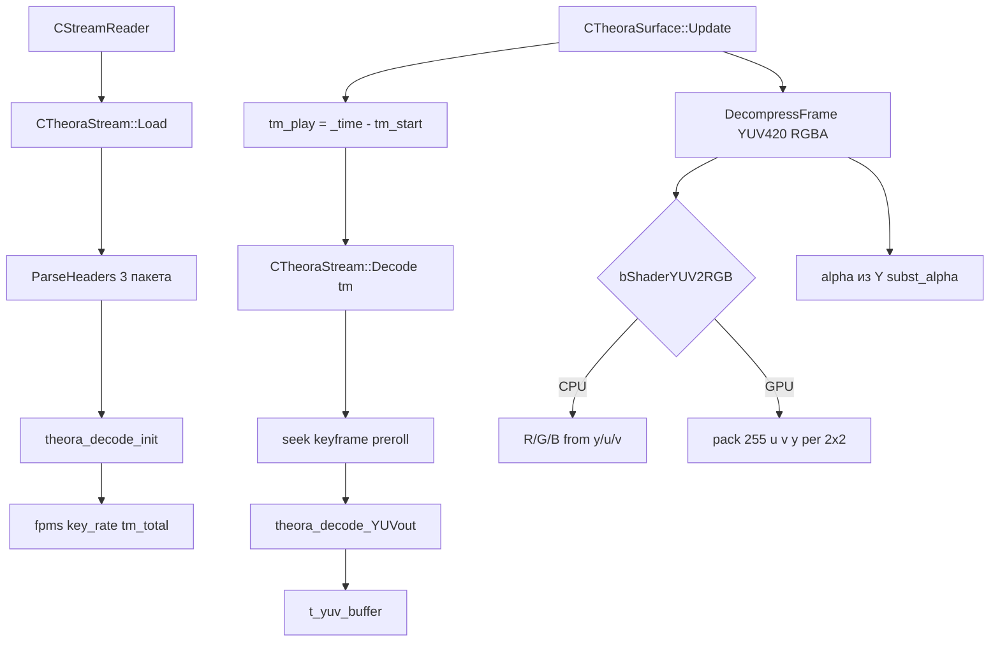

# UI-примитивы

**UI-примитивы** — набор вспомогательных UI/видео-модулей `xrEngine`, не связанных с игровой сценой: **ImGui-оверлей** (встроенный редактор/демо), **текстовый редактор** (`line_edit_control` — консоль/инпут), **Theora-декодер** (видео), **AVI-плеер** (`tntQAVI`), **SASH** (бенчмарк) и **WaveForm** (генератор сигналов).

См. [HUD](hud.md), [Device](device.md), [Камера](camera.md), [Цикл кадра](frame-loop.md).

## Ответственность

- **`xr_imgui::ide`** (`src/xrEngine/imgui_base.h/.cpp` + `imgui_base_input.cpp`) — ImGUI-based в-движковый оверлей: редактор-меню, демо-окно, metrics; регистрируется в `Device.seqFrame`/`seqRender` с приоритетом **`-5`** (рано); шрифты (Hack + Font Awesome, embedded-сжатые TTF); ввод (клавиатура/мышь/буфер обмена).
- **`imgui_helper`** (`src/xrEngine/imgui_helper.h/.cpp`) — inline-хелперы (`xr_key_to_imgui_key` DIK→ImGuiKey); `.cpp` **пуст** (1 строка — только `#include`).
- **`text_editor::line_edit_control`** (`src/xrEngine/line_edit_control.h/.cpp`) + **`line_editor`** (`line_editor.h/.cpp`) — текстовый редактор (консоль/инпут): буферы, курсор, выделение, undo, key-repeat accel, NumLock (инвертированный, см. «Ограничения»), `remove_spaces` / `split_cmd`.
- **`CTheoraStream`** / **`CTheoraSurface`** (`src/xrEngine/xrTheora_Stream.h/.cpp`, `xrTheora_Surface.h/.cpp`) — Ogg/Theora декодер: `Stream` (парсинг заголовков, seek по ключевым кадрам), `Surface` (YUV420→RGBA: CPU или GPU-shader path, alpha-поток).
- **`CAviPlayerCustom`** (`src/xrEngine/tntQAVI.h/.cpp`) — AVI-декодер (mmio): весь `movi` + `idx1` в RAM, keyframe-preroll, alpha-потоки.
- **`xrSASH`** (`src/xrEngine/xrSASH.h/.cpp`) — бенчмарк-харнес (глобал `g_SASH`); **OpenAutomate полностью закомментирован** — активна только native-ветка.
- **`WaveForm`** (`src/xrEngine/WaveForm.h`) — генератор сигналов (CONSTANT/SIN/TRIANGLE/SQUARE/SAWTOOTH/INVSAWTOOTH) + `Calculate` / `Similar`.

Чего это **НЕ делает**: не рисует игру (это [Device](device.md) / xrRender); не управляет вводом игрока (ввод — [Ввод](input.md), порцион 12); не играет звук (звук — xrSound); не управляет временем жизни объектов (это [Sheduler](scheduler.md)).

## Место в архитектуре

`xr_imgui::ide` — автономный оверлей (редактор/демо), не зависит от игровой сцены. `line_edit_control` — автономный текстовый редактор (используется в консоли, порцион 12). `CTheoraStream`/`CTheoraSurface` — автономные декодеры (используются в intro/меню). `CAviPlayerCustom` — автономный AVI-декодер. `xrSASH` — бенчмарк-харнес (не зависит от игры). `WaveForm` — автономный генератор сигналов.

## Публичный API

### `xr_imgui::ide` (`src/xrEngine/imgui_base.h`)

Наследует `pureRender`, `pureFrame`, `pureAppActivate`/`Deactivate`, `Start`/`End`, `pureScreenResolutionChanged`, `IInputReceiver`.

| Метод                             | Описание                                                              |
| --------------------------------- | --------------------------------------------------------------------- |
| `Show(bool)`                      | показать/скрыть оверлей (toggle `IR_Capture`/`IR_Release`)            |
| `EnableInput(bool)`               | вкл/выкл ввод                                                         |
| `is_shown()` / `is_input()`       | состояние                                                             |
| `InputChar(wchar_t)`              | ввод символа                                                          |
| `OnFrame()`                       | кадр (frametime, NewFrame, ShowMain)                                  |
| `OnRender()`                      | рендер (ImGui::Render + m_render->Render)                             |
| `OnAppStart()` / `OnAppEnd()`     | init/shutdown                                                         |
| `OnScreenResolutionChanged(w, h)` | смена разрешения                                                      |
| `GetFont(shared_str)`             | поиск шрифта (case-insensitive)                                       |
| `LoadImGuiFontConfig(path)`       | чтение `.ltx` `[font]` (oversample, pixel snap, glyph spacing и т.п.) |
| `LoadImGuiFont(path)`             | `AddFontFromMemoryTTF` (Cyrillic, `FontDataOwnedByAtlas=false`)       |

**Поля**: `m_shown` / `m_input` / `firstframe`, `m_timer` (`CTimer`), `m_render` (`IImGuiRender*`), `m_context` (`ImGuiContext*`), `m_backend_data` (`ide_backend*`), `keyboard_code_page`, `ImGuiFontsPtr` (`xr_vector<IReader*>`), `ImFonts` (`xr_map<shared_str, ImFont*>`).

### `text_editor::line_edit_control` (`src/xrEngine/line_edit_control.h`)

| Метод                                                                              | Описание                                                                                |
| ---------------------------------------------------------------------------------- | --------------------------------------------------------------------------------------- |
| `init(mode)`                                                                       | инициализация (`im_standart` / `im_number_only` / `im_read_only` / `im_file_name_mode`) |
| `clear_states()`                                                                   | сброс                                                                                   |
| `on_key_press(dik)` / `on_key_hold(dik)` / `on_key_release(dik)`                   | ввод                                                                                    |
| `on_frame()`                                                                       | кадр (blink, repeat accel)                                                              |
| `assign_callback(fn)`                                                              | callback на изменение                                                                   |
| `insert_character(c)` / `insert_text(str)`                                         | вставка                                                                                 |
| `get_key_state()` / `set_key_state(ks)`                                            | состояние клавиш                                                                        |
| `cursor_view()` / `need_update()`                                                  | состояние                                                                               |
| `str_edit()` / `str_before_cursor()` / `before_mark()` / `mark()` / `after_mark()` | буферы                                                                                  |
| `set_edit(str)` / `set_selected_mode(b)`                                           | установка                                                                               |
| `get_num_lock_state()`                                                             | **инвертированный** (см. «Ограничения»)                                                 |

**`key_state`** (биты): `ks_LShift`/`ks_RShift`/`ks_LCtrl`/`ks_RCtrl`/`ks_LAlt`/`ks_RAlt`/`ks_CapsLock`/`ks_NumLock` + комбинации `ks_Shift`/`ks_Ctrl`/`ks_Alt`/`ks_NumLk_Ctrl`/`ks_NumLk_Alt`.

**`init_mode`**: `im_standart` / `im_number_only` / `im_read_only` / `im_file_name_mode`.

**`line_editor`** (`src/xrEngine/line_editor.h/.cpp`) — тонкая `IInputReceiver`-обёртка: `IR_OnKeyboardPress`/`Hold`/`Release` → `line_edit_control m_control` + `on_frame`.

**Free-функции**: `remove_spaces(str)` (схлопывает пробелы), `split_cmd(cmd, params)` (разбивает на cmd/params по первому пробелу).

### `CTheoraStream` (`src/xrEngine/xrTheora_Stream.h`)

| Метод                  | Описание                                                                          |
| ---------------------- | --------------------------------------------------------------------------------- |
| `Load(CStreamReader&)` | парсинг заголовков (3 пакета), `theora_decode_init`, `fpms`, key_rate, `tm_total` |
| `Decode(tm)`           | seek по ключевому кадру + preroll, `theora_decode_YUVout` в `t_yuv_buffer`        |
| `Reset()`              | seek 0, reset states                                                              |
| `CurrentFrame()`       | `&t_yuv_buffer`                                                                   |

### `CTheoraSurface` (`src/xrEngine/xrTheora_Surface.h`)

| Метод                  | Описание                                                                                                               |
| ---------------------- | ---------------------------------------------------------------------------------------------------------------------- |
| `Load(fname)`          | `m_rgb` + опционально `m_alpha` (`<fname>#alpha<ext>`), VERIFY same dims, `bShaderYUV2RGB = HWSupportsShaderYUV2RGB()` |
| `Update()`             | prefetch 2 кадра, loop/stop, `tm_play = _time - tm_start`                                                              |
| `DecompressFrame()`    | YUV420→RGBA (CPU или GPU-shader), alpha из Y (`subst_alpha`, `K = 0.256788+0.504129+0.097906`)                         |
| `Width()` / `Height()` | реальные или `btwPow2_Ceil`                                                                                            |

### `CAviPlayerCustom` (`src/xrEngine/tntQAVI.h`)

| Метод               | Описание                                                                                             |
| ------------------- | ---------------------------------------------------------------------------------------------------- |
| `Load(fname)`       | `mmioOpen`, `movi` + `idx1` в RAM, `ICDecompressBegin`, опционально `_alpha` AVI                     |
| `GetFrame(tm)`      | `CalcFrame` по времени, keyframe preroll, `DecompressFrame`, alpha-merge (RGB-average `subst_alpha`) |
| `PreRoll(keyframe)` | `ICDECOMPRESS_PREROLL                                                                                | HURRYUP`, keyframe затем NOTKEYFRAME; `ICERR_DONTDRAW` tolerated (indeo 5.11) |
| `CalcFrame(tm)`     | time-based, `% m_dwFrameTotal`                                                                       |

### `xrSASH` (`src/xrEngine/xrSASH.h`)

Глобал `g_SASH`. **OpenAutomate полностью закомментирован** — активна только native-ветка.

| Метод                                                    | Описание                                                                                                  |
| -------------------------------------------------------- | --------------------------------------------------------------------------------------------------------- |
| `Init(cfg)`                                              | (OA-путь закомментирован) native: `m_strBenchCfgName` = cfg, «Running native path»                        |
| `MainLoop()`                                             | `LoopOA` (пусто, закомм.) или `LoopNative`                                                                |
| `LoopNative()`                                           | чтение `$app_data_root$/<cfg>` ini `[benchmark]`, per test: `Core.Params`, `RunBenchmark`, `ReportNative` |
| `StartBenchmark()` / `DisplayFrame()` / `EndBenchmark()` | frame times (`m_FrameTimer` / `m_aFrimeTimes`)                                                            |
| `ReportNative()`                                         | min/max/avg fps (15-frame window `iWindowSize=15`), per-frame stats в `<test>.result` ini                 |
| `TryInitEngine()` / `ReleaseEngine()`                    | init/release                                                                                              |

### `WaveForm` (`src/xrEngine/WaveForm.h`)

`#pragma pack(4)`. `EFunction` (`fCONSTANT`/`fSIN`/`fTRIANGLE`/`fSQUARE`/`fSAWTOOTH`/`fINVSAWTOOTH`). `Func(t)` per function. `Calculate(t) = arg[0] + arg[1]*Func(frac((t+arg[2])*arg[3]))`. `Similar` (fsimilar args, short-circuit if `arg[1]≈0`).

## Внутреннее устройство

### `xr_imgui::ide`

- **Конструктор**: аллокаторы (`xr_malloc`/`free`), `CreateContext`, `NavEnableKeyboard` + `DockingEnable`, `HasSetMousePos`, `Platform_OpenInShellFn` disabled, `ColorEditOptions` Float/RGB, регистрация в `seqResolutionChanged`.
- **`OnDeviceCreate`**: `RenderFactory->CreateImGuiRender()` → `m_render`.
- **`OnAppStart`**: ini/log в `$app_data_root$`/`$logs$`, загрузка default-шрифта `$game_textures$/fonts/$default.ltx` + embedded-сжатый Hack-Regular TTF (Cyrillic ranges) + merge Font Awesome icons (`ICON_MIN_FA`..`ICON_MAX_16_FA`, MergeMode), загрузка `$game_textures$/fonts/*.ttf|otf` с per-font `.ltx` config; **регистрация в `Device.seqFrame`/`seqRender` с приоритетом `-5`** (рано).
- **`OnFrame`**: frametime timer, early-return если `!Device.b_is_Active`, `NewFrame` после `firstframe`, `ShowMain` + опц. demo/metrics, mouse-teleport via `WantSetMousePos`, double-click-unfocused → `EnableInput(false)`.
- **`OnRender`**: `ImGui::Render` + `m_render->Render`, `NewFrame` после first frame.
- **`ShowMain`**: main menu bar File→Stats toggle `rsStatistic` + `g_pGamePersistent->ImGui_OnRender("MenuFile")` + Close, MenuBar, About→Demo/Metrics, DockSpace full-viewport passthru.
- **`Show`**: toggle `IR_Capture`/`IR_Release`.
- **`GetFont`**: case-insensitive map lookup.
- **`LoadImGuiFontConfig`**: чтение `.ltx` `[font]`: `oversampleh/v`, `pixelsnaph`, `glyphextraspacing`, `glyphoffset`, `ellipsischar`, `sizepixels`, `glyphminadvancex/max`, `rasterizermultiply/density`.
- **`LoadImGuiFont`**: `AddFontFromMemoryTTF` Cyrillic, `FontDataOwnedByAtlas=false`.
- **Embedded-сжатый TTF**: Hack ~220KB, FA ~247KB.

### `imgui_base_input.cpp`

- **`ide_backend`**: `{ clipboard_text_data }`.
- **`ImGui_UpdateKeyboardCodePage`**: `GetKeyboardLayout`→codepage, fallback `CP_ACP`.
- **`InitBackend`**: clipboard via `os_clipboard::copy_to_clipboard`/`paste_from_clipboard` 2048.
- **`OnAppActivate`/`Deactivate`**: `AddFocusEvent`.
- **`IR_Capture`**: `MouseDrawCursor=true`, `TeleportMousePos`, save+hide UICursor via `GetUICursor()`.
- **`IR_Release`**: `MouseDrawCursor=false`, maps mouse to `UI_BASE_WIDTH/HEIGHT` for UICursor, restores visibility.
- **`IR_OnKeyboardPress`**: binds `kQUIT`/`kEDITOR`→`Show(false)`/`EnableInput(false)` with `RControl` check; mods Ctrl/Shift/Alt/Super; `xr_key_to_imgui_key`.
- **`IR_OnKeyboardRelease`**: mirror mods check.
- **`InputChar`**: `MultiByteToWideChar` codepage.
- **`xr_key_to_imgui_key`** (в `imgui_helper.h`): DIK→ImGuiKey table (inline).

### `text_editor::line_edit_control`

- **`g_console_sensitive = 0.15`** (порог key-repeat).
- **`terminate_char`**: set пунктуации для word boundary.
- **`get_num_lock_state`** — **инвертированный** (demonized fork): возвращает `(GetKeyState(VK_NUMLOCK)&1)==0` — «use DISABLED numlock for scrolling, like in normal apps».
- **`update_key_states`**: читает `pInput->iGetAsyncKeyState` для mods, `GetKeyState` для CapsLock/NumLock.
- **`init`**: присваивает char pairs + callbacks per mode; `read_only` — меньше bindings; Antglobes numpad nav (NumLock-gated).
- **`on_key_press`**: clamp, clear inserted, compute positions, dispatch `m_actions[dik]`, Ctrl clears mark, `add_inserted_text`, select_start on mark.
- **`on_key_hold`**: key-repeat accel: `m_repeat_mode && m_last_key_time > 5.0*g_console_sensitive` → re-fire `on_key_press`; skips TAB/Shift/Ctrl/Alt.
- **`on_frame`**: cursor blink 0.3/0.4s, key-repeat accel `m_rep_time += dt*m_accel`, `g_console_sensitive` threshold, dt clamp 0.06666, `m_accel += 0.2` per repeat.
- **`add_inserted_text`**: insert/overwrite at mark, converts `\n\t`→space.
- **`update_bufs`**: splits into `m_buf0` (before-cursor), `m_buf1` (before-mark), `m_buf2` (mark), `m_buf3` (after-mark).
- **Clipboard ops**: via `os_clipboard`.
- **undo** / **select_all** / **insert-mode flip** / **delete selected/word** / **move home/end/left/right/word** (word boundary via `terminate_char`).
- **`SwitchKL`**: `ActivateKeyboardLayout(HKL_NEXT)`.

### `CTheoraStream` / `CTheoraSurface`

- **`CTheoraStream::Load`**: `ParseHeaders` (находит Theora stream среди BOS pages, читает 3 заголовка, `theora_decode_init`, `fpms`, scan всего потока считая frames + key_rate, `tm_total`).
- **`CTheoraStream::Decode(tm)`**: seek по ключевому кадру + preroll, `theora_decode_YUVout` в `t_yuv_buffer`.
- **`source`** — `CStreamReader` (или `IReader` в `_EDITOR`).
- **`CTheoraSurface::Load`**: `m_rgb` + опц. `m_alpha` (`<fname>#alpha<ext>`), VERIFY same dims, `bShaderYUV2RGB = Device.m_pRender->HWSupportsShaderYUV2RGB()`.
- **`CTheoraSurface::Update`**: prefetch fake first 2 frames, loop/stop logic, `tm_play = _time - tm_start`.
- **`CTheoraSurface::DecompressFrame`**: YUV420→RGBA: CPU path если `!bShaderYUV2RGB` (R/G/B from y/u/v), else GPU fast path packing `255<<24|u<<8|v|y` per 2×2 block для шейдера; alpha из Y через `subst_alpha`, `K=0.256788+0.504129+0.097906`.
- **`Width`/`Height`**: реальные или `btwPow2_Ceil`.
- **SDL output path** `#ifdef SDL_OUTPUT` (dev).

### `CAviPlayerCustom`

- **`Load`**: `mmioOpen`, находит `movi` list + `idx1` index, **загружает весь `movi` + `idx1` в RAM** (`m_pMovieData`/`m_pMovieIndex`), `ICLocate` `ICDECOMPRESS_FASTDECOMPRESS`, `ICDecompressBegin`; опц. `_alpha` AVI via `alpha` member.
- **`AVIStreamHeaderCustom`**: `RECT` заменён на 4 WORDs (комментарий «лажа в MSDN»).
- **`GetFrame`**: `CalcFrame` by time, keyframe preroll `PreRoll`, `DecompressFrame`; alpha merged by RGB-average `subst_alpha`.
- **`PreRoll`**: `ICDECOMPRESS_PREROLL|HURRYUP`, keyframe then NOTKEYFRAME; `ICERR_DONTDRAW` tolerated for indeo 5.11.
- **`CalcFrame`**: time-based, `% m_dwFrameTotal`.

### `xrSASH`

- **`OpenAutomate` полностью закомментирован** — только native-ветка активна.
- **`Init`**: (OA-путь закомм.), native: `m_strBenchCfgName` = cfg, «Running native path».
- **`MainLoop`** → `LoopOA` (пусто, закомм.) или `LoopNative`.
- **`LoopNative`**: читает `$app_data_root$/<cfg>` ini `[benchmark]`, per test: `Core.Params`, `RunBenchmark`, `ReportNative`.
- **`StartBenchmark`/`DisplayFrame`/`EndBenchmark`**: frame times via `m_FrameTimer`/`m_aFrimeTimes`.
- **`ReportNative`**: min/max/avg fps over 15-frame window `iWindowSize=15`, per-frame stats to `<test>.result` ini.
- **`TryInitEngine`/`ReleaseEngine`**.

### `WaveForm`

- `#pragma pack(4)`.
- `EFunction`: `fCONSTANT`/`fSIN`/`fTRIANGLE`/`fSQUARE`/`fSAWTOOTH`/`fINVSAWTOOTH`.
- `Func(t)` per function.
- `Calculate(t) = arg[0] + arg[1]*Func(frac((t+arg[2])*arg[3]))`.
- `Similar` (fsimilar args, short-circuit if `arg[1]≈0`).

## Взаимодействие

**Кто вызывает `xr_imgui::ide`**:

- **`CApplication`** (`engine.md`): создание/уничтожение;
- **`Device`**: `seqFrame`/`seqRender` (приоритет `-5`), `seqResolutionChanged`;
- **xrGame**: `Show`/`EnableInput` (открытие/закрытие редактора), `ImGui_OnRender` (в `ShowMain`).

**Кого вызывает `xr_imgui::ide`**:

- **`IImGuiRender`** (xrRender, итерация 3): `Render` (в `OnRender`);
- **`Device`**: `b_is_Active`, `dwWidth`/`dwHeight`, `seqFrame`/`seqRender`;
- **`g_pGamePersistent`**: `ImGui_OnRender("MenuFile")` (в `ShowMain`);
- **`os_clipboard`**: clipboard ops (в `imgui_base_input.cpp`);
- **`GetUICursor()`** (xrGame): save/restore UICursor (в `IR_Capture`/`IR_Release`).

**`line_edit_control` / `line_editor`**:

- **Вызывают**: `pInput->iGetAsyncKeyState` (ввод), `GetKeyState` (CapsLock/NumLock), `os_clipboard` (буфер обмена), `ActivateKeyboardLayout` (смена раскладки).
- **Их вызывают**: `CConsole`/`CTextConsole` (порцион 12), xrGame (инпут-поля).

**`CTheoraStream` / `CTheoraSurface`**:

- **Вызывают**: `theora` (libtheora), `CStreamReader` (чтение), `Device.m_pRender->HWSupportsShaderYUV2RGB()` (GPU path).
- **Их вызывают**: xrGame (intro/меню видео).

**`CAviPlayerCustom`**:

- **Вызывает**: `mmio` (AVI), `ICDecompress*` (декодирование).
- **Его вызывает**: xrGame (AVI-видео).

**`xrSASH`**:

- **Вызывает**: `Core.Params` (бенчмарк-параметры), `RunBenchmark` (запуск), `ReportNative` (отчёт).
- **Его вызывают**: `Device.Begin`/`End` (в бенчмарк-режиме), консоль (`sash` command).

**`WaveForm`**:

- **Вызывает**: ничего (автономный).
- **Его вызывают**: xrGame (генерация сигналов для звука/эффектов).

## Потоки данных

### ImGui-кадр

### Theora-видео

## Конфигурация

**`xr_imgui::ide`**:

- `$app_data_root$/imgui.ini` — состояние окон (ImGui-ини);
- `$logs$/imgui.log` — лог;
- `$game_textures$/fonts/$default.ltx` — default-шрифт config;
- `$game_textures$/fonts/*.ttf|otf` + `*.ltx` — пользовательские шрифты.

**`line_edit_control`**:

- `g_console_sensitive = 0.15` (порог key-repeat, хардкод).

**`CTheoraStream` / `CTheoraSurface`**:

- нет конфигов; видео-файлы — `$game_data$` / `$level$` (по пути);
- alpha-поток: `<fname>#alpha<ext>`.

**`CAviPlayerCustom`**:

- нет конфигов; AVI-файлы — по пути;
- alpha-поток: `<fname>_alpha.avi`.

**`xrSASH`**:

- `$app_data_root$/<cfg>.ini` — `[benchmark]` секция (test-список);
- `<test>.result` ini — отчёт (min/max/avg fps, per-frame).

**`WaveForm`**:

- нет конфигов; параметры — в коде (xrGame).

## Известные ограничения / дебаг

- **`imgui_helper.cpp`** — **пуст** (1 строка, только `#include`); вся логика — в `imgui_helper.h` (inline) и `imgui_base_input.cpp`.
- **`xr_imgui::ide`** — приоритет **`-5`** в `seqFrame`/`seqRender` (рано); `OnFrame` early-returns при `!Device.b_is_Active`.
- **`line_edit_control::get_num_lock_state`** — **инвертированный** (fork-изменение): NumLock **off** включает numpad (как в обычных приложениях).
- **`xrSASH`** — OpenAutomate **полностью закомментирован**; только native-ветка активна. Не документировать OA как активный.
- **`CAviPlayerCustom`** — **весь `movi` + `idx1` в RAM** (потребление памяти ~размер AVI-файла).
- **`CTheoraSurface`** — `bShaderYUV2RGB` зависит от `HWSupportsShaderYUV2RGB()` (GPU path); при отсутствии — CPU path (медленнее).
- **`WaveForm`** — `#pragma pack(4)`, размер структуры зависит от `float`/`int` layout.
- **DEBUG**: `xrSASH::ReportNative` — per-frame stats в `<test>.result` ini (только в бенчмарк-режиме).
