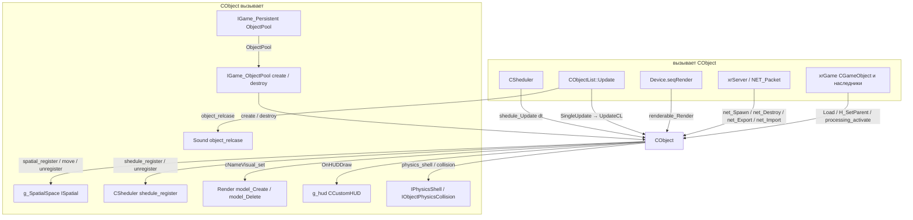
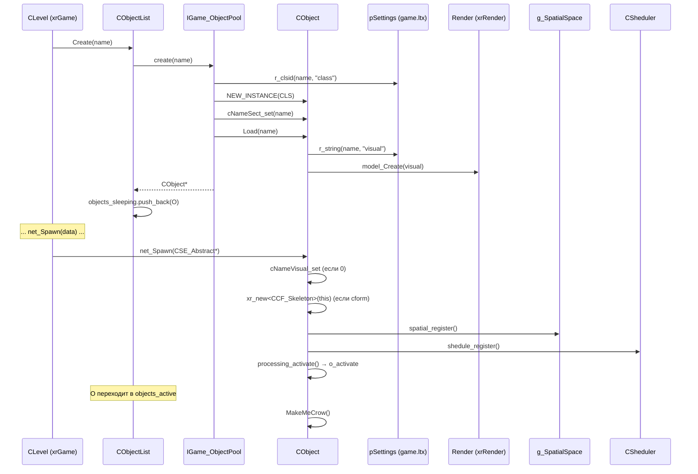
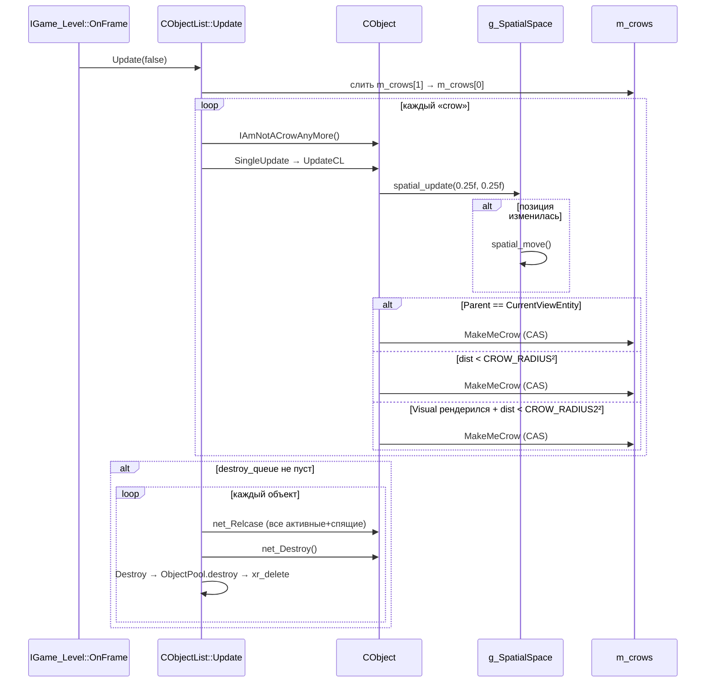

# Объект (xr_object)

`CObject` — базовый класс **игрового объекта** уровня: всё, что живёт в мире и имеет имя, матрицу трансформации, визуальную модель, форму коллизии и сетевой ID. Наследники — в `xrGame` (`CGameObject` и дальше: персонажи, оружие, зоны, физика).

`CObject` сам по себе — не «сущность»: он не содержит ни AI, ни физики, ни здоровья. Это **каркас** (skeleton of an object): пространственная регистрация в `g_SpatialSpace`, учёт в `CObjectList` (активные/спящие/«crow»), привязка к родителю, сетевой экспорт/импорт, HUD-хук и позиция-стек для интерполяции.

Чего это **НЕ делает**: не хранит игровое состояние (это [xrGame](../game/index.md)), не считает физику (это [Физика](../game/physics.md)), не анимирует кости (это [Скелет и анимация](skeleton-motion.md)), не владеет рендером модели (только указатель `visual` в xrRender).

## Место в архитектуре

```mermaid
graph TD
    subgraph xrEngine
        Obj[CObject]
        ObjL[CObjectList]
        Anim[CObjectAnimator]
        Pool[IGame_ObjectPool]
        Pers[IGame_Persistent]
        Level[IGame_Level / CLevel xrGame]
    end
    subgraph интерфейсы
        Spatial[ISpatial / g_SpatialSpace]
        Sched[ISheduled / CSheduler]
        Render[IRenderable]
        Collide[ICollidable]
    end
    subgraph наследники
        GO[CGameObject xrGame]
    end

    Obj --implements--> Spatial
    Obj --implements--> Sched
    Obj --implements--> Render
    Obj --implements--> Collide
    Level -->|Objects: CObjectList| ObjL
    ObjL -->|active / sleeping / crow| Obj
    Pers -->|ObjectPool| Pool
    Pool -->|create / destroy| Obj
    Obj --H_Parent|-> Obj
    GO --inherits--> Obj
    Anim -.анимирует.-> GO
```

- **`CObject`** — единственный общий предок всех игровых объектов; `dcast_CObject()` — универсальный downcast из `ISpatial`/`IRenderable`/`ICollidable`.
- **`CObjectList`** — реестр объектов уровня: живёт в `IGame_Level::Objects`, управляет жизненным циклом (create/destroy), активацией/сном, «crow»-режимом и сетевым экспортом.
- **`CObjectAnimator`** — независимый (не mixin) владелец анимационных циклов `.anm/.anms`; в `xrGame` встраивается в объекты через наследование/композицию.

См. [Карта модулей](../../architecture/module-map.md), [Модель объектов](../../architecture/object-model.md), [Уровень](level.md), [Пул объектов](object-pool.md), [Скелет и анимация](skeleton-motion.md).

## Публичный API

### `CObject` (`src/xrEngine/xr_object.h`)

| Группа       | Методы                                                                                                                                                                                                                                               |
| ------------ | ---------------------------------------------------------------------------------------------------------------------------------------------------------------------------------------------------------------------------------------------------- |
| Имена        | `cName()`, `cNameSect()`, `cNameVisual()`, `cName_set`, `cNameSect_set`, `cNameVisual_set` (смена модели через `Render->model_Create/Delete`)                                                                                                        |
| Трансформ    | `XFORM()` (→ `renderable.xform`), `Position()`, `Direction()`, `Center(Fvector&)`, `Radius()`, `BoundingBox()`, `ForceTransform`                                                                                                                     |
| Пространство | `spatial_register/unregister/move`, `spatial_update(eps_P, eps_R)`, `Sector()` (через `H_Root()`)                                                                                                                                                    |
| Родитель     | `H_Parent()`, `H_Root()`, `H_SetParent(CObject*, just_before_destroy)`, хуки `OnH_B_Chield`/`OnH_A_Chield`/`OnH_B_Independent`/`OnH_A_Independent`                                                                                                   |
| Активность   | `processing_activate/deactivate` (счётчик `bActiveCounter`), `processing_enabled`                                                                                                                                                                    |
| Флаги        | `setVisible/getVisible`, `setEnabled/getEnabled`, `setDestroy/getDestroy` (ставит в `destroy_queue`)                                                                                                                                                 |
| Сеть         | `ID()/setID`, `Local/Remote`, `setLocal/getLocal`, `Ready/setReady`, `setSVU/getSVU`, `net_Spawn(CSE_Abstract*)`, `net_Destroy`, `net_Export/Import/ImportInput(NET_Packet&)`, `net_Relevant`, `net_MigrateInactive/Active`, `net_Relcase(CObject*)` |
| Обновление   | `shedule_Update(u32 dt)`, `UpdateCL`, `renderable_Render`, `shedule_Scale/Needed/Name`, `register_schedule`                                                                                                                                          |
| Crow         | `MakeMeCrow`, `IAmNotACrowAnyMore`, `AmICrow`, `AlwaysTheCrow`                                                                                                                                                                                       |
| HUD/сущность | `OnHUDDraw(CCustomHUD*)`, `On_SetEntity`, `On_LostEntity`                                                                                                                                                                                            |
| Стек позиции | `ps_Size()`, `ps_Element(u32)`                                                                                                                                                                                                                       |
| Физика-хуки  | `physics_shell()`, `physics_collision()` (по умолчанию `0`)                                                                                                                                                                                          |
| Mesh-точки   | `get_new_local_point_on_mesh(u16&)`, `get_last_local_point_on_mesh(Fvector const&, u16)`                                                                                                                                                             |
| Загрузка     | `Load(LPCSTR section)` — из `pSettings`                                                                                                                                                                                                              |

### `CObjectList` (`src/xrEngine/xr_object_list.h`)

| Метод                                                               | Назначение                                                         |
| ------------------------------------------------------------------- | ------------------------------------------------------------------ |
| `Create(LPCSTR name)`                                               | создать объект через `ObjectPool.create` в `objects_sleeping`      |
| `Destroy(CObject*)`                                                 | убрать из всех контейнеров, `ObjectPool.destroy`                   |
| `Update(bool bForce)`                                               | кадр: обновление «crow», `SingleUpdate`, обработка `destroy_queue` |
| `SingleUpdate(CObject*)`                                            | `UpdateCL` + рекурсия по родителю                                  |
| `o_activate`/`o_sleep`                                              | перенос `objects_sleeping ↔ objects_active`                        |
| `FindObjectByName` / `FindObjectByCLS_ID`                           | линейный поиск по обоим спискам                                    |
| `net_Register` / `net_Unregister` / `net_Find(u16)`                 | таблица `map_NETID[0xffff]`                                        |
| `net_Export(NET_Packet*, start, count)` / `net_Import(NET_Packet*)` | сетевой обмен                                                      |
| `Load` / `Unload`                                                   | проверка пустоты / массовое уничтожение                            |
| `register_object_to_destroy`                                        | поставить флаг + найти детей                                       |
| `relcase_register` / `relcase_unregister`                           | пользовательские callback'и при уничтожении                        |
| `o_count()` / `o_get_by_iterator(u32)`                              | итерация «active+sleeping» одним индексом                          |

### `CObjectAnimator` (`src/xrEngine/ObjectAnimator.h`)

| Метод                             | Назначение                                               |
| --------------------------------- | -------------------------------------------------------- |
| `Load(LPCSTR name)`               | загрузить `.anm`/`.anms` из `$level$` или `$game_anims$` |
| `Play(bool bLoop, LPCSTR name=0)` | активировать цикл по имени (или первый)                  |
| `Pause(bool)` / `Stop()`          | управление воспроизведением                              |
| `Update(float dt)`                | оценить текущий цикл → `m_XFORM`                         |
| `Speed()`                         | множитель скорости (ссылка на `float`)                   |
| `XFORM()`                         | текущая матрица анимации                                 |
| `GetLength()`                     | длина цикла в секундах                                   |
| `DrawPath()`                      | только `_EDITOR`: отрисовка траектории в редакторе       |

## Внутреннее устройство

### `CObject` — layout

```cpp
// src/xrEngine/xr_object.h
class ENGINE_API CObject :
    public DLL_Pure,      // NEW_INSTANCE по CLASS_ID
    public ISpatial,      // g_SpatialSpace: spatial_register/move/unregister, sector
    public ISheduled,     // CSheduler: shedule_Update
    public IRenderable,   // renderable.xform / visual / pROS
    public ICollidable    // collidable.model : ICollisionForm*
{
    union ObjectProperties {   // одно u32-поле, битовые флаги
        struct {
            u32 net_ID : 16;   // сетевой ID (0xffff = нет)
            u32 bActiveCounter : 8;  // счётчик processing_activate/deactivate
            u32 bEnabled : 1, bVisible : 1, bDestroy : 1;
            u32 net_Local : 1, net_Ready : 1, net_SV_Update : 1;
            u32 crow : 1;      // «виден/близко» — участвует в UpdateCL
            u32 bPreDestroy : 1;
        };
        u32 storage;
    } Props;

    shared_str NameObject, NameSection, NameVisual;
    CObject* Parent;                       // иерархия (H_SetParent)
    svector<SavedPosition, 4> PositionStack;  // для сетевой интерполяции
    u32 dwFrame_UpdateCL;                  // защита от двойного UpdateCL
    u32 dwFrame_AsCrow;                    // CAS-защита MakeMeCrow
};
```

Ключевые решения:

- **`Props` как union из битов** — всё состояние флагов в одном `u32`; `bActiveCounter` — 8 бит, потому что активность — рекурсивный счётчик (родитель активирует, потомок ещё один).
- **Три имени** — `NameObject` (уникальное, `FindObjectByName`), `NameSection` (секция в `game.ltx`, определяет `CLASS_ID`), `NameVisual` (путь к `.ogf`). `cNameVisual_set` — не просто сеттер: создаёт/удаляет `IRenderVisual` через `Render->model_Create/Delete` и переносит callback'и `IKinematics`.
- **`renderable.xform`** — единственная матрица трансформации; `Position()/Direction()` — алиасы на её `c`/`k`.

### Crow-режим

«Crow» = объект, который **достаточно интересен** (близок к камере / является родителем view-entity / помечен `AlwaysTheCrow()`), чтобы его `UpdateCL` вызывался каждый кадр. Механика:

1. `UpdateCL` (и `shedule_Update`, и `renderable_Render`) зовут `MakeMeCrow()`.
2. `MakeMeCrow` — CAS по `dwFrame_AsCrow` против `Device.dwFrame`: один раз за кадр объект попадает в `m_crows[owner_thread]`.
3. `CObjectList::Update` сливает `m_crows[1]` (вторичный поток) в `m_crows[0]` (main), делает их workload'ом: `IAmNotACrowAnyMore` + `SingleUpdate` на каждый.
4. Флаг `rsDisableObjectsAsCrows` — fallback на «все активные».

Радиусы: `CROW_RADIUS = 30.f` (всегда), `CROW_RADIUS2 = 60.f` (только если модель рендерилась в этом/прошлом кадре — `Visual()->getVisData().hom_frame + 2 > Device.dwFrame`).

### `spatial_update`

Определяет, нужен ли `spatial_move` (перерегистрация в `g_SpatialSpace`):

- Пустой `PositionStack` → заполнить текущей позицией, `bUpdate = true`.
- Позиция не изменилась в пределах `eps_P` → обновить только `dwTime`.
- Изменилась → сдвинуть стек (max 4 записи), `bUpdate = true`.
- Если `spatial.node_ptr` уже установлен: перерегистрировать только если радиус или центр изменились сверх `eps_R`/`eps_P`.

`UpdateCL` вызывает `spatial_update(0.05f*5, 0.05f*5)`, `shedule_Update` — `(0.05f, 0.05f)` (точнее, но реже).

### `H_SetParent`

Правила:

- Нельзя вешать объект, у которого уже есть родитель (нужно сначала `H_SetParent(0)`).
- При `new_parent != 0` — `spatial_unregister()` (объект не в spatial DB, он «внутри» родителя).
- При `new_parent == 0` — `spatial_register()`.
- Хуки: `OnH_B_Chield` (по умолчанию `setVisible(false)` — родителю виден только корень иерархии), `OnH_A_Chield`, `OnH_B_Independent`, `OnH_A_Independent`.

### `net_Spawn` / `net_Destroy`

`net_Spawn(CSE_Abstract* data)`:

1. `PositionStack.clear()`.
2. Если `Visual() == 0` и в секции есть `visual` — загрузить.
3. Если `collidable.model == 0` и в секции есть `cform` — создать `CCF_Skeleton(this)`.
4. `spatial_register()`, `shedule_register()` (если `register_schedule()`), `processing_activate()`, `setDestroy(false)`, `MakeMeCrow()`.

`net_Destroy()`: `xr_delete(collidable.model)`, `shedule_unregister`, `spatial_unregister`, `cNameVisual_set(0)`.

### `CObjectList::Update`

Порядок (кадр):

1. Если не пауза или `bForce`:
   - Слить `m_crows[1]` в `m_crows[0]`, отсортировать (DEBUG: проверить уникальность).
   - Выбрать workload: `crows` (обычно) или `objects_active` (`rsDisableObjectsAsCrows`).
   - Для каждого в workload: `IAmNotACrowAnyMore()`, `dwFrame_AsCrow = u32(-1)`, затем `SingleUpdate`.
2. Если `destroy_queue` не пуст:
   - Для каждого в `objects_active` и `objects_sleeping` → `net_Relcase(destroy_queue[i])` (разрыв ссылок).
   - `Sound->object_relcase`.
   - Каждый `m_relcase_callbacks[i]` → `callback(destroy_queue[i])` + `g_hud->net_Relcase`.
   - Обратный обход: `net_Destroy()` + `Destroy()`.

### `CObjectList::Destroy`

- `net_Unregister`.
- Убрать из `m_crows[0]` и `m_crows[1]`.
- Убрать из `objects_active` **или** `objects_sleeping` (если ни в одном — `FATAL`).
- `g_pGamePersistent->ObjectPool.destroy(O)` — реально `xr_delete`.

### `CObjectList::register_object_to_destroy`

Помимо постановки в `destroy_queue`, **рекурсивно** ищет всех детей (в `objects_active` + `objects_sleeping`) у кого `H_Parent() == object_to_destroy` и ставит им `setDestroy(TRUE)`. Это защита от «сирот».

### `CObjectAnimator`

- `m_Motions` — отсортированный по имени вектор `COMotion*`.
- `LoadMotions` — `.anm` (один цикл) или `.anms` (контейнер: `u32 count` + последовательность `COMotion::Load`).
- `Play` — `std::lower_bound` по имени (или первый, если `name == 0`).
- `Update` — `m_Current->_Evaluate(frame, P, R)` → `m_XFORM.setXYZi(R).translate_over(P)`.
- `m_MParam` (`SAnimParams`) — внутренний тайминг: `Frame()`, `Update(dt, speed, loop)`, `Play/Stop/Pause`.

## Взаимодействие



**Кто вызывает меня**:

- `CObjectList::SingleUpdate` → `UpdateCL` (каждый кадр для «crow»).
- `CSheduler` → `shedule_Update(dt)` (адаптивный бюджет).
- `IGame_Level::Load` → `Objects.Load()` → `CObjectList::Create` → `ObjectPool.create` → `CObject::Load`.
- `xrGame` (`CLevel`, `CSE_Abstract` спавн) → `net_Spawn`, `net_Destroy`, `net_Export/Import`.
- `IGame_Level::OnFrame` → `Objects.Update(false)`.
- `CObjectAnimator` — в `xrGame` встраивается в объекты (наследование), не вызывается из `CObject`.

**Кого вызываю я**:

- `g_SpatialSpace` (`ISpatial`) — `spatial_register/move/unregister`.
- `CSheduler` — `shedule_register/unregister`.
- `::Render` (`IRender_interface`) — `model_Create/Delete` (смена визуала).
- `g_pGamePersistent->ObjectPool` — `create/destroy`.
- `g_hud` (`CCustomHUD`) — `OnHUDDraw`.
- `Sound` — `object_relcase` (через `CObjectList::Update`).
- `IPhysicsShell` / `IObjectPhysicsCollision` — по умолчанию `0`, переопределяются в `xrGame`.

## Потоки данных

### Загрузка объекта (спавн)



### UpdateCL (кадр)



## Конфигурация

- **`game.ltx`** (секции объектов) — `Load(LPCSTR section)` читает:
  - `visual = <путь к .ogf>` — модель (обязателен для `cform`).
  - `cform` — наличие строки (любое значение) включает создание `CCF_Skeleton` при `net_Spawn`.
  - `bullet_check_visual` (опционально, `#ifdef CBULLETMANAGER_EX`) — проверка пуль по меши.
- **`prefetch_objects_<game_type>`** (в `game.ltx`) — секция для `IGame_ObjectPool::prefetch()`: каждый item — имя секции объекта.
- **`CROW_RADIUS = 30.f`**, **`CROW_RADIUS2 = 60.f`** — `#define` в `xr_object.h` (не из конфига).
- **`base_spu_epsP = 0.05f`**, **`base_spu_epsR = 0.05f`** — базовые эпсилоны для `spatial_update` (в `xr_object.cpp`).

## Известные ограничения / дебаг

- **`CObject::BoundingBox()`** — берёт из `renderable.visual->getVisData().box`, **не** из `CFORM()->getBBox()`. Два разных bounding volume. Если `visual == 0` — возвращает статический `NULL_BOX`.
- **`CObject::get_last_local_point_on_mesh`** — использует `CFORM()->getBBox()` как OBB; если `CFORM() == NULL` — crash.
- **`CObject::cNameVisual_set`** — при смене модели **не** переносит `Update_Callback` у `IKinematics` (закомментировано); переносит только через `SetUpdateCallback` (если оба `IKinematics`).
- **`CObject::shedule_Scale()`** — по умолчанию `distance_to(camera) / 200.f`; переопределяется в наследниках.
- **`CObjectList::map_NETID[0xffff]`** — статический массив (не `xr_map`); `u16(-1) == 0xffff` = «нет объекта». `net_Find(0xffff)` → `NULL`.
- **`CObjectList::Update`** — если `destroy_queue` не пуст, `net_Relcase` вызывается для **всех** активных+спящих (O(n²) при большом числе объектов).
- **`CObject::MakeMeCrow`** — CAS по `dwFrame_AsCrow`; если два потока одновременно вызывают `MakeMeCrow` для одного объекта, только один попадёт в `m_crows`.
- **`CObjectAnimator`** — не часть `CObject` (не mixin); в `xrGame` встраивается через наследование или композицию. `Load` делает `Debug.fatal` если файл не найден.
- **`CObjectList::Unload`** — логирует каждый объект как «leaked» (`Msg("! ...")`); это не ошибка, а диагностика.
- **`CObject::net_MigrateInactive/Active`** — по умолчанию просто переключают `net_Local`; реальная миграция (сервер ↔ клиент) — в `xrGame`.
- **`CObject::PositionStack`** — `svector<,4>` (статический размер 4); не растёт. Используется для сетевой интерполяции (позиции за последние 4 «тика»).
- **`Props.bActiveCounter`** — 8 бит; `VERIFY` при переполнении/недополнении. Если кто-то вызовет `processing_activate` 256 раз — `VERIFY3` сработает.
