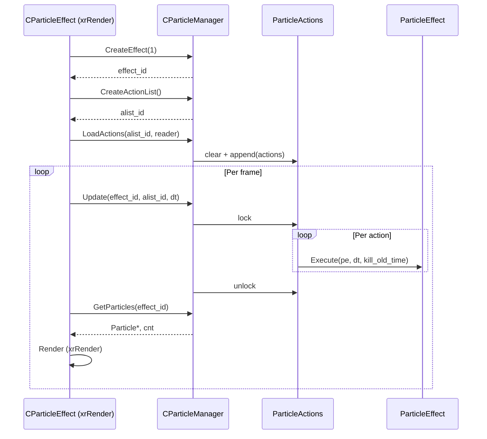

# xrParticles — PAPI и ядро симуляции

> Порцион 1 итерации 4. Файлы: `psystem.h`, `particle_core.h/.cpp`,
> `particle_effect.h/.cpp`, `particle_manager.h/.cpp`.

## 1. Ответственность

Ядро симуляции частиц: структура данных `Particle` (plain data, 76 байт),
геометрия доменов (`pDomain` — где рождаются и куда попадают частицы),
контейнер живых частиц (`ParticleEffect`) и менеджер (`CParticleManager`),
который владеет эффектами и списками действий, управляет Play/Stop/Update.

**НЕ делает**: рендер (xrRender, `CParticleEffect::Render`), описания
эффектов (`.pe` — `CPEDef` в xrRender), выбор действий при загрузке
(редактор `ParticleEffectActions.h/.cpp` в xrRender).

## 2. Место в архитектуре

`xrParticles` — отдельный DLL-модуль (`xrParticles.lib`, `#pragma comment(lib)`
в `psystem.h`). Потребитель — xrRender (`CParticleEffect`/`CParticleGroup`,
[Частицы и wallmarks](../renderer/particles-wallmarks.md)). Глобальный
менеджер — `CParticleManager PM` (static storage, `particle_manager.cpp`),
доступен через `PAPI::ParticleManager()`.

## 3. Публичный API

| Символ                                | Назначение                                                                                                  |
| ------------------------------------- | ----------------------------------------------------------------------------------------------------------- |
| `PAPI::ParticleManager()`             | Глобал `IParticleManager*` (→ `&PM`). Единственный экспортуемый символ.                                       |
| `IParticleManager::CreateEffect`      | Создать эффект, вернуть `effect_id` (индекс в `effect_vec`, free-slot или append).                            |
| `IParticleManager::DestroyEffect`     | `xr_delete(effect_vec[eff])`. **NULL в слот не ставится** (quirk).                                            |
| `IParticleManager::CreateActionList`  | Создать список действий, вернуть `alist_id`.                                                                 |
| `IParticleManager::DestroyActionList` | `xr_delete(m_alist_vec[id])`. **NULL не ставится** (quirk).                                                    |
| `IParticleManager::PlayEffect`        | Сбросить состояние: `PASource::flSilent=false`, `PAExplosion::age=0`, `PATurbulence::age=0`.                  |
| `IParticleManager::StopEffect`        | `PASource::flSilent=true`; при `!deffered` — `pe->p_count=0`.                                                  |
| `IParticleManager::Update`            | Вызвать `Execute(pe, dt, kill_old_time)` на каждом действии.                                                    |
| `IParticleManager::Render`            | **Пустая заглушка** (рендер — в xrRender).                                                                     |
| `IParticleManager::Transform`         | `Transform(m)` на каждом действии + `PASource::parent_vel = vel * parent_motion`.                              |
| `IParticleManager::RemoveParticle`    | `pe->Remove(p_id)`.                                                                                           |
| `IParticleManager::SetMaxParticles`   | `pe->Resize(max)`.                                                                                            |
| `IParticleManager::SetCallback`       | Установить `b_cb`/`d_cb`/`owner`/`param` на `ParticleEffect`.                                                   |
| `IParticleManager::GetParticles`      | Вернуть `Particle*` и `cnt` (сырой указатель, без копирования).                                                  |
| `IParticleManager::GetParticlesCount` | `pe->p_count`.                                                                                                 |
| `IParticleManager::CreateAction`      | Фабрика: `switch (PActionEnum)` → `xr_new<PA*>()`, 30 подклассов (порционы 2–3).                                 |
| `IParticleManager::LoadActions`       | Чтение `u32 cnt` + per-действие `u32 type` + `Load(R)`. `type == (u32)-1` → skip.                               |
| `IParticleManager::SaveActions`       | Запись `u32 cnt` + per-действие `u32 type` + `Save(W)`. `NULL` → `(u32)-1`.                                      |

## 4. Внутреннее устройство

### `psystem.h` — данные PAPI

- **`pVector`** (`: Fvector`): перегрузки операторов `*`, `/`, `+`, `-`, `^`
  (cross), `+=`, `-=`, `*=`, `/=`, `length`/`length2` (inline). Наследует
  `x/y/z` от `Fvector`.
- **`Rotation`**: единственный член `float x` (угол).
- **`Particle`** (76 байт, plain data, `#pragma pack(4)`):
  - `rot` (4), `pos`/`posB`/`vel`/`size` (4×12), `colorR/G/B/A` (4×4),
    `age` (4), `frame` (u16), `flags` (Flags16).
  - `ANIMATE_CCW = (1 << 0)` — направление анимации (обратный порядок кадров).
  - **`posB`** — «вторичная позиция», используется `PACopyVertexB` (копирование
    `pos` → `posB` при рождении) и `PAFollow` (ускорение к предыдущей частице).
  - **`colorA/R/G/B`** — нормализованы `[0..1]` (устанавливаются в `Add`).
- **`PDomainEnum`**: `PDPoint=0` … `PDRectangle=10` (11 типов),
  `domain_enum_force_dword = u32(-1)`.
- **`PActionEnum`**: `PAAvoidID` … `PAScatterID` (31 код),
  `action_enum_force_dword = u32(-1)`.
  **`PACallActionListID_obsolette`** — помечен obsolete, но занимает слот
  в enum (не удаляется — бинарная совместимость).
- **`IParticleManager`** — чистый интерфейс, 17 виртуальных методов.
- **`drand48()`** = `::Random.randF()` (глобал xrCore).
- **`P_MAXFLOAT`** = `1e16` (`sqrt(MAXFLOAT)`), **`P_MAXINT`** = `0x7fffffff`.
- **`PARTICLES_API`** — `__declspec(dllexport/dllimport)` закомментирован
  (модуль компилируется как статический).

### `particle_core.h/.cpp` — `pDomain`

Структура (pack 4): `type`, `p1`, `p2`, `u`, `v`, `radius1`, `radius2`,
`radius1Sqr`, `radius2Sqr`.

Конструктор `pDomain(dtype, a0..a8)` — 9 float'ов, интерпретация по типу:

| Тип          | Поля                                                                                                     |
| ------------ | -------------------------------------------------------------------------------------------------------- |
| `PDPoint`    | `p1 = (a0,a1,a2)`.                                                                                          |
| `PDLine`     | `p1 = (a0..2)`, `p2 = (a3..5) - p1` (вектор направления).                                                   |
| `PDBox`      | `p1` = min-угол, `p2` = max-угол (swap per-axis при `a? > a?+3`).                                            |
| `PDTriangle` | `p1`, `u = tp2-p1`, `v = tp3-p1`; `radius1Sqr = |u|`, `radius2Sqr = |v|`, `p2 = (u/|u|) × (v/|v|)` normalize, `radius1 = -(p1·p2)` (d plane eqn). |
| `PDRectangle`| То же, но `u`/`v` напрямую из `a3..8`.                                                                       |
| `PDPlane`    | `p1`, `p2` = normalize(a3..5); `radius1 = -(p1·p2)`.                                                         |
| `PDSphere`   | `p1` = center; `radius1/2` = max/min(a3,a4); `radius1Sqr/2Sqr`.                                               |
| `PDCylinder`/`PDCone` | `p1` = apex/base, `p2` = axis vector; `radius1/2` = max/min(a6,a7); `radius1Sqr = radius1²`; **`radius2Sqr = 1/|p2|²`** (не квадрат радиуса!); `u`/`v` = orthonormal basis (basis = (1,0,0) или (0,1,0) при `|dot(n, basis)| > 0.999`). |
| `PDBlob`     | `p1` = center; `radius1 = a3` (sigma); `radius2Sqr = -0.5·(1/radius1)²`; `radius2 = (1/√(2π))·(1/radius1)`. |
| `PDDisc`     | `p1` = center, `p2` = normalize(normal); `u`/`v` = orthonormal basis; `radius1Sqr = -(p1·p2)` (d plane eqn, **не** квадрат радиуса!). |

**`Within(pos)`** — проверка принадлежности:
- `PDBox`: AABB.
- `PDPlane`: `pos·p2 >= -radius1` (положительная полуплоскость).
- `PDSphere`: `r² ∈ [radius2Sqr, radius1Sqr]` (кольцо при `radius1 ≠ radius2`).
- `PDCylinder`/`PDCone`: `dist = (p2·x)·radius2Sqr` (проекция на ось,
  `∈ [0,1]`); радиальный тест (cone: `r² ≤ (dist·radius1)²`).
- `PDBlob`: **стохастический** — `drand48() < Gx` (Gaussian PDF).
- Остальные: `FALSE`.

**`Generate(pos)`** — равномерная выборка:
- `PDPoint`: `p1`.
- `PDLine`: `p1 + p2·drand48()`.
- `PDBox`: per-axis lerp.
- `PDTriangle`: `r1+r2 < 1` → `p1+u·r1+v·r2`, иначе `p1+u·(1-r1)+v·(1-r2)`.
- `PDRectangle`: `p1 + u·drand48() + v·drand48()`.
- `PDPlane`: **`pos = p1`** (инфинитная плоскость — нет осмысленной выборки).
- `PDSphere`: `RandVec() - (0.5,0.5,0.5)` → normalize → `p1 + pos·r`
  (r ∈ [`radius2`, `radius1`]).
- `PDCylinder`/`PDCone`: `dist = drand48()`, `theta = 2π·drand48()`,
  `r ∈ [radius2, radius1]`; cone: `x/y *= dist`.
- `PDBlob`: `p1 + NRand(radius1)` per-axis (Gaussian).
- `PDDisc`: `theta = 2π·drand48()`, `r ∈ [radius2, radius1]`.

**`transform(domain, m)`** — преобразование домена:
- `PDBox`: **`Fbox* bb = (Fbox*)&p1`** — bit-cast, `xform` по 8 углам.
- `PDPlane`: `transform_tiny(p1)`, `transform_dir(p2)`, `radius1 = -(p1·p2)`.
- `PDSphere`/`PDBlob`/`PDPoint`: только `p1`.
- `PDCylinder`/`PDCone`/`PDRectangle`/`PDTriangle`/`PDDisc`:
  `p1` (tiny), `p2`/`u`/`v` (dir).
- `PDLine`: `p1` (tiny), `p2` (dir).

**`transform_dir(domain, m)`** — `Fmatrix M = m; M.c = 0;` → `transform`
(только вращение/масштаб, без трансляции).

**`NRand(sigma)`** — нормальное распределение (Box–Muller variant):
`y = -log(drand48())`, rejection `drand48() > exp(-0.5·(y-1)²)`,
знак `rand() & 0x1`, масштаб `y·sigma/0.7975`.

### `particle_effect.h/.cpp` — `ParticleEffect`

Структура: `p_count`, `max_particles`, `particles_allocated`, `Particle* particles`,
`void* real_ptr`, `b_cb`/`d_cb`, `owner`, `param`.

- **Ctor** (`mp`): `xr_malloc(sizeof(Particle)·(mp+1))`,
  **64-byte alignment**: `particles = (Particle*)((uintptr_t)real_ptr + (64 - (real_ptr & 63)))`.
  `+1` — запас для unaligned allocation.
- **`Resize(max_count)`**:
  - Уменьшение: `max_particles = max_count`, `p_count = min(p_count, max_particles)`.
  - Увеличение: `xr_malloc` новый буфер, `CopyMemory` `p_count` частиц,
    `xr_free` старый. При OOM — `max_particles = particles_allocated` (откат).
- **`Remove(i)`**: `d_cb(owner, param, m, i)`, **`m = particles[--p_count]`**
  (swap-with-back; комментарий: «не менять правило удаления !!! (dependence
  ParticleGroup)» — `CParticleGroup` полагается на этот порядок).
- **`Add(pos, posB, size, rot, vel, color, age, frame, flags)`**:
  `p_count < max_particles` → заполнить, `colorA/R/G/B = (color >> N) & 0xff` / 255,
  `b_cb(owner, param, P, p_count)`, `p_count++`.

### `particle_manager.h/.cpp` — `CParticleManager`

- **Глобал**: `CParticleManager PM;` (static storage, `particle_manager.cpp` L12).
  `PAPI::ParticleManager()` → `&PM`.
- **`effect_vec`** / **`m_alist_vec`**: `DEFINE_VECTOR` (сырые указатели),
  комментарии: «static because all threads access the same effects. All
  accesses should be locked» — но **локов нет** (только `pa->lock()` на
  `ParticleActions`).
- **`CreateEffect`**: free-slot (первый `NULL`) или `push_back`.
- **`DestroyEffect`**: `xr_delete`, **NULL не ставится** (quirk: free-slot
  не восстанавливается, следующий `CreateEffect` найдёт другой слот).
- **`PlayEffect`**: `pa->lock()`, per-действие `switch (type)`:
  `PASourceID` → `flSilent=false`, `PAExplosionID` → `age=0`,
  `PATurbulenceID` → `age=0`. `pa->unlock()`.
- **`StopEffect`**: `PASourceID` → `flSilent=true`; при `!deffered` —
  `pe->p_count=0` (немедленная очистка).
- **`Update`**: `pa->lock()`, per-действие `Execute(pe, dt, kill_old_time)`,
  `pa->unlock()`. `kill_old_time = 1.0f` (не используется большинством
  действий, кроме `PAKillOld`).
- **`Render`**: **пустая заглушка** (комментарий `//    ParticleEffect* pe = GetEffectPtr(effect_id);`).
- **`Transform`**: `pa->lock()`, per-действие: `ALLOW_ROTATE` → `full`,
  иначе `mT = translate(full.c)`; `Transform(m)`; `PASourceID` →
  `parent_vel = vel * parent_motion`. `pa->unlock()`.
- **`CreateAction`**: `switch (PActionEnum)` → `xr_new<PA*>()`, 30 подклассов
  (порционы 2–3). `PATargetRotateDID` → `PATargetRotate` (двойственный,
  quirk из ит.3 порц.16).
- **`LoadActions`**: `pa->clear()`, `u32 cnt = R.r_u32()`, per:
  `u32 type = R.r_u32()`, `type == (u32)-1` → skip, `CreateAction` + `Load(R)`.
- **`SaveActions`**: `pa->lock()`, `W.w_u32(size)`, per: `NULL` → `(u32)-1`,
  иначе `W.w_u32(type)` + `Save(W)`. `pa->unlock()`.

## 5. Взаимодействие

- **Кто вызывает**: xrRender — `CParticleEffect` (ctor: `CreateEffect(1)` +
  `CreateActionList()`, `OnFrame` → `Update`, `Render` → `GetParticles`,
  `Stop` → `StopEffect`), `CParticleGroup` (аналогично per-эффект).
  См. [Частицы и wallmarks](../renderer/particles-wallmarks.md).
- **Кого вызывает**: xrCore (`xr_malloc`/`xr_free`/`xr_new`/`xr_delete`,
  `::Random.randF`, `IReader`/`IWriter`, `Fvector`/`Fmatrix`).
- **Порционы 2–3**: `ParticleAction` (базовый), 30 подклассов,
  `ParticleActions::copy`.

## 6. Потоки данных

## 7. Конфигурация

Нет cvar'ов в самом модуле. `ps_particle_update_coeff` — в xrRender
(множитель `uDT_STEP` в `CParticleEffect::OnFrame`).

## 8. Известные ограничения и дебаг

- **`Render` — пустая заглушка** (рендер в xrRender).
- **`DestroyEffect`/`DestroyActionList` не ставят `NULL`** в слот —
  free-slot не восстанавливается, `CreateEffect` находит другой или append.
  При многократном create/destroy вектор растёт.
- **`pDomain::radius2Sqr`** — для `PDCylinder`/`PDCone` хранит `1/|p2|²`
  (не квадрат радиуса), для `PDDisc` — `-(p1·p2)` (d plane eqn).
  Имя вводит в заблуждение.
- **`PDPlane::Generate`** — `pos = p1` (инфинитная плоскость, нет осмысленной
  выборки).
- **`PDBlob::Within`** — стохастический (Gaussian PDF), не детерминированный.
- **`ParticleEffect::Remove`** — swap-with-back, **порядок частиц меняется**
  (комментарий: «dependence ParticleGroup» — `CParticleGroup` полагается).
- **`CParticleManager`** — комментарии про «all threads access», но **локов нет**
  (только `ParticleActions::lock()` — мьютекс-флаг, не mutex).
