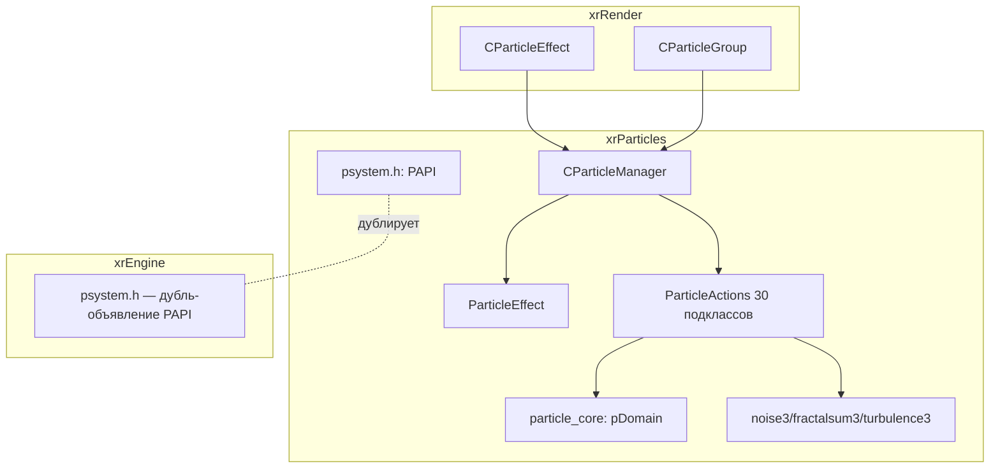

# Модуль: xrParticles

`xrParticles` — **ядро симуляции частиц** (`namespace PAPI`): данные частиц,
домены пространства, список действий (actions) и менеджер эффектов.
Отвечает на вопрос «как частицы живут и двигаются».

**Чего НЕ делает**: не рендерит (рендер — `CParticleEffect`/`CParticleGroup`
в xrRender, [Частицы и wallmarks](../renderer/particles-wallmarks.md)),
не хранит описания эффектов (`.pe`/`.pg` — `CPEDef`/`CPGDef`, тоже xrRender).

См. [Карта модулей](../../architecture/module-map.md), [Граф связей](../../architecture/dependencies.md).

## Структура

| Страница                                          | Что покрывает                                                                                                                                                                                                                                                                                         |
| ------------------------------------------------- | ----------------------------------------------------------------------------------------------------------------------------------------------------------------------------------------------------------------------------------------------------------------------------------------------------- |
| [PAPI и ядро симуляции](core.md)                  | `psystem.h` (`pVector`, `Particle`, `PDomainEnum`, `PActionEnum`, `IParticleManager`), `particle_core` (`pDomain`: Within/Generate/transform, `NRand`), `ParticleEffect` (аллокация 64-byte, `Add`/`Remove`/`Resize`), `CParticleManager` (глобал `PM`, create/destroy/Play/Stop/Update/Transform/IO) |
| [Actions: ядро и домены](actions.md)              | `ParticleAction` (базовый класс, `ALLOW_ROTATE`), `ParticleActions` (контейнер + lock), каркас 29 подклассов: макро `_METHODS`, dual-domain (L/world), закон сил 1/r², правило обратного обхода, `PAMove`-интегратор, SSE-`PATurbulence`, схема IO                                                    |
| [Actions: 29 подклассов](actions-actions.md)      | `particle_actions_collection.cpp` (55 KB): `Execute`/`Transform` всех 29 подклассов — столкновения (`PAAvoid`/`PABounce`), интегратор `PAMove`, sinks, O(n²)-пары (`PAGravitate`/`PAMatchVelocity`), вихрь `PAVortex`, `PASource`, `PATurbulence` (SSE)                                               |
| [Actions: IO](actions-io.md)                      | `particle_actions_collection_io.cpp`: базовый заголовок (2×u32), примитивы (`r_fvector3`/`r_float`/`r_u32`/`r_s32`/сырой pDomain), dual-domain при Load, таблица полей всех 29 подклассов, quirks (`PATurbulence.age` не читается, `PASource.parent_motion` мёртвое)                                  |     |
| Noise и связка с движком (`noise-integration.md`) | _(порцион 4)_ — `noise.h/.cpp` (`noise3`/`fractalsum3`/`turbulence3`), интеграция с xrEngine (`CParticleEffect`, `ps_particle_*`)                                                                                                                                                                     |

## Карта связей

- **Потребитель**: только xrRender — `CParticleEffect`/`CParticleGroup`
  (рантайм-обёртки, [Частицы и wallmarks](../renderer/particles-wallmarks.md)).
  Вызовы идут через `ParticleManager()`.
- **Зависимости**: xrCore (`Fvector`/`Fmatrix`, `xr_malloc`, `::Random`,
  `IReader`/`IWriter`).
- **Публичный API**: `PAPI::ParticleManager()` → `IParticleManager*`
  (единственный входной экспортуемый символ).

## Статус порционов (итерация 4)

| #   | Порцион                     | Страницы                              | Статус    |
| --- | --------------------------- | ------------------------------------- | --------- |
| 1   | PAPI и ядро симуляции       | `index.md`, `core.md`                 | ✅ готово |
| 2   | Actions: ядро и домены      | `actions.md`                          | ✅ готово |
| 3   | Actions: 30 подклассов + IO | `actions-actions.md`, `actions-io.md` | ✅ готово |
| 4   | Noise и связка с движком    | `noise-integration.md`                | —         |
